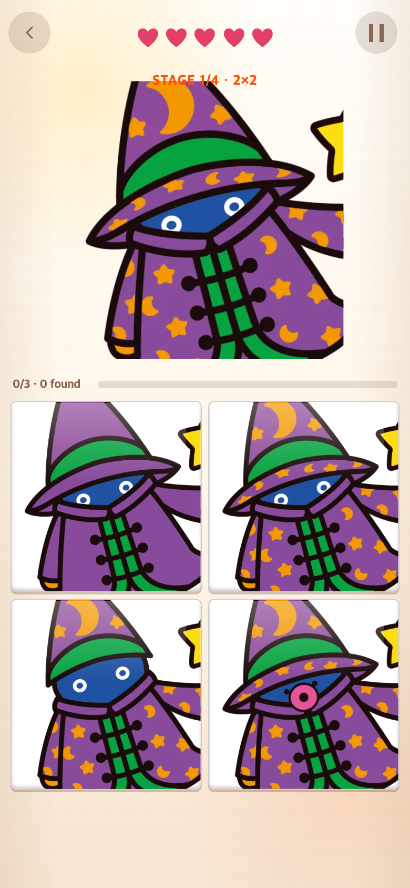
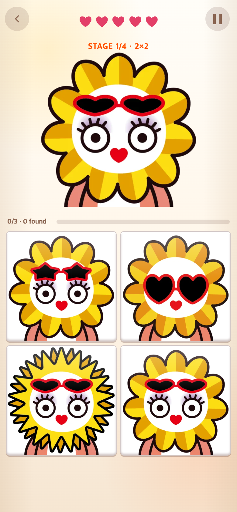
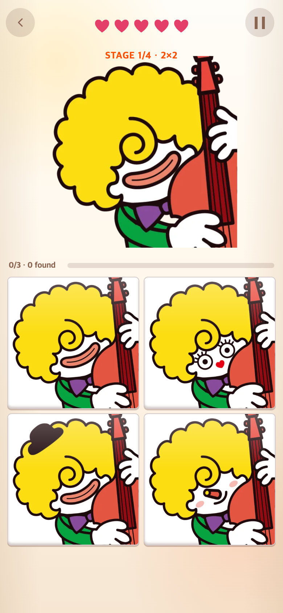
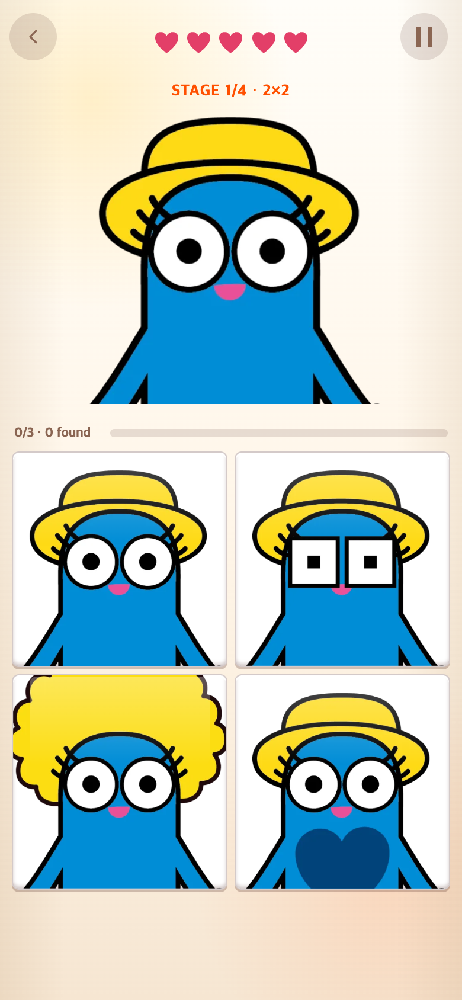
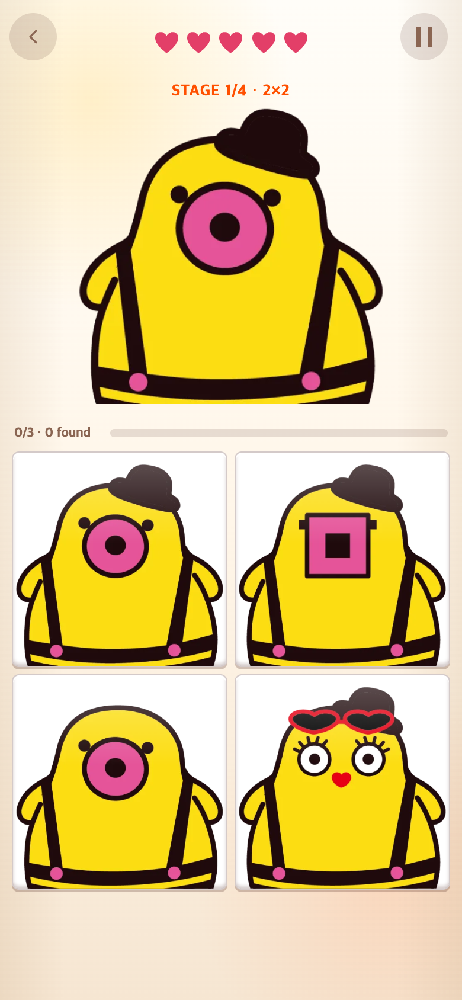
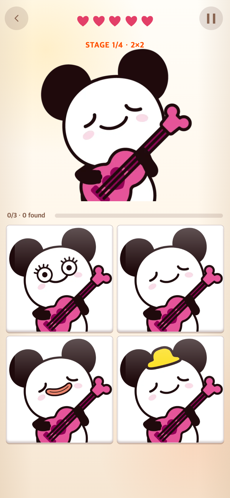
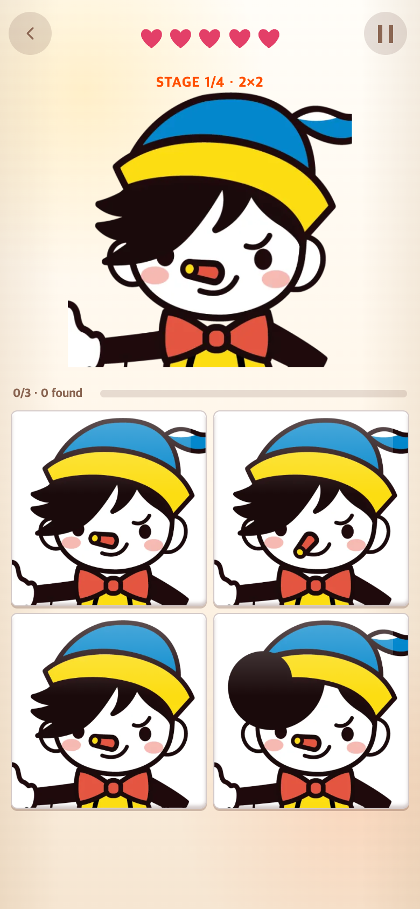

# 게임 2 — 뒷모습·상하 반전 제외와 첫 단계 형태 비교

작성일: 2026-09-05 · 적용 커밋: [da4afe9](https://github.com/Junyyyong/TaptoPick/commit/da4afe9)

## 문제와 요청

뒷모습이나 거꾸로 된 캐릭터는 출제하지 않도록 요청받았다. 먼저 실제 이미지를 검토해 원본 파일명 8개를 제시했고, 사용자의 승인을 받은 뒤 제외했다. 또한 첫 2×2 단계가 색상만 보고 쉽게 구별되는 대신 형태를 비교하는 문제가 되도록 요청받았다. 이 설명은 개발 대화의 요약이며 사용자 실험 결과는 아니다.

## 변경 내용

다음 파일에 대응하는 게임용 WebP를 **모든 단계의 출제 목록과 프리로드 목록에서 제외**했다. 원본 PNG·WebP 파일은 삭제하지 않았다.

| 원본 폴더 | 원본 파일 | 제외 이유 |
|---|---|---|
| 해피-얼굴 | 해피-23.png | 뒷모습 |
| 뽀글스-얼굴 | 뽀글스15.png | 뒷모습 |
| 태피-얼굴 | 태피17.png | 뒷모습 |
| 티피-얼굴 | 티피20.png | 뒷모습 |
| 재피-얼굴 | 재피11.png | 뒷모습 |
| 피노팬-얼굴 | 피노팬1.png | 뒷모습 |
| 태피-얼굴 | 태피1.png | 상하 뒤집힘 |
| 피노팬-얼굴 | 피노팬17.png | 상하 뒤집힘 |

첫 2×2는 정답 한 개와 형태가 다른 오답 세 개를 배치한다. 색상만 바뀐 그림, 좌우 반전만 된 그림, 3D 표현으로 바뀐 그림은 첫 단계의 오답 후보로 사용하지 않는다. 3×3 이후에는 위에서 승인한 8개를 제외한 기존 색상·좌우 반전 바리에이션도 사용할 수 있다. 보드 진급 조건·하트·타이머 정책·종료 영상·게임 1·3 규칙은 바꾸지 않았다.

### 첫 단계의 형태 변화 후보

숫자는 `optimized/montage/{캐릭터}/variation-{번호}.webp`의 파일 번호다. 이미지 검토를 통해 명시적으로 선택했고, 색상·형태를 자동 판별한 것은 아니다.

| 캐릭터 | 파일 번호 | 주요 비교 요소 |
|---|---|---|
| 해피 | 16, 17, 20, 22, 27 | 입, 꽃잎 윤곽, 안경 형태·위치 |
| 뽀글스 | 1, 8, 11, 19 | 머리, 별 모양 눈, 얼굴 형태 |
| 태피 | 7, 10, 13, 14, 18, 19, 20 | 눈, 입, 머리, 안경 |
| 티피 | 6, 7, 11, 12, 14, 15, 18 | 모자, 코, 머리, 얼굴 |
| 후피 | 10, 12, 13, 16 | 귀 크기, 눈, 입, 모자 |
| 재피 | 5, 6, 14, 15 | 모자 장식, 눈 장식, 코, 얼굴을 가리는 부분 |
| 피노팬 | 9, 10, 12, 16 | 코 길이·방향, 앞머리, 입 |

## 모바일 화면 비교

390×844 CSS px, 배율 2에서 캡처한 780×1688 PNG다. 변경 전은 이전 연구 기록에 보관된 `1b8b69f` 재현 화면이며, 변경 후는 `da4afe9`의 게임 코드를 실행한 화면이다. 두 화면 모두 재피의 첫 2×2지만 동일한 난수 시드를 사용한 짝 비교는 아니다.

| 변경 전: 색상 변화 중심 | 변경 후: 형태 변화 중심 |
|---|---|
|  |  |

### 나머지 여섯 캐릭터의 첫 단계

| 해피 | 뽀글스 | 태피 |
|---|---|---|
|  |  |  |

| 티피 | 후피 | 피노팬 |
|---|---|---|
|  |  |  |

## 확인 결과와 한계

- 관련 Vitest **38개 통과**, `npm run build` 성공.
- 테스트에서 제외한 8개가 활성 이미지·프리로드 목록에 없고, 단계별 보드 생성에서도 선택되지 않음을 확인했다.
- 일곱 캐릭터의 첫 단계 후보 파일 번호와 2×2의 정답 1개·서로 다른 오답 3개 구성을 검증했다.
- 모바일 브라우저에서 일곱 캐릭터의 첫 단계를 각각 캡처하고, 이미지 로딩과 페이지 오류를 확인했다. 캡처별 난수 시드, 실제 이미지 경로와 SHA-256은 [manifest.json](manifest.json)에 있다.
- “조금 더 어려워지는 것”은 변경 의도다. 실제 난이도 상승이나 적정 난이도는 사용자 플레이로 검증해야 한다. 캡처는 실제 휴대폰 촬영이 아니라 모바일 브라우저 재현 화면이다.

## 재현

[capture.cjs](capture.cjs)는 실행 중인 로컬 개발 서버에서 메뉴를 클릭해 첫 문제를 캡처한다. 현재 작업 폴더의 게임을 사용하므로 과거 버전을 재현할 때는 `da4afe9`를 별도 폴더에 내보내 서버를 실행해야 한다. 현재 브랜치를 과거로 돌릴 필요는 없다.

```sh
NODE_PATH=/path/to/node_modules RESEARCH_URL=http://127.0.0.1:5189/ CHROME_PATH=/path/to/chrome node docs/research/2026-09-05-montage-shapes/capture.cjs
```

캡처 도구는 난수와 브라우저 시계를 고정하지만 게임 상태를 주입하지 않는다. 실제 플레이어 소요 시간이나 네트워크 성능을 측정하지 않는다. 연구 문서·캡처는 게임에서 불러오지 않는다.
