# TAP to PICK — 모바일 게임 수정 과정 기록

작성일: 2026-09-05 · 기록 기준: [`1b8b69f`](https://github.com/Junyyyong/TaptoPick/commit/1b8b69f)

## 기록 목적과 읽는 방법

개발 중 제기된 문제와 디자인 요청을 **문제 → 수정 → 화면 → 확인 결과** 순서로 정리했다. 문제 설명은 개발 대화의 요약이며, 사용자 조사나 실험에서 수집한 원문 인용이 아니다. 화면은 당시 촬영해 두었던 사진이 아니라, **Git에 남아 있는 해당 버전을 이번 기록 작업에서 다시 실행한 재현 스크린샷**이다.

모든 화면은 세로형 모바일 환경인 **390 × 844 CSS px**, 배율 2에서 캡처했다. 원본 PNG는 **780 × 1688 px**이며 아래에서는 읽기 편하게 축소 표시한다. 원본은 [screenshots 폴더](screenshots)에 있다. 실제 휴대폰 촬영이나 모든 기종에 대한 호환성 검증은 아니다.

기록의 핵심은 변경의 추적 가능성이다. “더 쉬워졌다”, “더 빨라졌다”는 개발 의도와 실제 검증 결과를 구분했다. 난이도·만족도·로딩 시간에 대한 사용자 실험은 이 작업에 포함하지 않았다.

## 1. 원본 게임 구조를 이미지 찾기 게임으로 전환

**요구:** TAPtoTALK의 구조·디자인·폰트를 계승하되, 원본 게임을 건드리지 않고 별도 게임을 제작한다.

**수정:** TaptoPick 저장소에 복사된 기준 버전에서 세 가지 이미지 게임을 구성했다. 첫 번째는 전체 그림에 속한 조각 찾기, 두 번째는 제시 그림과 같은 그림 찾기, 세 번째는 카드 페어 찾기다. 조각 번호는 왼쪽 위부터 행 순서로 3×3 또는 3×4에 대응하도록 정리했다.

| 복사된 기준 버전의 메뉴 | 초기 이미지 조각 게임 |
|---|---|
| 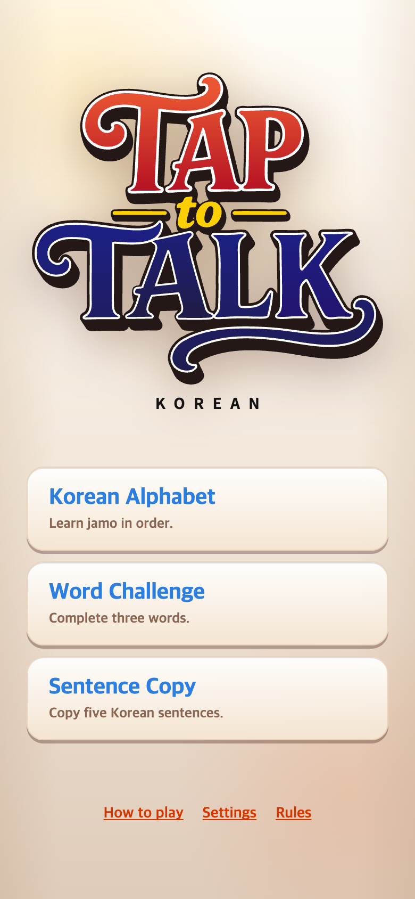 | 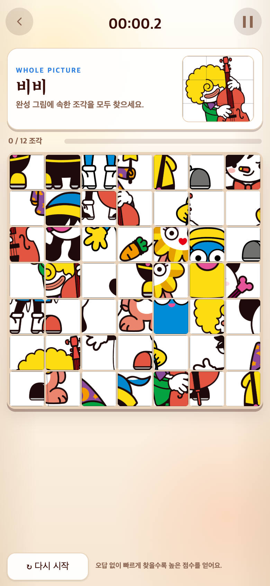 |
| `edb6abd` | `432d9db` |

**확인:** 메뉴 기반 화면 흐름을 유지하면서 이미지 조각 보드로 전환한 상태를 확인했다. 왼쪽 화면도 원본 TAPtoTALK 저장소를 실행한 것이 아니라 **TaptoPick 내부의 복사 커밋**이다. 번호 대응 수정은 `3a69c80`에 남아 있다.

## 2. 캐릭터 잘림과 제시 영역의 정보 과밀 개선

**문제:** 캐릭터 전체가 잘려 보이고, 이름·설명·흰 박스가 제시 그림의 공간을 차지했다.

**수정:** 전체 그림을 가운데 배치하고, 불필요한 설명을 덜어냈다. 이후 제시 영역의 세로 공간을 늘리고 하단 Restart와 안내 문구를 제거했다. 캐릭터 이름은 그림 옆이 아니라 타이머와 제시 그림 사이로 옮겨 표시했다.

| 초기 제시 영역 | 전체 그림 표시 개선 | 이름과 넓어진 제시 영역 |
|---|---|---|
|  | 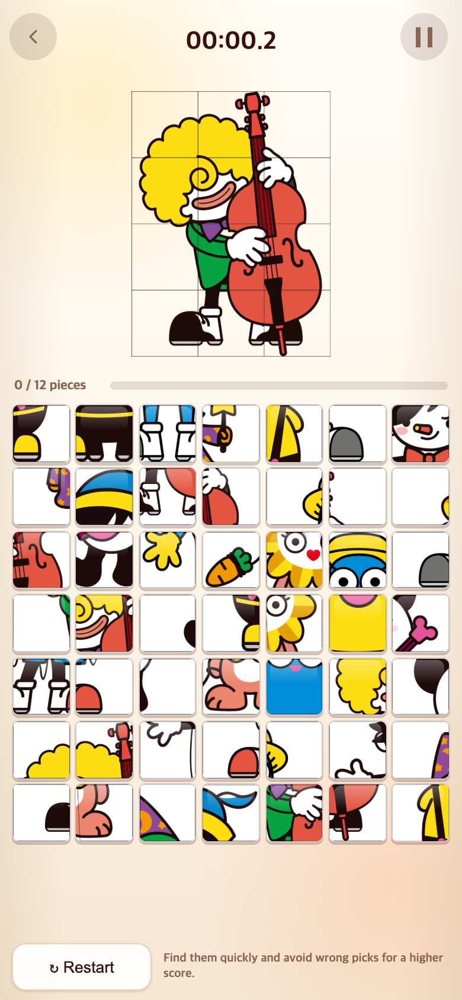 |  |
| `432d9db` | `ae18ad0` | `8d2f5e1` |

**확인:** 재현한 캐릭터의 전체 그림이 표시되고, 이름이 위쪽에 분리되어 나타난다. 이름 표기는 Tapee, Tepee, Hooopee, Zapee, Hapee, Bbogles, PinoPan이다. 모든 캐릭터·화면 크기의 잘림 여부를 이 세 장만으로 증명하는 것은 아니다.

## 3. 브랜드와 커버를 TAP to PICK 자산으로 교체

**요구:** 기존 게임과 유사한 화면 흐름과 배치를 유지하면서 새 로고·커버를 사용하고, 스튜디오 로고 배경을 `#fccf00`으로 변경한다. 화면 문구는 영어로 정리한다.

**수정:** 제공된 스튜디오 로고, 게임 로고, 수정된 커버를 반영했다. 메뉴의 불필요한 “Picture” 표기도 제거했다.

| 시작 스튜디오 화면 | 커버 | 메뉴 |
|---|---|---|
| 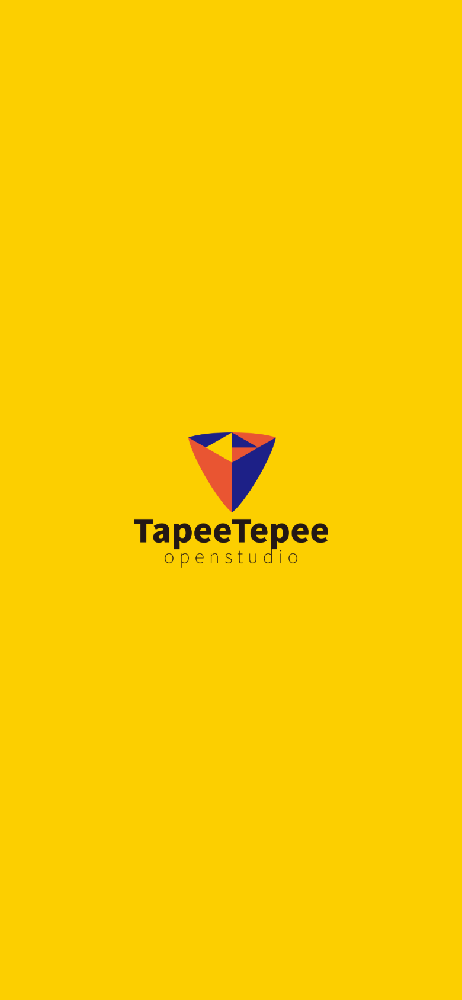 | 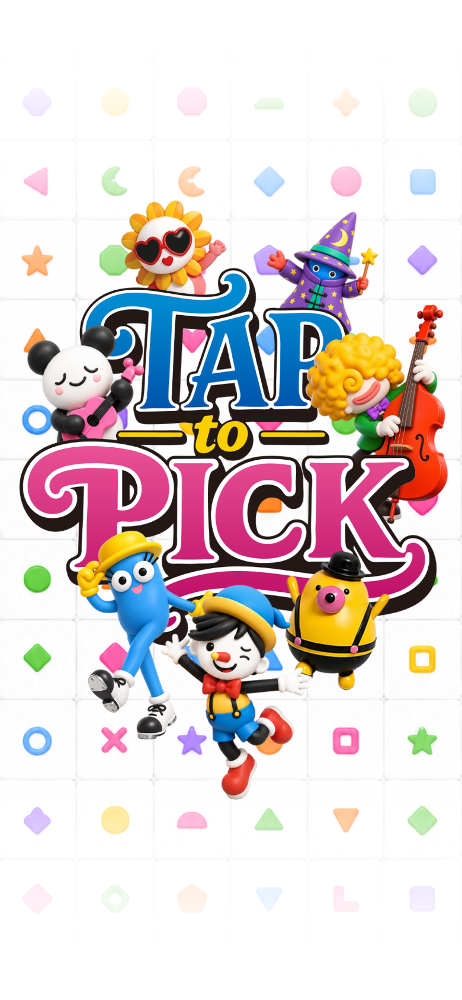 | 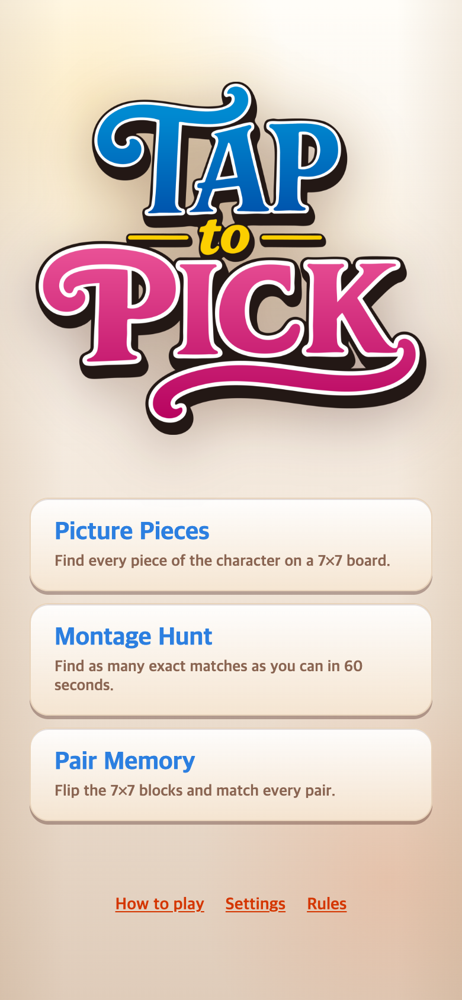 |

**확인:** `138318e` 버전에서 세 화면을 각각 재현했다. 정지 화면은 로고·커버·문구의 근거이며, 노출 시간 자체를 증명하지는 않는다. 관련 변경은 `a380919`, `3901e17`, `dd72c76`, `6d953ff`, `138318e`에 남아 있다.

## 4. 게임 1 — 맞춘 부분만 컬러로 보이는 진행 피드백

**문제:** 조각을 맞추는 행동과 전체 그림의 완성 과정이 시각적으로 연결될 필요가 있었다. 지정한 Tapee 그리드 자산을 사용하는지도 정리해야 했다.

**수정:** 제시 그림을 회색으로 시작하고, 올바른 조각을 찾을 때 해당 부분만 컬러로 드러나게 했다. 조각·그리드 자산 처리와 웹용 이미지 생성도 함께 정리했다.

| 초기 전체 그림 | 세 조각을 찾은 진행 상태 |
|---|---|
|  | 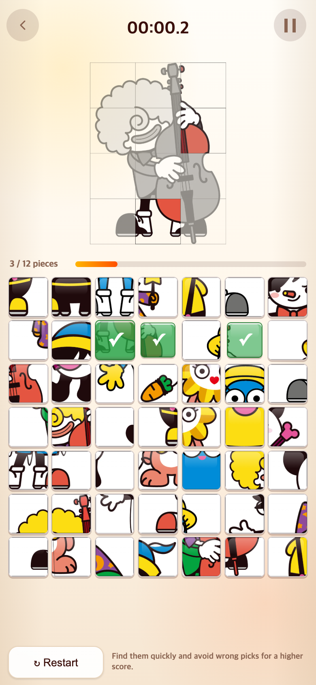 |
| `432d9db` | `444fd07` |

**확인:** 정답 세 개를 클릭한 뒤 회색 부분과 컬러 부분이 함께 보이는 상태를 재현했다. 전·후는 같은 캐릭터의 동일 장면을 비교한 것이 아니라 **진행 피드백 방식**의 비교다.

## 5. 이미지 최적화 — 파일 용량을 근거로 기록

**문제:** 게임 진입 후 이미지가 늦게 나타난다는 개발 중 관찰이 있었다. 원본 PNG·JPG를 게임 표시 크기에 맞는 자산으로 정리할 필요가 있었다.

**수정:** 웹용 WebP 자산을 생성해 사용하고, 이후 시작 화면에서 게임 이미지를 미리 준비하는 처리를 추가했다(`444fd07`, `55c12be`).

| 동일 이름으로 대응되는 조각 75개 | Git 파일 크기 합계 |
|---|---:|
| 변경 전 JPG (`219b041`) | 2,941,708 bytes |
| 변경 후 WebP (`444fd07`) | 199,118 bytes |
| 감소량 | 2,742,590 bytes, 약 **93.2% 감소** |

**확인:** 75개 파일의 이름 대응과 저장된 파일 크기를 Git 객체에서 확인했다. 원자료는 [git-evidence.json](git-evidence.json)의 `picturePieces`에 있다. 이는 **해당 조각 자산의 용량 비교**이지 전체 앱 크기, 모든 게임 이미지의 압축률, 다운로드 전송량 또는 로딩 시간 측정치가 아니다. 따라서 “93.2% 더 빨라졌다”고 해석해서는 안 된다. 실제 속도 검증에는 동일 기기·네트워크의 캐시 유무별 측정이 추가로 필요하다.

## 6. 게임 2 — 너무 많은 작은 블록에서 식별 가능한 그림으로

**문제:** 초기에는 81개 블록에서 그림이 너무 작고 비슷해 보였다. 블록 내부 그리드와 전신 이미지도 식별을 방해했다.

**수정:** 보드 수를 7×7, 이후 5×5로 줄였다. 제시 그림과 블록에 전체 PNG를 사용하고, 전신 이미지가 찌그러지지 않도록 원본 비율을 유지해 축소했다. 다음 단계에서는 제공된 얼굴 정답·오답 자산으로 교체했다.

| 초기 9×9 | 전체 PNG를 사용한 5×5 | 전신 비율 보존 | 얼굴 중심으로 전환 |
|---|---|---|---|
| 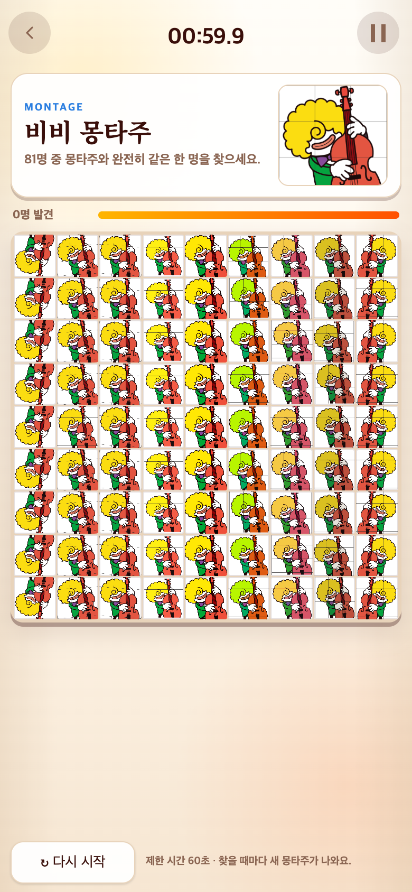 | 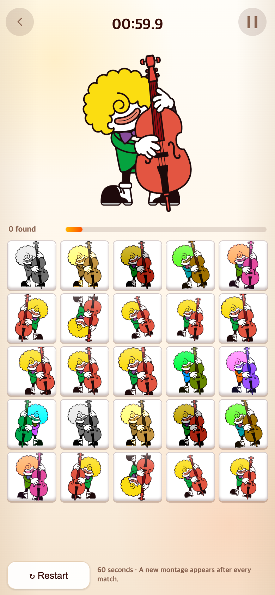 | 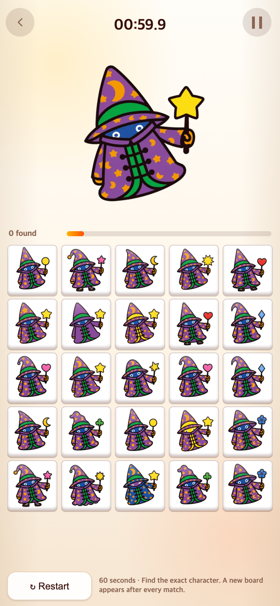 | 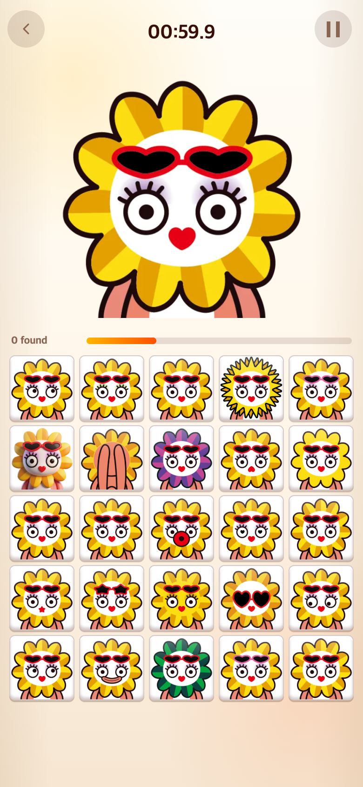 |
| `432d9db` | `219b041` | `18211bf` | `d86d1af` |

**확인:** 81칸에서 25칸으로 줄어들고 얼굴이 더 크게 표시되는 구성을 확인했다. 비율 보존 버전의 캡처 캐릭터는 재피다. 따라서 이 화면을 “뽀글스 동일 이미지의 찌그러짐 전·후 비교”로 사용하지 않는다. 뽀글스 문제에 대한 구현 근거는 `18211bf`의 비율 보존 처리다.

## 7. 게임 2 — 임의 시각 변형에서 제공된 정답·오답 자산으로

**문제:** 회전·색·크기 변화만으로는 원하는 세부 형태 차이를 만들기 어려웠고, 전신 차이는 모바일에서 잘 보이지 않았다. 같은 캐릭터가 자주 반복되어 일곱 캐릭터를 모두 경험하기도 어려웠다.

**수정:** 제공된 얼굴 정답과 바리에이션 이미지를 콘텐츠로 등록했다. 해피부터 시작해 뽀글스, 티피·태피, 후피·재피·피노팬까지 확대했다. 일곱 캐릭터를 한 번씩 소진한 뒤 다시 섞는 방식으로 변경했다. 점수 표시는 누적 점수 대신 찾은 개수로 바꿨다.

| 얼굴 콘텐츠 도입 | 일곱 캐릭터 콘텐츠가 등록된 버전 |
|---|---|
|  | 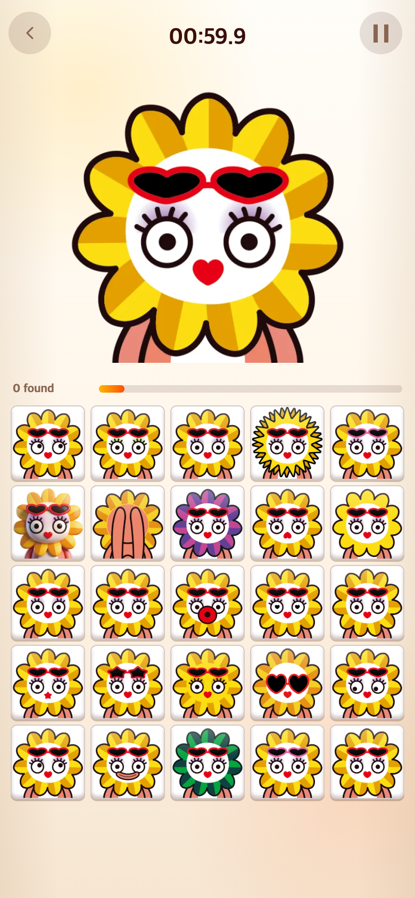 |
| `d86d1af` | `2d1c636` |

**확인:** 두 캡처는 모두 해피 문제다. 화면 한 장으로 일곱 캐릭터의 등록·순서를 증명하지 않는다. 콘텐츠 확대는 `16eec6a`, `c240696`, `2d1c636`, 순환 출제는 `fa3c2bf`, 개수 표시는 `a4c7d51`의 코드 이력이 근거다. 오답은 제공된 바리에이션이며 중복 배치가 허용된다.

## 8. 게임 3 — 작은 조각 49개에서 얼굴 페어로 단순화

**문제:** 49칸에 작은 이미지 조각을 기억하는 방식은 어렵다는 의견이 있었다. 카드 뒷면이 모두 파란색인 것도 기존 디자인과 달랐다.

**수정:** 카드 뒷면을 여러 색으로 바꾸고, 조각 대신 얼굴을 찾는 방식으로 전환했다. 이후 바리에이션까지 기억해야 하는 부담을 줄이기 위해 **일곱 캐릭터의 원본 얼굴만** 사용하도록 제한했다. 동일 원본이 여러 쌍 나오는 것은 허용한다. 별도로 업로드한 게임 3 표정 자산은 보류했다.

| 초기 파란 카드 49칸 | 다양한 색의 조각 카드 | 얼굴 카드 도입 | 원본 얼굴만 사용 |
|---|---|---|---|
| 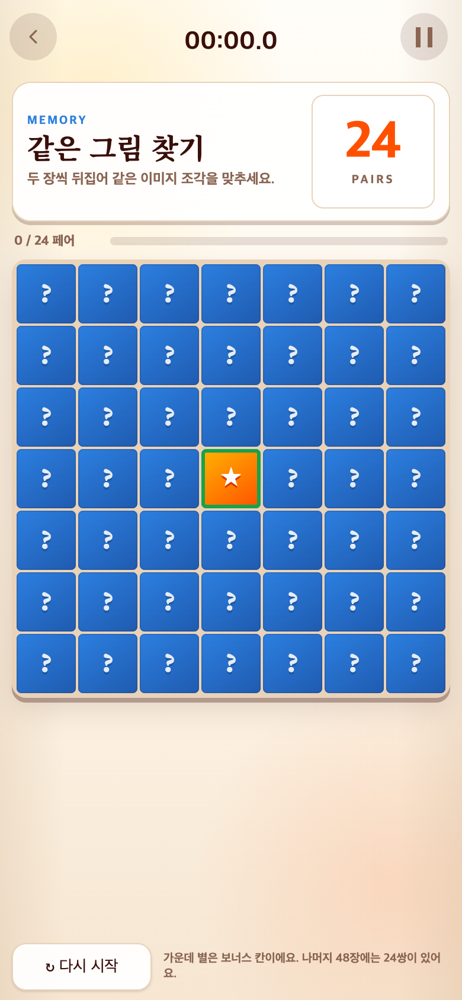 | 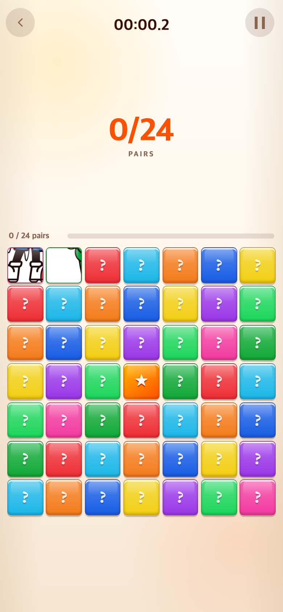 | 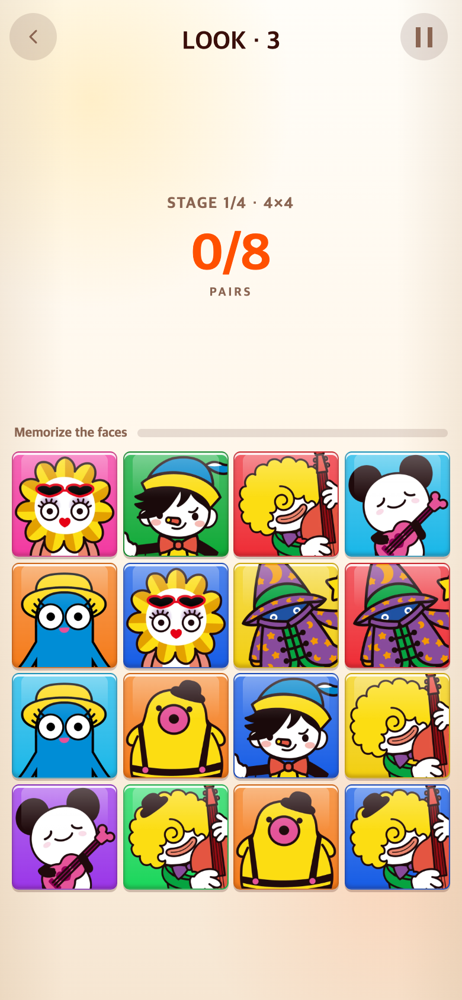 | 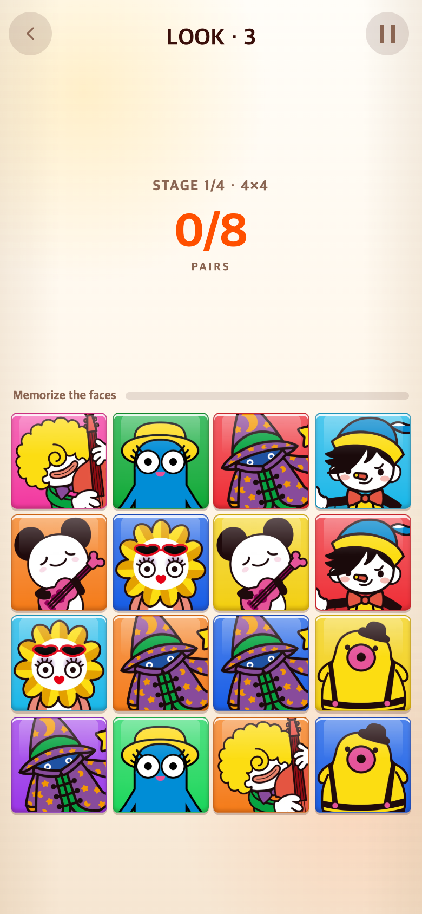 |
| `432d9db` | `444fd07` | `321798e` | `8948acd` |

**확인:** 현재 방식은 4×4로 시작한다. 오른쪽 두 화면은 카드가 자동으로 공개되는 시작 미리보기이며, 플레이 중 카드가 항상 열려 있다는 뜻은 아니다. 쉬워지는 것을 목표로 한 구성 변경이며, 난이도 감소가 사용자 실험으로 입증된 것은 아니다.

## 9. 게임 3 — 한 판을 네 단계로 구성

**요구:** 작은 보드부터 시작해 7×7까지 진행하되, 큰 단계에는 시간을 더 준다.

**수정:** `321798e`에서 단계별 보드와 타이머를 도입했다. 홀수 보드에는 회색 별 한 칸을 두고 페어 수에서 제외했다.

| 단계 | 보드 | 페어 | 제한 시간 |
|---|---|---:|---|
| 1 | 4×4 | 8 | 1분 |
| 2 | 5×5 | 12 | 1분 |
| 3 | 6×6 | 18 | 1분 30초 |
| 4 | 7×7 | 24 | 2분 |

| 단계 도입 당시 5×5 진입 | 현재 원본 얼굴 방식의 5×5 진입 |
|---|---|
| 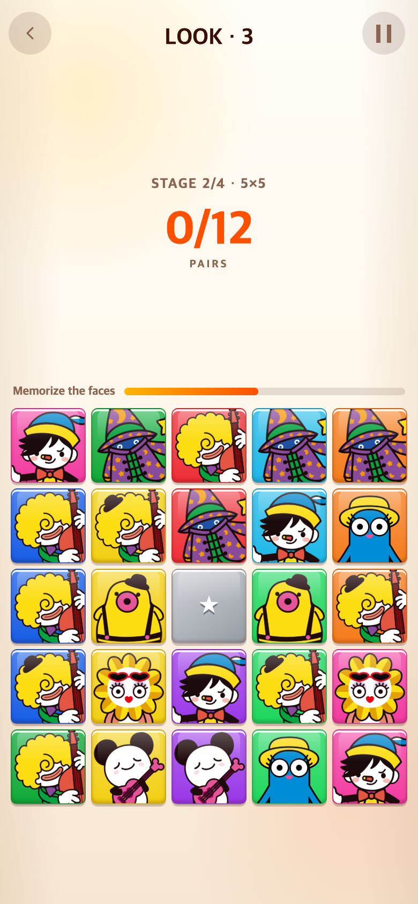 | 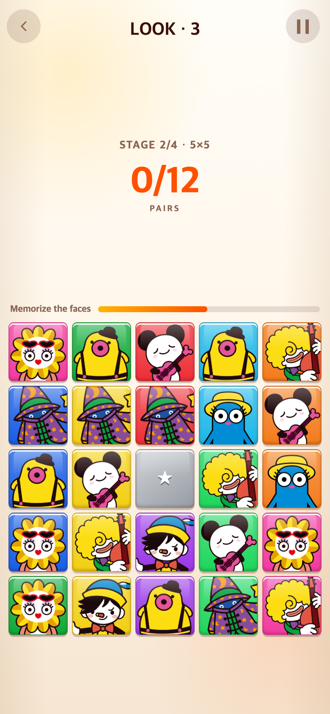 |

**확인:** 4×4의 모든 페어를 실제 클릭으로 맞춘 뒤 5×5로 진급하는 상태를 재현했다. 3초 미리보기는 단계 제한 시간에서 제외된다. 표의 6×6·7×7 규칙은 코드·테스트 근거이며, 이 두 장은 마지막 단계 클리어의 증거가 아니다. 대화에서 논의한 별도의 중간 시안이 커밋으로 남아 있지 않다면 해당 화면은 재구성하지 않았다.

## 10. 카드가 직사각형으로 나타나거나 클릭 때 크기가 변하는 문제

**문제:** 이미지 로딩 전후와 카드 뒤집기 과정에서 블록 크기가 달라진다는 관찰이 있었다.

**수정:** `f4ea687`에서 보드의 정사각형 레이아웃을 고정하고, 페어 카드의 DOM을 유지하며 상태만 갱신하는 방식으로 변경했다. 이미지 로딩이나 앞·뒤면 콘텐츠가 카드 크기를 결정하지 않게 하는 것이 목적이다.

| 수정 전 버전의 로딩 완료 상태 | 수정 후 조각 보드 | 수정 후 뒤집은 카드 |
|---|---|---|
|  | 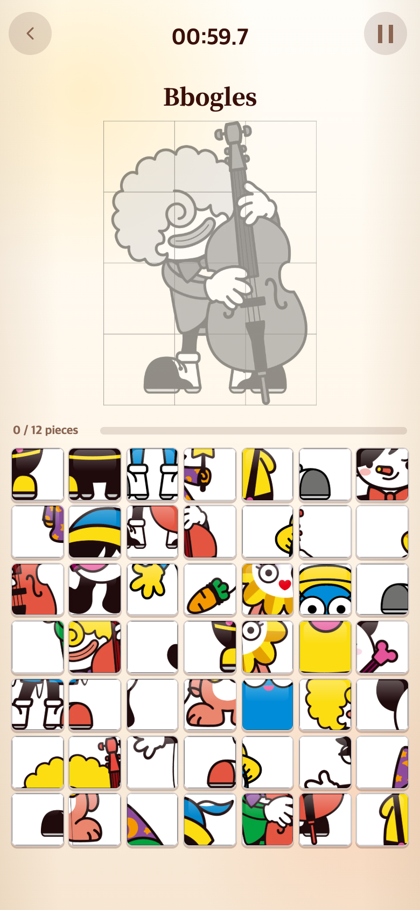 | 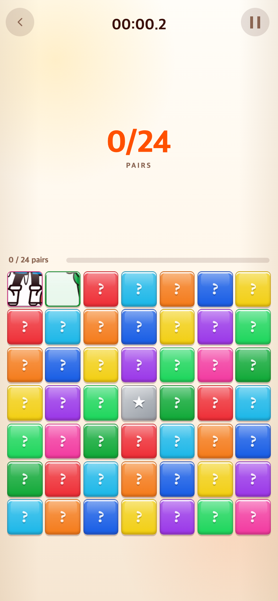 |

**확인과 한계:** 저장된 캡처는 이미지 로딩이 끝난 상태이므로 수정 전에도 정사각형이다. 따라서 왼쪽 사진을 직사각형 오류가 재현된 증거로 쓰면 안 된다. 이번 기록에서는 순간적인 로딩 오류를 성공적으로 캡처하지 못했다. 수정 내용은 커밋으로 추적하고, 오른쪽은 수정 후의 안정된 상태 참고 화면으로 남긴다. 별도의 저속 네트워크 동영상 검증이 필요하다.

## 11. 게임 1·2 — 시간 종료에서 다섯 번의 실수 기회로

**문제:** 제한 시간보다 실수 횟수로 게임을 운영하고 싶다는 요구가 있었고, 숫자만 줄어들 때 생명 감소가 잘 보이지 않았다.

**수정:** 게임 1·2의 시간 제한을 없애고 다섯 번 틀리면 Game Over가 되도록 변경했다(`36c3ad3`). 이어 다섯 하트, 잃은 하트의 회색 처리, 오답 시 붉은 경고와 짧은 흔들림을 추가했다(`48f8456`). 게임 3은 단계별 타이머를 유지한다.

| 이전 3분 타이머 방식 | 실수 기회의 숫자 표시 | 오답 직후 하트·경고 효과 |
|---|---|---|
| 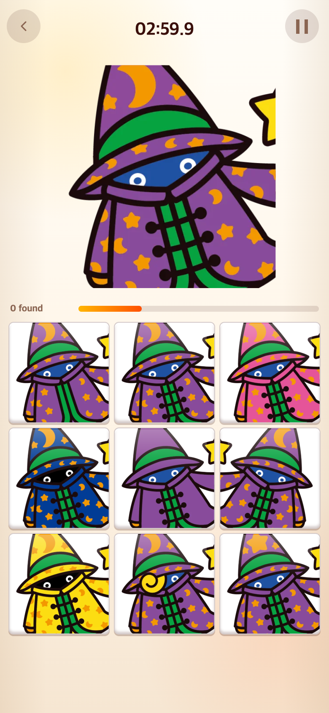 |  | 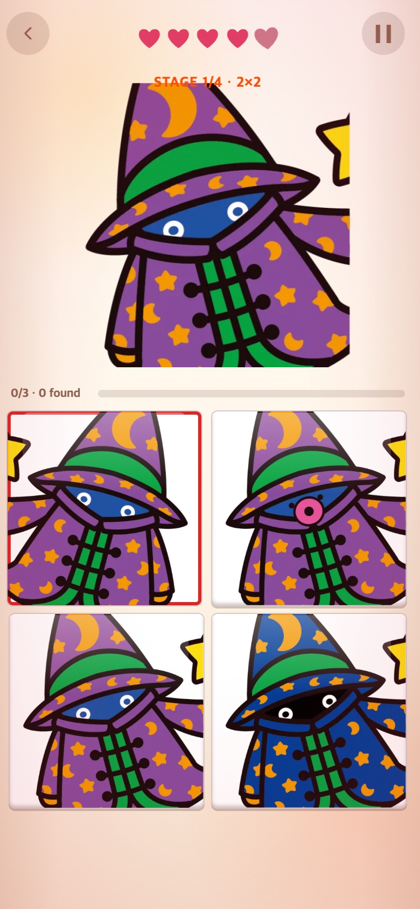 |
| `321798e` | `36c3ad3` | `48f8456` |

**확인:** 한 번 오답을 클릭한 상태에서 숫자 감소와 회색 하트, 붉은 경고 프레임을 재현했다. 정지 화면만으로 흔들림의 전체 움직임을 설명할 수는 없다.

게임 1은 이전에 10초 이내 1500점, 20초 이내 1200점, 30초 이내 900점, 45초 이내 600점, 60초 이내 300점의 구간을 도입했다(`607416e`). 이후 시간 종료를 없앤 현재 버전에서는 마지막 점수 구간이 60초 이후에도 적용된다. **이전 1분 제한과 현재 생명제 규칙을 혼동하지 않는다.**

## 12. 게임 2 — 작은 보드에서 시작하는 단계형 난이도

**요구:** 2×2로 시작하고, 단계별 통과와 생명 보너스를 넣는다. 후반부에는 더 어려운 오답과 위치 변경을 사용한다.

**수정:** `48f8456`에서 아래 흐름을 도입했다. 총 18개를 찾으면 네 단계를 모두 통과한다. 3×3 단계 완료 시 생명 한 개를 회복하되 최대 다섯 개를 넘지 않는다.

| 단계 | 보드 | 해당 단계 목표 | 누적 목표 | 특징 |
|---|---|---:|---:|---|
| 1 | 2×2 | 3개 | 3개 | 쉬운 오답 구성 |
| 2 | 3×3 | 5개 | 8개 | 중간 난이도, 완료 시 생명 +1 |
| 3 | 4×4 | 5개 | 13개 | 어려운 오답 구성 |
| 4 | 5×5 | 5개 | 18개 | 어려운 오답, 일부 위치 교환 |

| 현재 첫 단계 2×2 | 보너스를 받은 4×4 진입 |
|---|---|
| 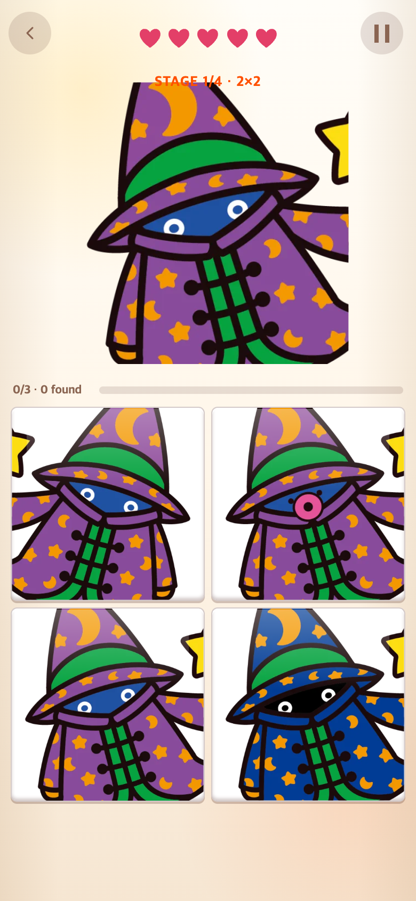 | 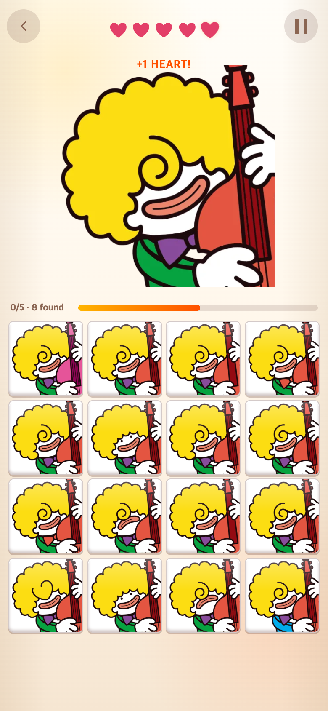 |

**확인:** 한 번 틀려 생명을 네 개로 만든 뒤 정답 여덟 개를 찾는 절차로 보너스를 재현했다. 파일명 `27-current-stage2`의 숫자 2는 게임 2를 가리키며, 화면은 **첫 단계**다. “아무도 통과하지 못할 정도”의 난이도는 검증된 결과나 보장 조건이 아니다. 시간 제한을 반으로 줄이는 방식은 현재 규칙에 적용하지 않았다.

## 13. 게임 2 — 전체 보드 깜빡임에서 두 칸의 문 닫힘·교환으로

**문제:** 후반에 보드 전체가 깜빡이며 바뀌면 어떤 변화가 일어났는지 알기 어려웠다. 일부 카드만 서로 자리를 바꾸는 방식이 요청되었다.

**수정:** `06783f7`에서 전체 보드 변화 대신 두 칸만 선택해 문이 닫히고, 가려진 동안 자리를 바꾼 다음 다시 열리도록 변경했다. 나머지 23칸은 유지한다. 기본 대기 6초, 닫힘 360ms, 가려짐 120ms, 열림 360ms의 흐름이다.

| 이전 전체 보드: 대기 | 이전 전체 보드: 변화 중 |
|---|---|
| 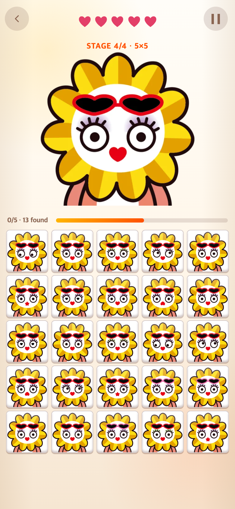 | 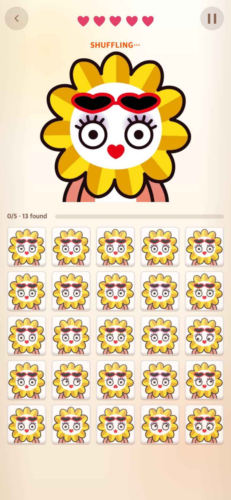 |
| `48f8456` | `48f8456` |

| 현재: 교환 전 | 현재: 두 칸 닫힘 | 현재: 교환 후 열림 |
|---|---|---|
|  | 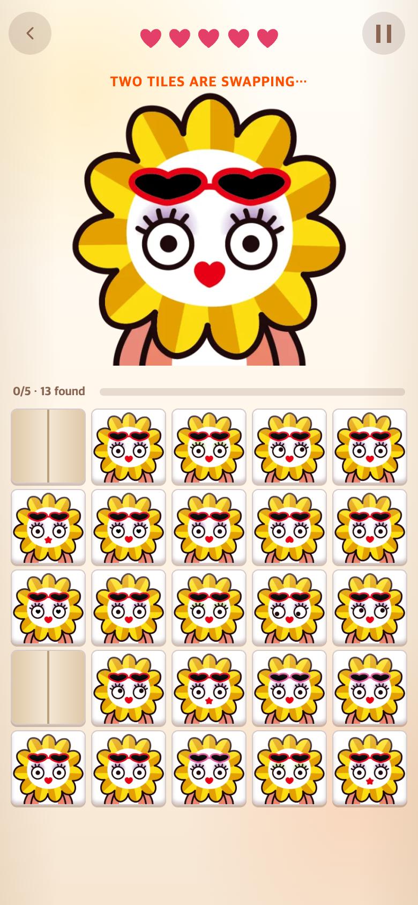 | 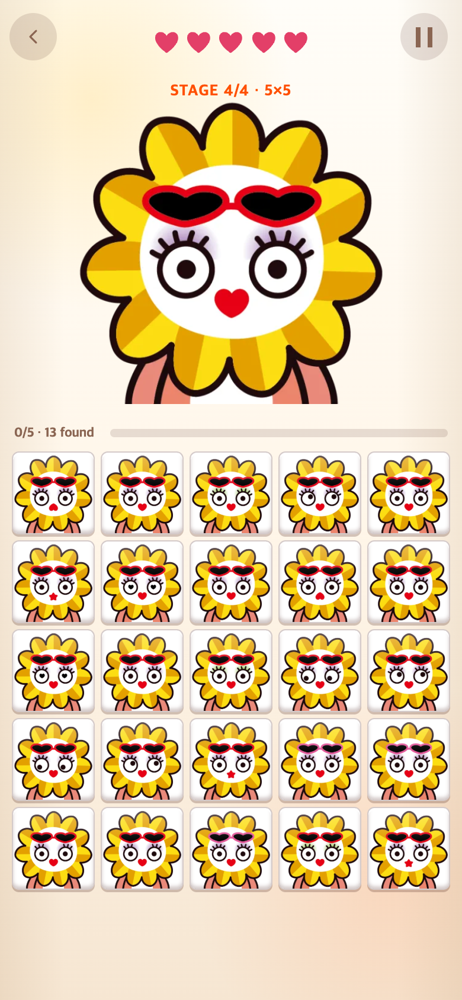 |
| `1b8b69f` | `1b8b69f` | `1b8b69f` |

**확인:** 같은 난수 시드와 같은 정답 클릭 절차를 사용해 세 프레임을 각각 재현했다. 가운데 캡처에서 교환 대상 표식은 두 칸이다. 정지 사진의 연속 비교이며 녹화 영상은 아니다. 교환 중 입력 잠금, 일시정지, 대상 선택 규칙은 테스트·코드로 확인한다.

## 14. 종료 영상의 캐릭터 연결

**요구:** 맞춘 캐릭터와 종료 영상이 연결되어야 한다. 게임 2는 클리어가 어려우므로 실패하더라도 마지막으로 플레이하던 캐릭터 영상을 보여준다. 이름이 4인 영상은 피노팬이다.

**수정:** 캐릭터별 영상 연결(`87f49fc`) 후, 생명제 도입 때의 티피 고정 실패 정책에서 **게임 2만 마지막 캐릭터를 사용**하도록 변경했다(`06783f7`). 게임 1의 실패 영상은 티피 고정을 유지한다.

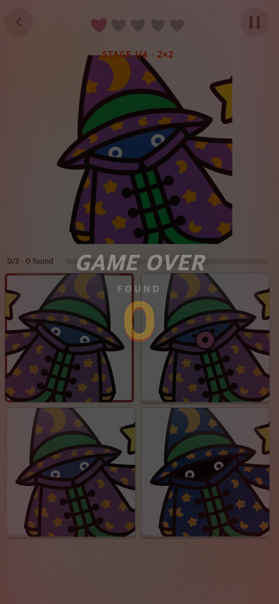

**확인:** 다섯 번 틀린 뒤 Game Over와 찾은 개수 표시를 재현했다. 이 사진은 종료 UI의 증거다. 영상 파일의 캐릭터 매핑은 코드 근거이며, 이 정지 화면만으로 영상 전체 재생·소리·종료 처리를 검증했다고 보지 않는다.

## 15. 게임 3에 잘못 보이던 하트 제거

**문제:** 생명제가 아닌 게임 3에도 하트가 나타났다.

**수정:** `1b8b69f`에서 게임 3의 생명 표시를 숨기고 상태를 정리했다. 게임 1·2의 하트는 유지했다.

| 수정 전: 게임 2에서 게임 3으로 진입 | 수정 후: 동일한 진입 경로 |
|---|---|
| 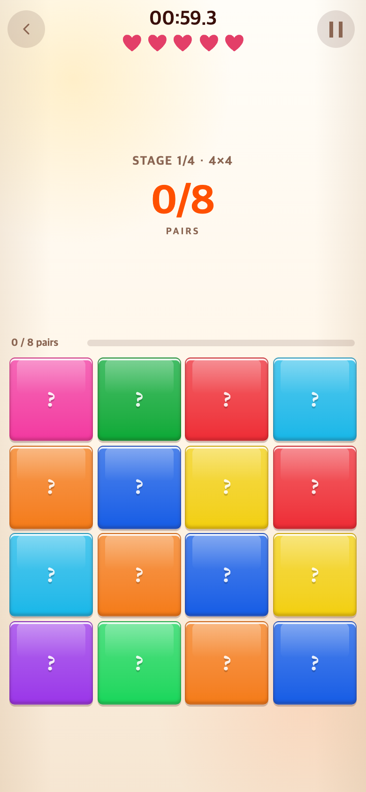 | 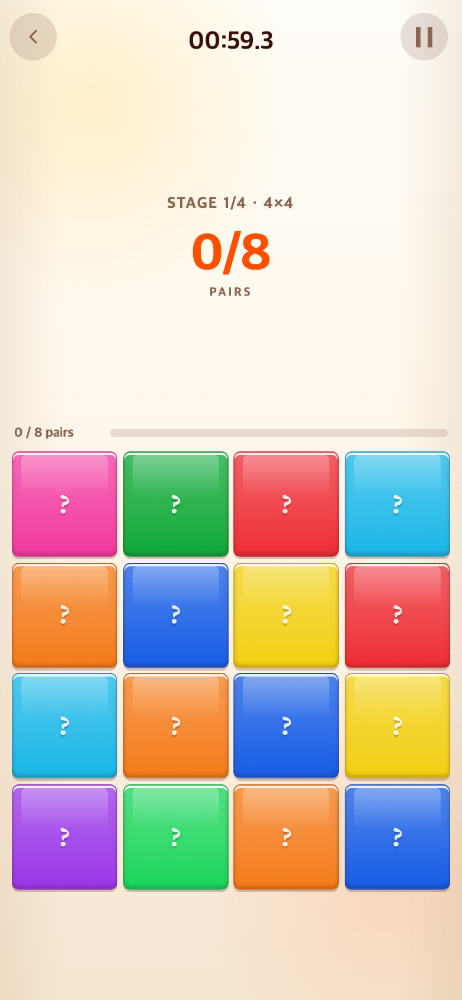 |
| `06783f7` | `1b8b69f` |

**확인:** 두 버전 모두 게임 2 실행 → 메뉴로 돌아가기 → 게임 3 실행 순서로 비교했다. 수정 후 생명 영역의 계산된 CSS display는 `none`이다. 게임 3의 단계 타이머와 페어 진행 표시는 남아 있다.

## 현재 상태 요약

| 구분 | 현재 주요 규칙 |
|---|---|
| 게임 1 | 7×7 조각 찾기, 전체 그림·이름 표시, 맞춘 부분 컬러 전환, 생명 5개, 시간 제한 없음 |
| 게임 2 | 얼굴 정답 1개와 제공된 오답, 일곱 캐릭터 순환, 2×2 → 3×3 → 4×4 → 5×5, 찾은 개수 표시, 생명 5개와 단계 보너스, 마지막 단계 두 칸 교환 |
| 게임 3 | 일곱 원본 얼굴만 사용, 4×4 → 5×5 → 6×6 → 7×7, 단계별 타이머, 홀수 보드 회색 별, 하트 없음 |

## 근거 파일과 재현 방법

- [manifest.json](manifest.json): 34개 캡처의 커밋 SHA, 커밋 시각, 시나리오, 이미지 경로·해시, 화면 상태, 브라우저 정보.
- [git-evidence.json](git-evidence.json): 기준 버전까지의 커밋 목록과 이미지 용량 비교 원자료.
- [capture.cjs](capture.cjs): 모바일 캡처 재현 스크립트.
- [evidence.cjs](evidence.cjs): Git 파일 크기·이력 추출 스크립트.
- [verify.cjs](verify.cjs): 이미지 크기·해시·문서 참조와 캡처 오류 검사.
- [verification.json](verification.json): 위 검사 결과.

재현에는 저장소의 Git 이력, 기존 개발 의존성, Node.js, Playwright, Chrome이 필요하다. Playwright는 기록 도구용 외부 설치를 사용했으며 게임의 package.json에는 추가하지 않았다.

```sh
NODE_PATH=/path/to/node_modules CHROME_PATH=/path/to/chrome node docs/research/2026-09-05/capture.cjs
node docs/research/2026-09-05/evidence.cjs
node docs/research/2026-09-05/verify.cjs
```

`RESEARCH_REFS=1b8b69f`처럼 지정하면 선택한 버전만 다시 캡처할 수 있다. 스크립트는 Git 스냅샷을 새 임시 폴더에 내보내고 로컬 Vite 서버에서 실행한다. 현재 작업 브랜치를 과거 버전으로 돌리지 않는다. 로컬 자산을 불러온 뒤 캡처하며, 난수 시드를 고정하고 브라우저 시계를 제어해 원하는 애니메이션 프레임을 재현한다. 따라서 프레임의 시간 값은 실제 플레이어가 소요한 시간이 아니다.

### 연구 자료로 사용할 때의 한계

1. 커밋이 없는 중간 상태는 임의로 만들어 전·후 화면으로 제시하지 않았다. 한 커밋에 여러 수정이 포함된 경우에는 한 가지 수정만의 효과를 분리할 수 없다.
2. 같은 화면 구성 비교라도 버전별 캐릭터·난수 소비 방식이 달라 대상 이미지가 다를 수 있다. 엄밀한 동일 자극 실험 자료가 아니다.
3. 캡처는 이미지 로딩 완료 후의 재현 화면이다. 초기 로딩 지연·순간 레이아웃 흔들림을 정지 화면으로 입증하지 못한 부분은 별도 표시했다.
4. 사용자 난이도, 실패율, 만족도, 로딩 속도는 별도 측정해야 한다. 후속 연구에서는 기기·브라우저·네트워크·캐시 상태, 성공률, 오답 수, 완료 시간, 참가자 수를 함께 기록하면 좋다.

### 게임에 미치는 영향

이번 기록 작업의 추가 파일은 **docs/research/** 안에만 둔다. 게임 소스·규칙·원본 이미지·의존성은 수정하지 않는다. 앱에서 이 문서를 불러오지 않으며 일반 게임 빌드에 스크린샷을 포함하지 않는다. Git에 올리면 저장소 용량은 늘지만 게임 다운로드용 자산에 자동으로 추가되는 것은 아니다. 원본 **Junyyyong/TAPtoTALK** 저장소는 수정하지 않는다.

기록 작성 후 `npm run build`가 성공했으며, `npm test -- src/core/pick src/content/puzzles.test.ts`의 **4개 파일, 36개 테스트가 통과**했다. 문서 검사에서는 34개 PNG의 크기·해시·참조 경로, 캡처 중 페이지 오류 없음, 표시 이미지 로딩 완료를 확인했다. 스크린샷 원본의 합계 크기는 약 25.7 MB이며, 일반 빌드 결과에 연구 기록 파일이 들어가지 않는 것도 확인했다.
