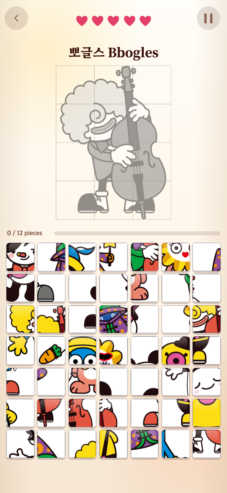
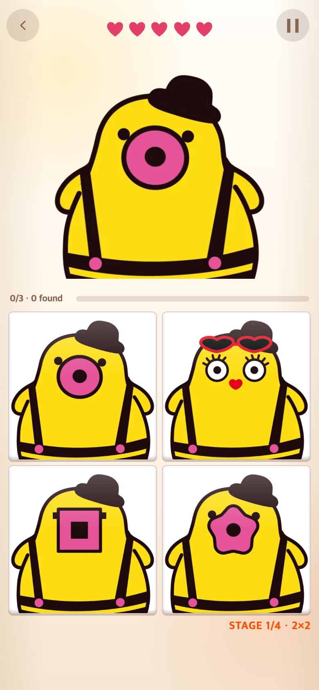
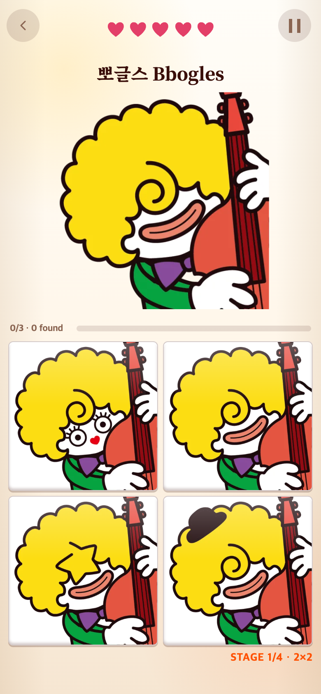

# 게임 1·2 — 한글과 영어 캐릭터 이름 표시

2026-09-06. 변경 전 코드 기준: `dda4ce0`.

## 요청 → 수정

게임 2에도 게임 1처럼 이름을 표시하고, 두 게임 모두 `재피 Zapee`와 같이 한글과 영어를 함께 보여 달라는 요청을 반영했다. 기존 이름 영역을 두 게임에서 공유하며, 게임 2는 문제가 바뀔 때 이름도 갱신한다. 이름 공간을 확보하고 게임 2의 단계 표시는 보드 아래 오른쪽에 유지했다. 게임 3은 이름을 표시하지 않는다.

| 한글 | 영어 |
|---|---|
| 태피 | Tapee |
| 티피 | Tepee |
| 후피 | Hooopee |
| 재피 | Zapee |
| 해피 | Hapee |
| 뽀글스 | Bbogles |
| 피노팬 | PinoPan |

게임 2에 남아 있던 Haepi/Hupi/Jaepi/Pino Pan 표기도 승인된 영어 이름으로 통일했다. 캐릭터 ID·이미지 경로·영상 매핑·게임 규칙은 바꾸지 않았다.

## 화면

| 게임 1: 이전 영어 이름 표시 참고 (`8d2f5e1`) | 게임 1: 한글·영어 함께 표시 |
|---|---|
|  |  |

| 게임 2: 이름 없음 (`dda4ce0` 적용 시 기록) | 게임 2: 한글·영어 이름 추가 |
|---|---|
|  |  |

이전 기록의 스크린샷을 재사용했다. 특히 게임 1의 이전 화면은 생명제 이전 버전이므로 이름 외에도 다른 UI 차이가 있다. 동일 캐릭터·동일 버전의 통제 비교로 해석하지 않는다. 새 캡처는 390×844 CSS px, 배율 2의 780×1688 PNG이며 실제 휴대폰 촬영은 아니다.

## 확인 결과

- 콘텐츠 테스트에서 두 게임의 일곱 이름이 정확히 일치하는지 확인했다. 관련 Vitest 39개 통과, 빌드 성공.
- 390×844, 375×667, 430×932에서 이름과 그림이 겹치지 않고 보드가 화면 안에 들어오는지 확인했다.
- 게임 2에서 정답을 클릭하며 일곱 캐릭터의 이름이 갱신되는지, 하단 단계 표시가 유지되는지 확인했다.
- 게임 3에서는 이름을 숨기는 것을 확인했다. 브라우저 페이지 오류 없음.

검증 코드: [check.cjs](check.cjs), 결과: [verification.json](verification.json). 포트 5189의 로컬 개발 서버와 외부 Playwright 설치로 실행한다. 난수·브라우저 시계는 재현용으로 제어하며, 사용자 연구나 성능 측정은 아니다.

```sh
NODE_PATH=/path/to/node_modules node docs/research/2026-09-06-character-names/check.cjs
```
