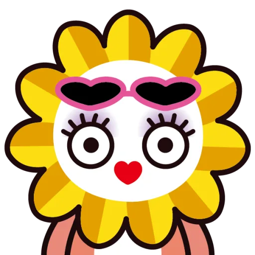
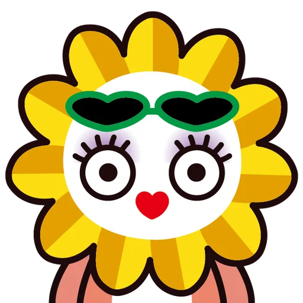
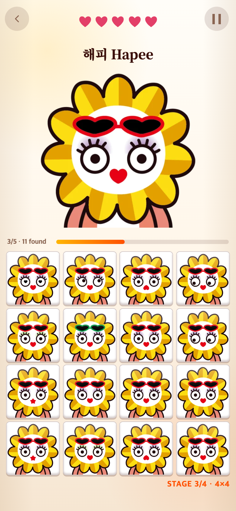

# 해피 11번 — 분홍 선글라스에서 초록 선글라스로

2026-09-06. 업로드 기준 커밋 `be3fe5f`.

기존 분홍 선글라스는 정답과 차이가 잘 보이지 않는다는 요청에 따라, 사용자가 제공한 `해피-얼굴/해피-11-초록.png`를 게임 2의 11번 이미지로 교체했다. 기존 `해피-얼굴/해피-11.png`는 요청대로 삭제했다. 삭제 전 원본은 Git 이력에서 복구할 수 있다.

게임용 경로 `optimized/montage/haepi/variation-11.webp`는 유지하고 내용을 교체했다. 새 PNG를 비율·투명도를 보존한 512×512 WebP로 변환했다(quality 85). 변환 스크립트: [convert.cjs](convert.cjs). 난이도 목록·게임 1·3·정답 이미지·제외 목록은 변경하지 않았다. 첫 2×2에는 여전히 색상만 바뀐 11번이 나오지 않는다.

| 이전 게임용 이미지 | 교체한 게임용 이미지 |
|---|---|
|  |  |

위 비교 이미지는 자산 자체이며 게임 화면 캡처가 아니다. 이전 이미지는 연구 기록에만 남고 현재 게임에서는 사용하지 않는다.

## 모바일 확인

390×844 CSS px, 배율 2에서 실제 정답을 클릭하며 새 11번이 출제된 상태를 캡처했다. [check.cjs](check.cjs)와 [verification.json](verification.json)에 재현 절차·출제 이미지 목록을 남겼다. 브라우저 난수·시계는 재현용으로 제어했으며 실제 기기 촬영이나 시인성 실험은 아니다. 관련 테스트 44개 통과, 빌드 성공. 초록색이 더 잘 구분되는지는 실제 플레이로 추가 검토할 수 있다.
