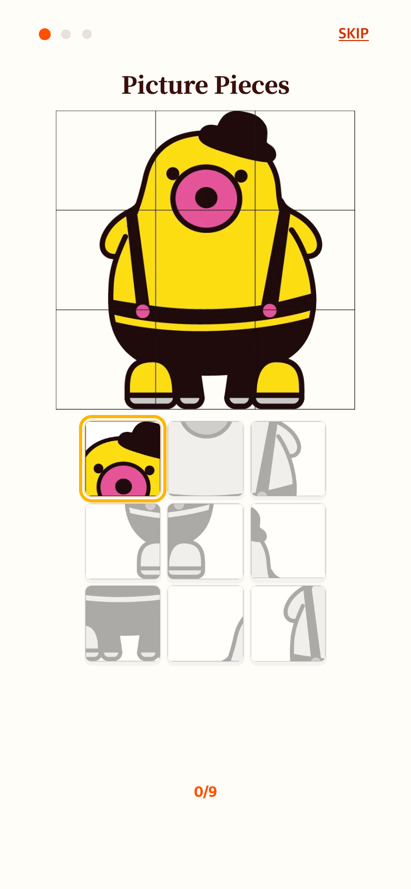
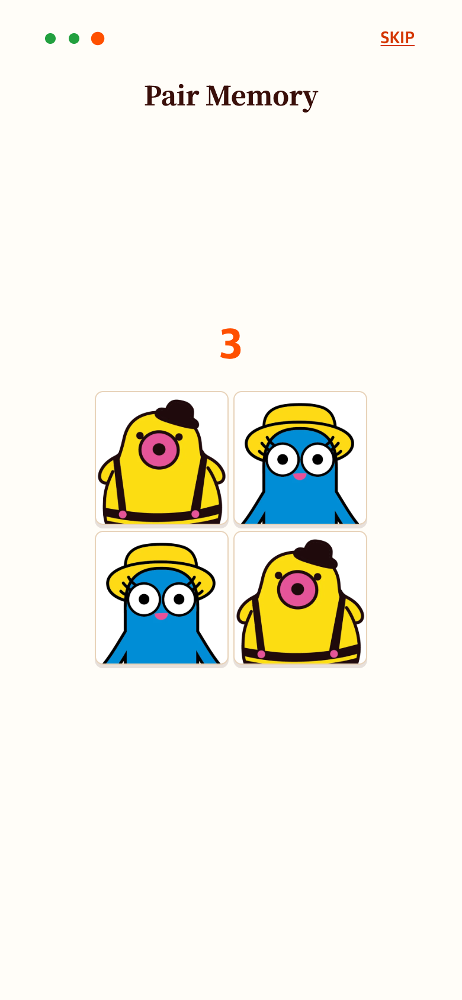
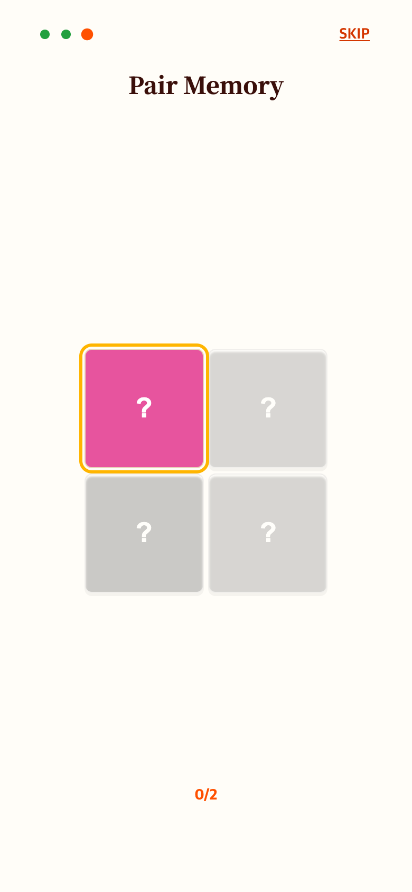

# 9조각 안내와 컬러 카운트다운

기존 4칸 중 3개를 누르는 예제가 모호하다는 피드백으로 첫 안내를 티피의 정답 9조각 전체를 찾는 3×3으로 변경했다. 제시 그림의 자동 위 여백을 제거해 제목 바로 아래로 올렸다. 왼쪽 첫 진행 점 위치를 유지하고 점 중심 간격을 36px에서 20px로 줄였다. 완료 체크는 없애고 Next/Done만 표시한다.

페어 안내는 이미지 로딩 후 모든 얼굴을 컬러로 표시하며 위에 3·2·1을 각 1초 보여준다. 카운트가 끝나면 가리고 다음 카드의 금색 맥동으로 누를 차례를 안내한다. 미리보기 컬러가 기존 회색 처리 스타일에 덮이지 않도록 우선순위도 수정했다.

이전: [2초 미리보기 안내](../2026-09-06-help-preview/README.md)

| 첫 안내 | 페어 컬러 미리보기 | 입력 시작 |
| --- | --- | --- |
|  |  |  |

현재 작업 버전의 Chrome 모바일 에뮬레이션, 390×844 CSS px·DPR 2(780×1688 PNG). 실제 기기 사진은 아니다.

검증: 390×844, 375×667, 320×568에서 9회 입력 완료, 컬러 스타일, 3·2·1 각 1초, 카운트 중 입력 차단, 화면 이탈 시 예약 취소, 완료 체크 없음, Skip/Next 및 스크롤 없음 확인. `check.cjs`, `verification.json` 참고. Vitest 205개와 빌드 통과.
