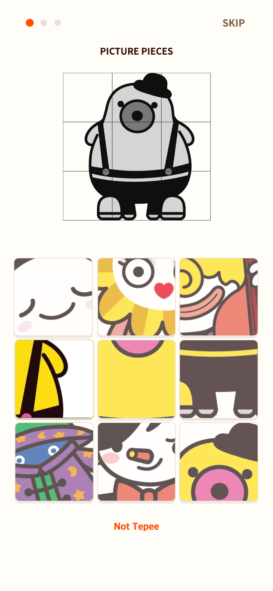

# 다른 캐릭터 오답과 TALK 스타일 안내

첫 안내를 티피 정답 4조각+다른 캐릭터 오답 5조각의 3×3으로 확장했다. 보드 폭은 기존 폭의 1.5배에 반 간격을 더해 개별 카드 크기를 유지한다. 오답은 컬러로 구분할 수 있으며 누르면 짧은 흔들림과 Not Tepee를 표시하고 진행·컬러 복원은 하지 않는다.

TAPtoTALK의 src/ui/styles/talk.css를 읽기 전용 참조했다. 안내 제목은 TAP Sans KR 13px 대문자, Skip은 700 14px/1 및 ink-soft 색상, Next는 최대320px·14px로 맞췄다. 강조는 TALK의 1.1초 금색 링·2px 떠오르기, 오답은 .32초 흔들림을 사용한다. 이미지 안내 특성상 본문 그림 위치는 모바일 화면에 맞춰 조정했으며 TALK 텍스트 예제와 픽셀 단위로 동일하다는 의미는 아니다. 이전 손가락·화살표·다시하기는 복원하지 않았다.

이전: [미니 안내](../2026-09-06-help-mini/README.md). 현재 작업 Chrome 모바일 에뮬레이션 390×844 CSS px, DPR2 PNG. 실제 기기 사진 아님.

검증: 3가지 모바일 크기에서 9칸, 개별 카드 폭 유지, 오답 시 진행 없음, 정답4개 완료, 페어 카운트다운·컬러·스크롤 없음 확인. Vitest205개 통과. 본 게임 및 원본 TALK 수정 없음.
