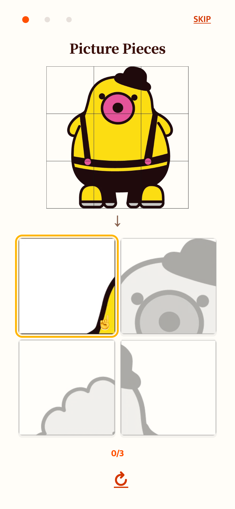
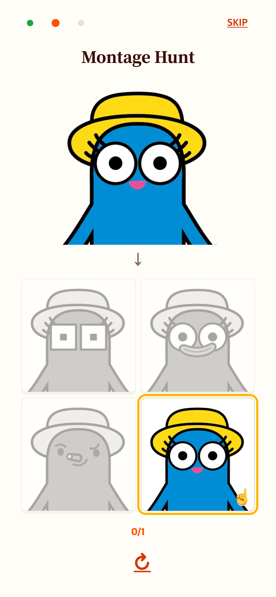
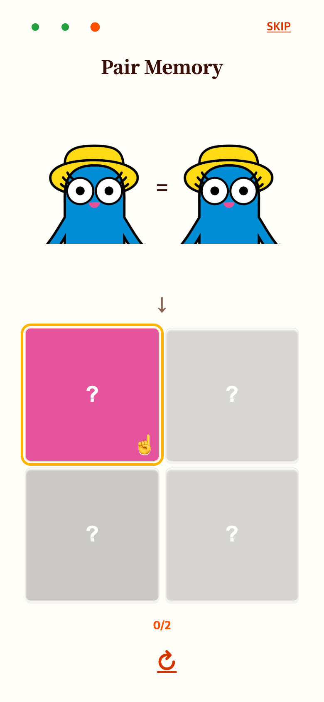
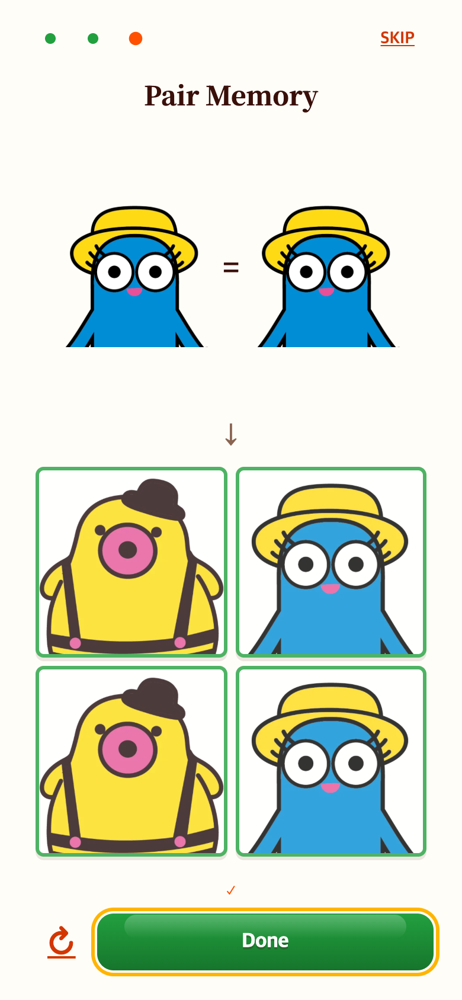

# How to Play 전체 화면과 큰 제시 이미지

## 문제

안내가 팝업 테두리 안에 들어가 있어 참조 게임과 레이아웃이 달랐다. 특히 높이 700px 이하에서 제시 그림은 60px로 축소되어 알아보기 어려웠다.

## 변경

TAPtoTALK의 `src/ui/styles/talk.css`와 TAPtoTEN의 `src/ui/styles/tutorial.css`를 읽기 전용으로 확인했다. TAPtoTALK처럼 전체 화면·상단 진행 점과 오른쪽 Skip·중앙 체험·하단 Next 구조로 맞췄다. 제시 그림은 화면 높이의 25–28%, 보드는 34–39%로 확대했다. 원본 비율을 유지하고 기존 컬러 강조·손가락 표시·직접 누르는 순서는 유지했다. 게임 규칙은 변경하지 않았다.

## 화면 비교

이전: [기존 안내 화면](../2026-09-06-visual-help/README.md)

| 조각 찾기 | 몽타주 찾기 | 페어 찾기 |
| --- | --- | --- |
|  |  |  |

완료 화면: 

현재 작업 버전을 Chrome 모바일 에뮬레이션 390×844 CSS px, 배율 2(780×1688 PNG)로 캡처했다. 실제 휴대폰 사진은 아니다. 기존 스크린샷 해상도는 변경하지 않았다.

## 검증

390×844, 375×667, 320×568에서 가로 전체 화면, 제시 이미지 높이, 스크롤 없이 표시, 세 체험 완료·Next·Skip·재시도·설정창 복귀·동작 줄이기를 확인했다. `check.cjs`와 `verification.json` 참고. 전체 테스트 204개와 production build 통과.
