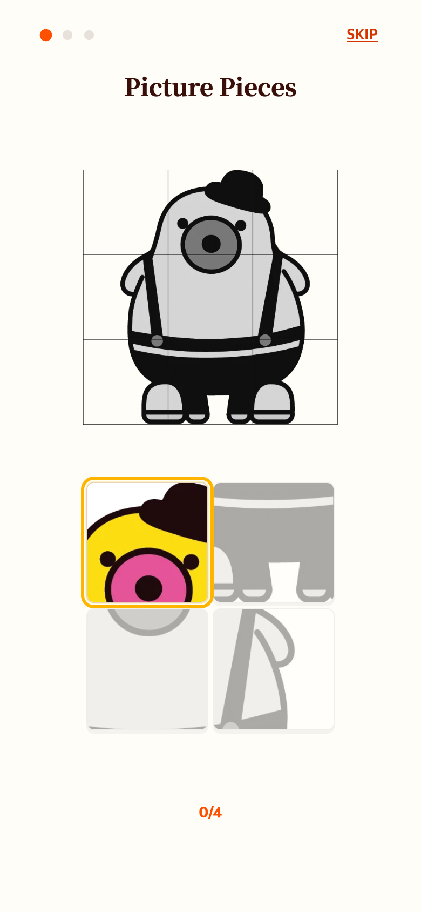
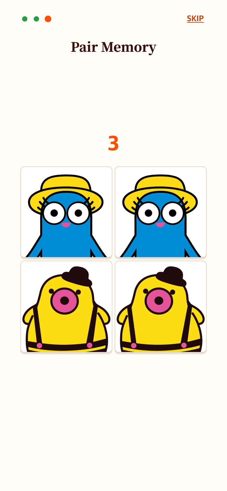

# 첫 게임 미니 안내와 메모리 카드 확대

기존 첫 안내는 앞쪽 네 조각만 선택하여 빈 여백이 많은 조각이 포함됐다. 실제 첫 게임의 티피 조각 중 2·5·6·8번을 선택하고 원본 정사각 비율을 유지했다. 블록 이미지 가장자리 선은 1.02배 표시로 가장자리만 숨긴다. 실제 게임처럼 회색 제시 그림에서 맞힌 조각 영역을 컬러로 복원한다. 네 조각 샘플이므로 완료 후 나머지 영역은 회색으로 유지된다.

제시 그림과 보드 간격을 24–44px 추가했다. 페어 카드는 보드 폭을 최대 320px로 확대했고 3·2·1 컬러 미리보기는 유지했다. 본 게임 파일과 원본 이미지는 수정하지 않았다.

| 조각 안내 | 페어 안내 |
| --- | --- |
|  |  |

이전: [레이아웃 통일](../2026-09-06-help-unified/README.md). 현재 작업 버전 Chrome 모바일 에뮬레이션 390×844 CSS px, DPR 2 PNG 캡처. 실제 기기 사진은 아니다. 세 모바일 크기의 완료·카운트다운·스크롤 없음 검증은 check.cjs와 verification.json 참고.
