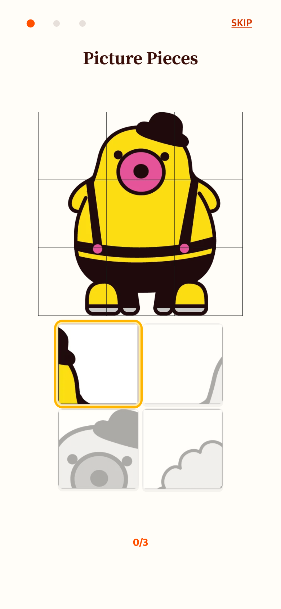
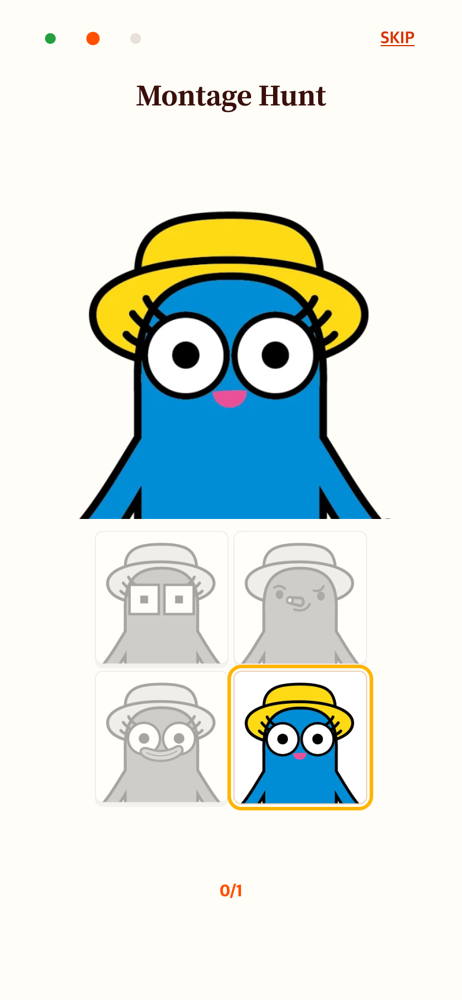
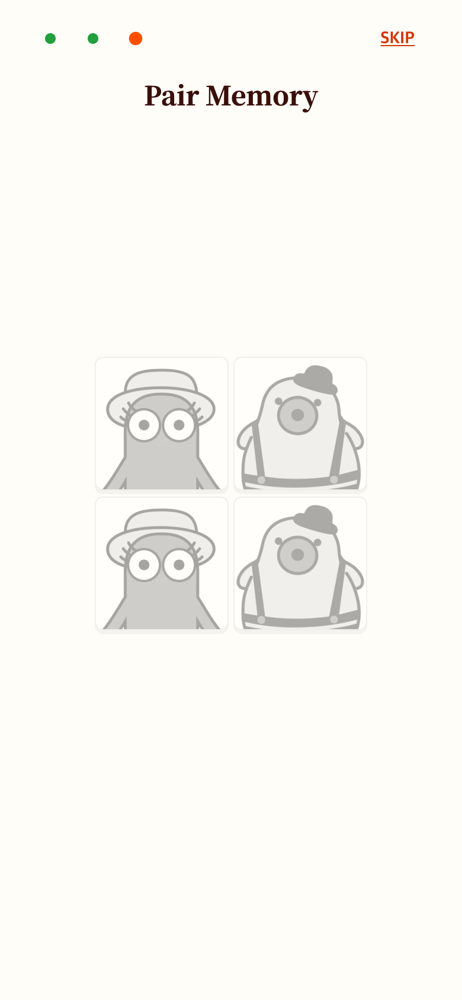
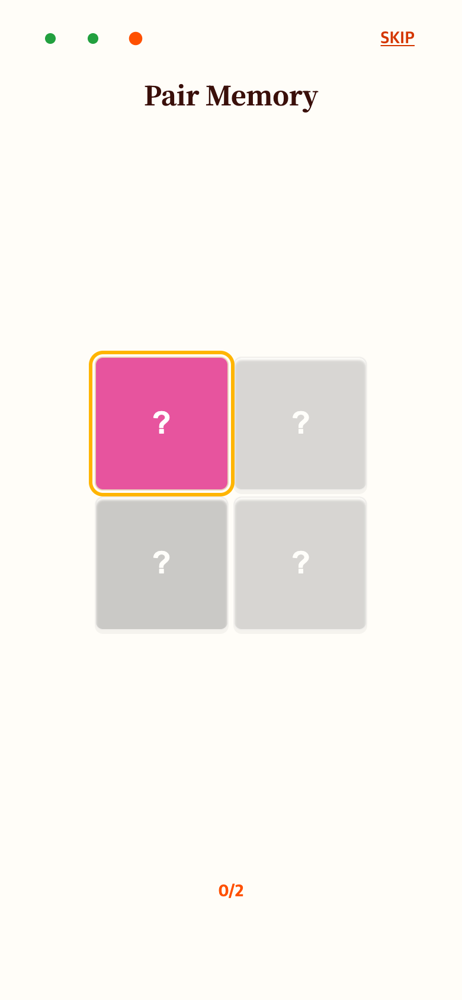

# How to Play 시각 요소 정리와 페어 미리보기

## 요청과 변경

손가락 이모지, 다시하기 버튼, 제시 그림 아래 화살표를 제거했다. 이전 버전 대비 제시 그림 높이는 20% 확대하고 보드 폭과 간격은 30% 줄였다. 이미지 비율은 유지한다.

세 번째 안내는 상단 예시 그림을 제거하고 카드 네 장의 얼굴을 모두 보여준다. 이미지 디코딩 완료 후 2초가 지나면 뒷면으로 바꾸고 다음 카드에 컬러와 금색 맥동 효과를 적용한다. 미리보기 동안 입력은 차단하며, 다른 안내로 이동하거나 닫으면 예약된 전환을 취소한다. 본 게임 규칙은 바꾸지 않았다.

## 화면

이전: [전체 화면 안내](../2026-09-06-help-layout/README.md)

| 조각 찾기 | 몽타주 |
| --- | --- |
|  |  |

| 페어 2초 미리보기 | 가린 뒤 빛으로 안내 |
| --- | --- |
|  |  |

Chrome 모바일 에뮬레이션 390×844 CSS px, DPR 2로 현재 작업 버전을 캡처했다(780×1688 PNG). 실제 기기 사진은 아니다. 기존 기록 이미지는 변경하지 않았다.

## 검증

`check.cjs`: 390×844, 375×667, 320×568에서 요소 제거, 미리보기 중 입력 차단, 1999ms까지 앞면 유지·2000ms에 가림, 순차 유도, 완료·Skip, 단계 전환 시 예약 취소, 스크롤 없음, reduced motion을 검증했다. 결과는 `verification.json`. 전체 테스트 204개 및 production build 통과.
