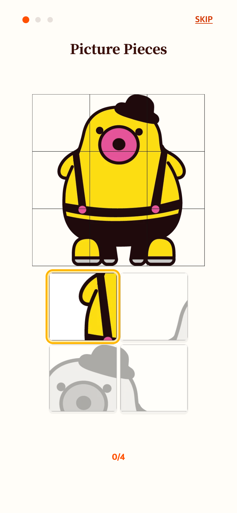
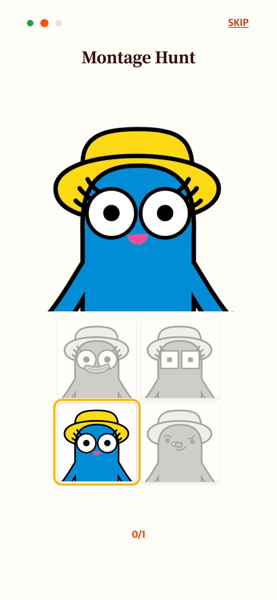

# 첫째·둘째 안내 레이아웃 통일

첫 안내만 위로 당긴 그림과 9칸 보드를 사용하던 구성을 둘째와 동일하게 맞췄다. 첫 안내 전용 CSS를 제거해 그림·보드 위치와 크기를 공유하고, 2×2 샘플 정답 4조각을 모두 누르는 방식으로 줄였다. 본 게임과 세 번째 안내는 유지했다.

이전: [9조각 안내](../2026-09-06-help-countdown/README.md)

| 첫 안내 | 둘째 안내 |
| --- | --- |
|  |  |

현재 작업 버전 Chrome 모바일 에뮬레이션 390×844 CSS px, DPR 2(780×1688 PNG) 캡처. 실제 기기 사진은 아니다.

검증: 390×844, 375×667, 320×568에서 두 안내의 그림과 보드 bounding box가 동일함을 자동 확인했다. 각 4칸, 연습 완료, 페어 카운트다운, Skip/Next, 스크롤 없음도 확인했다. `check.cjs`, `verification.json` 참고. Vitest 205개와 production build 통과.
