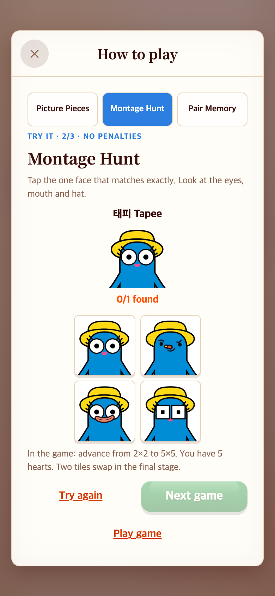
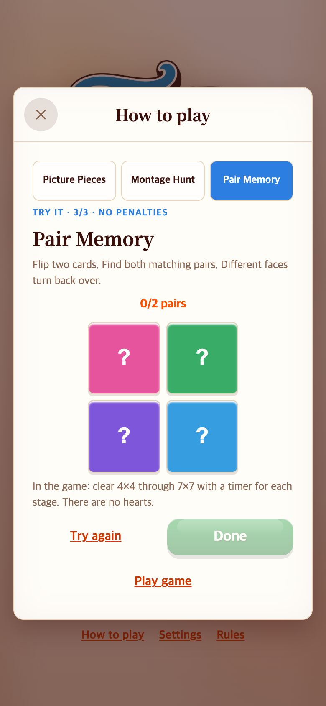
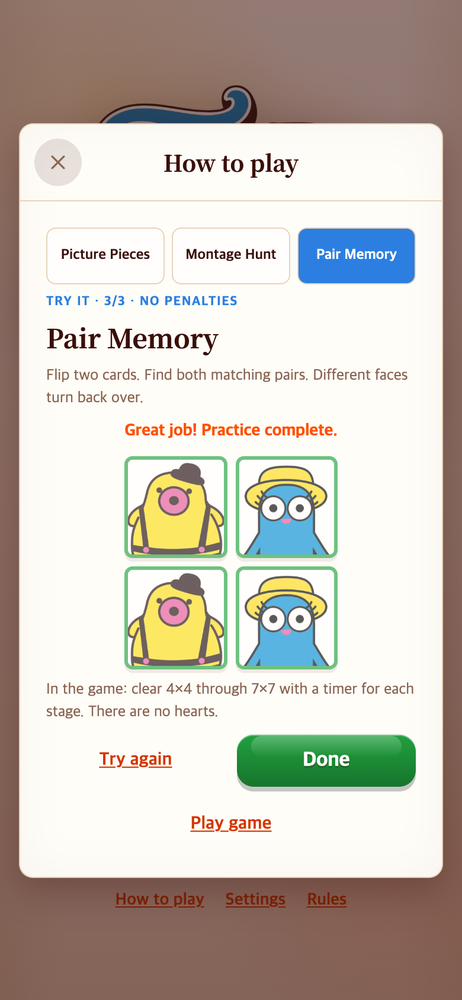

# How to play — 글 안내에서 직접 누르는 연습으로

2026-09-06. 기존 TAPtoPICK의 `showHowToPlay`는 세 게임 규칙을 글로만 표시했다. 사용자가 TAPtoTALK처럼 직접 체험하는 버튼형 안내를 요청했다.

## 참고와 변경

TAPtoTALK의 `showTutorial`·`renderTutorial`·`playTutorialKey`를 읽기 전용으로 참고했다. 버튼 입력 → 정답·오답 피드백 → 성공 후 다음 단계라는 흐름을 이미지 게임에 맞게 적용했다. 원본 저장소는 변경하지 않았다.

상단의 **Picture Pieces / Montage Hunt / Pair Memory** 버튼으로 원하는 연습을 바로 선택한다. 본 게임과 구분되는 작은 연습판이며 하트·시간 제한·점수 저장은 없다.

| 연습 | 직접 해보는 동작 |
|---|---|
| Picture Pieces | 전체 그림을 보고 샘플 조각 3개를 찾는다. 다른 캐릭터 조각 1개는 오답이다. |
| Montage Hunt | 2×2에서 원본 얼굴과 정확히 같은 그림 한 개를 찾는다. 오답은 승인된 형태 변경 이미지다. |
| Pair Memory | 카드 4개를 뒤집어 원본 얼굴 두 쌍을 맞춘다. 오답은 650ms 뒤 다시 닫힌다. |

정답은 완료 표시가 남고, 오답에는 안내·소리/햅틱 설정에 따른 피드백을 준다. **Try again**으로 해당 연습을 초기화한다. 성공하면 **Next game / Done**을 사용할 수 있고, **Play game**은 선택한 실제 게임을 새 판으로 시작한다. 상단 선택 버튼과 닫기는 성공 전에도 사용할 수 있다.

## 모바일 캡처

| 조각 찾기 연습 | 같은 얼굴 찾기 연습 |
|---|---|
|  |  |

| 페어 연습 | 페어 연습 완료 |
|---|---|
|  |  |

390×844 CSS px, 배율 2로 저장한 780×1688 PNG다. 작은 375×667 화면에서도 버튼 클릭을 검사했다. 내용이 화면보다 긴 경우 도움말 내부를 스크롤할 수 있다. 캡처는 변경 후 실제 UI이며, 변경 전 글 안내는 코드 이력으로 추적한다. 변경 전 이미지를 임의로 만들어 비교하지 않았다. 실제 휴대폰 촬영·난이도 실험은 아니다.

## 구조와 검증

- `src/content/pickTutorial.ts`: 연습에 쓰는 기존 이미지와 안내 문구.
- `src/core/pick/tutorial.ts`: DOM과 분리된 연습 정답·페어 상태. 기존 게임 상태나 저장소에 접근하지 않는다.
- `src/ui/pickTutorial.ts`: 연습 버튼과 피드백. 창 닫기·탭 변경·실제 게임 시작 시 남아 있는 카드 닫기 타이머를 해제한다.
- 새 규칙 테스트 4개를 포함해 관련 Vitest **43개 통과**, 빌드 성공.
- [check.cjs](check.cjs)에서 세 연습 완료, 오답, 페어 불일치 후 닫힘, 재시도, 탭 전환 중 타이머 정리, 세 실제 게임 시작, 닫기·재진입을 검사했다. [verification.json](verification.json)에 모바일 크기별 결과를 남겼다. 페이지 오류 없음.

로컬 5189 포트의 개발 서버와 외부 Playwright 설치를 사용한다. 브라우저 시계는 재현용으로 제어했으며 실제 소요 시간·네트워크 성능을 측정한 것은 아니다.

```sh
NODE_PATH=/path/to/node_modules node docs/research/2026-09-06-interactive-help/check.cjs
```

본 게임의 단계·점수·하트·영상 규칙은 그대로다. 추가 이미지를 만들지 않고 이미 최적화된 게임 자산을 재사용한다. 연구 기록은 게임 실행 코드에서 불러오지 않는다.
