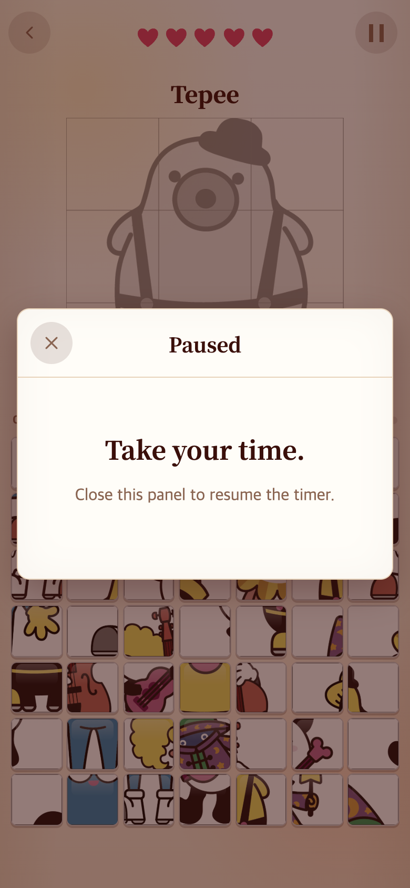
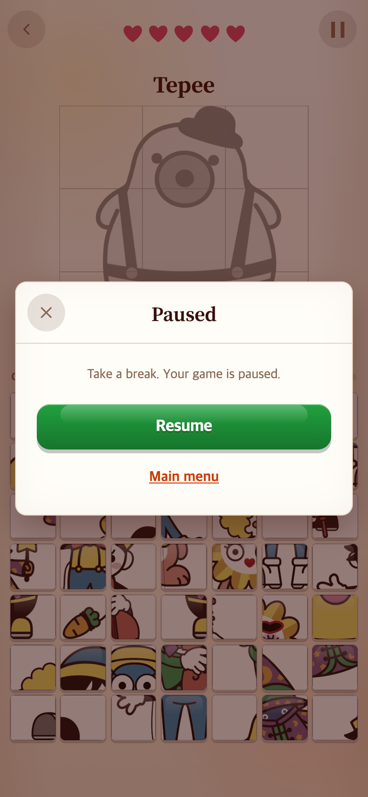

# 2026-09-06 — 일시정지 창에서 메인 메뉴로 나가기

## 문제 → 수정

기존 일시정지 창은 닫아서 재개하는 방법만 안내했다. 사용자가 일시정지 상태에서 바로 메인 화면으로 나갈 수 있도록 요청했다.

로컬 TAPtoTALK 기준 버전 `ee9c9c0`의 `src/ui/talkApp.ts` 일시정지 구성을 읽기 전용으로 참고했다. 같은 `pause-card`, `wood-btn`, `text-btn` 스타일을 재사용해 **Resume → Main menu** 순서로 버튼을 배치했다. 시간 제한이 없는 게임도 있으므로 안내는 “Your game is paused.”로 표현했다.

- **Resume:** 현재 판을 이어서 진행한다.
- **Main menu:** 현재 판을 끝내고 게임 선택 메뉴로 돌아간다. 타이머를 재개하지 않으며, 다음에 게임을 선택하면 새 판을 시작한다.
- 기존 닫기 버튼도 계속 재개 기능으로 작동한다.
- 게임 1·2·3에 공통 적용한다. 게임 규칙·자산·TAPtoTALK 원본은 변경하지 않았다.

## 모바일 전후 화면

| 변경 전 (`e8cfe00`) | 변경 후 |
|---|---|
|  |  |

390×844 CSS px, 배율 2로 실행해 780×1688 PNG로 저장했다. 변경 전후 각각 실제 메뉴에서 첫 게임을 시작하고 일시정지를 눌렀다. 배경의 캐릭터는 무작위이며 동일 캐릭터 비교가 아니다. 브라우저 시계는 검증을 위해 제어했다. 실제 기기 촬영이나 사용자 편의성 실험은 아니다.

## 확인 결과

- 세 게임 모두 일시정지 → 재개 → 일시정지 → 메인 메뉴 → 새 판 시작 → 닫기로 재개를 브라우저에서 확인했다.
- 일시정지 중 시계 표시가 변하지 않고, 게임 3은 Resume 이후 다시 흐르는 것을 확인했다.
- 메인 메뉴 진입 후 일시정지 창이 숨겨지고, 기다려도 게임으로 돌아가지 않는 것을 확인했다.
- 캡처 중 페이지 오류 없음. `npm run build` 성공, 관련 Vitest 38개 통과.

검증 스크립트는 [check.cjs](check.cjs), 결과는 [verification.json](verification.json)이다. 로컬 개발 서버를 5189 포트에서 실행하고 외부 Playwright 설치를 이용한다. `BEFORE=1`은 기존 버전의 화면 기록에 사용했으며, 기본 실행은 변경 후 세 모드 동작을 검사한다. 과거 화면을 재현하려면 해당 Git 버전을 별도 폴더에서 실행한다.

```sh
NODE_PATH=/path/to/node_modules node docs/research/2026-09-06-pause-menu/check.cjs
```

이 기록과 스크린샷은 게임 실행 코드에서 불러오지 않는다.
