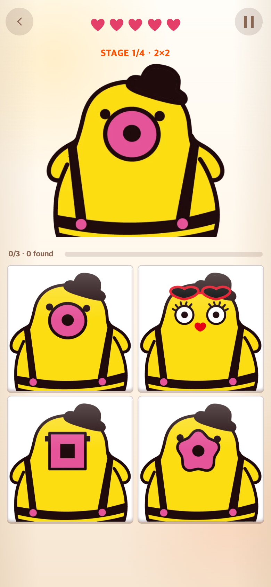

# 게임 2 단계 표시를 보드 아래 오른쪽으로 이동

2026-09-06. 변경 전 기준: `eba376b`.

## 요청과 수정

제시 그림 위에 있던 `STAGE 1/4 · 2×2` 표시를 그림 버튼 아래 오른쪽으로 옮겨 달라는 요청에 따라, 상태 요소를 보드 다음에 배치하고 보드 폭에 맞춰 오른쪽 정렬했다. 작은 화면에도 같은 정렬을 적용했다. 같은 요소에 표시되는 생명 보너스·교환 안내도 새 위치에 나타난다. 게임 1·3에서는 계속 숨겨진다. 규칙·이미지·점수는 바꾸지 않았다.

| 변경 전 | 변경 후 |
|---|---|
|  |  |

390×844 CSS px, 배율 2의 모바일 브라우저 캡처(780×1688 PNG). 동일 난수 시드로 첫 문제를 재현했다. 실제 휴대폰 촬영은 아니다.

## 검증

[check.cjs](check.cjs)로 390×844, 375×667, 430×932에서 실제 정답을 클릭해 2×2 → 3×3 → 4×4 → 5×5까지 진행했다. 각 단계에서 표시가 보드 아래에 있고, 오른쪽 끝이 정렬되며, 화면 밖으로 잘리지 않는지 검사했다. 게임 1·3에서는 표시가 숨겨지는지도 확인했다. 측정 좌표는 [verification.json](verification.json)에 기록한다. 게임 빌드도 성공했다.

로컬 개발 서버를 5189 포트에 실행한 뒤 외부 Playwright 설치로 검사한다. `BEFORE=1`은 수정 전 버전의 캡처용이며, 기본 실행은 수정 후를 검사한다. 브라우저 시계·난수는 재현용으로 제어하며 사용자 실험이나 성능 측정은 아니다.

```sh
NODE_PATH=/path/to/node_modules node docs/research/2026-09-06-stage-position/check.cjs
```
