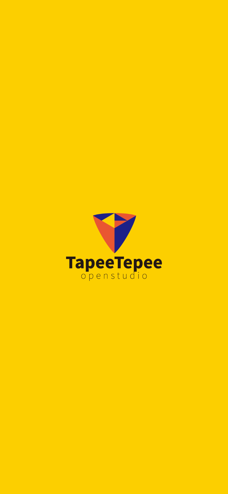
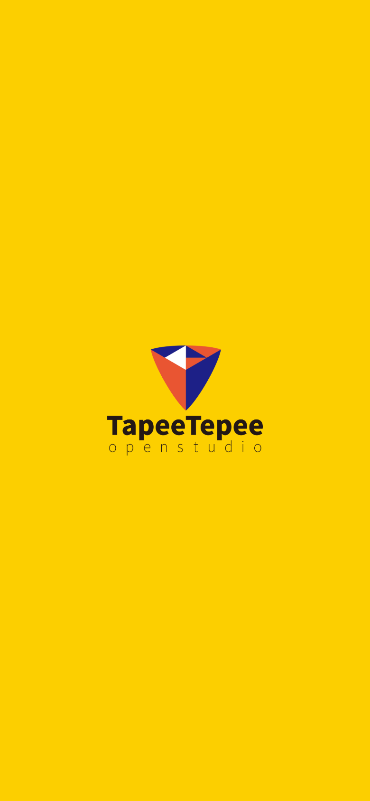

# 커버 전 TapeeTepee 로고 교체

2026-09-06. 변경 전: `e3ae37b`.

사용자가 제공한 `tapeetepee-open2-06.png`로 스튜디오 로고만 교체했다. 원본 PNG를 재생성·자르기·재압축하지 않고 복사했다. `TapeeTepee`와 `open studio` 글씨까지 이미지 전체를 표시한다.

CSS는 변경하지 않았다. 중앙 배치, 너비 42%, 높이 auto, 배경 `#fccf00`, 노출 시간 1,800ms를 유지한다. 원본 종횡비에 따른 높이는 자동 계산된다. 커버·게임 로고·규칙·TAPtoTALK 원본은 변경하지 않았다.

| 변경 전 | 변경 후 |
|---|---|
|  |  |

390×844 CSS px, 배율 2의 모바일 브라우저 캡처다. [check.cjs](check.cjs)로 전후 너비와 중앙 위치, 배경색이 같은지, 원본 비율이 유지되는지, 1.8초 뒤 커버로 넘어가는지 확인했다. 좌표는 [before.json](before.json), [after.json](after.json)에 기록했다. 실제 기기 촬영이나 성능 실험은 아니다. 게임 빌드 성공.

복사한 파일과 제공 원본의 SHA-256 일치:

`53af9f5cc061823fcabffbd3c0b6732684dcaa57cece1cd83e2e8da6f78a80dd`

캡처는 로컬 서버 5189 포트와 외부 Playwright를 사용한다. 변경 전 버전에서 `BEFORE=1`로 기록한 뒤 변경 후 기본 실행으로 비교한다. 브라우저 시계는 검증용으로 제어한다.
