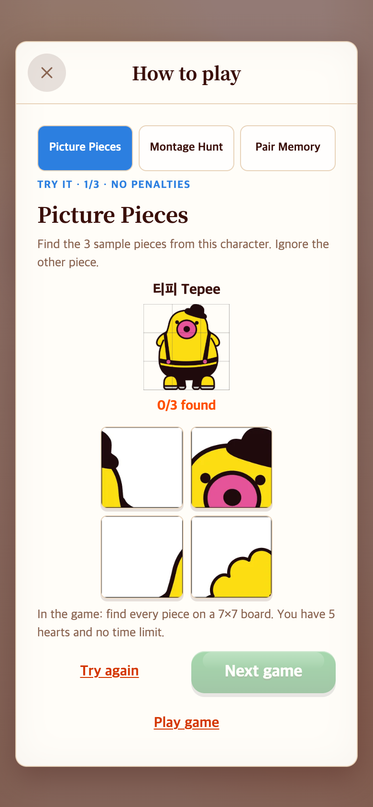
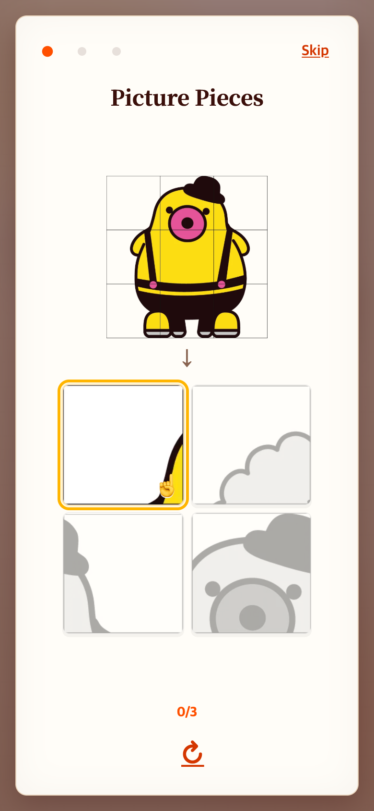
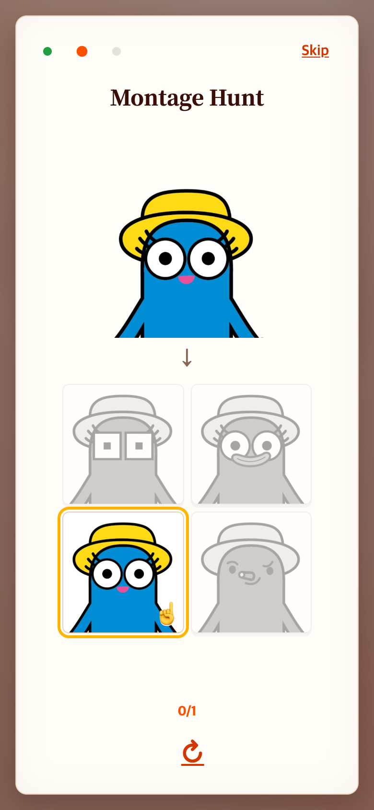
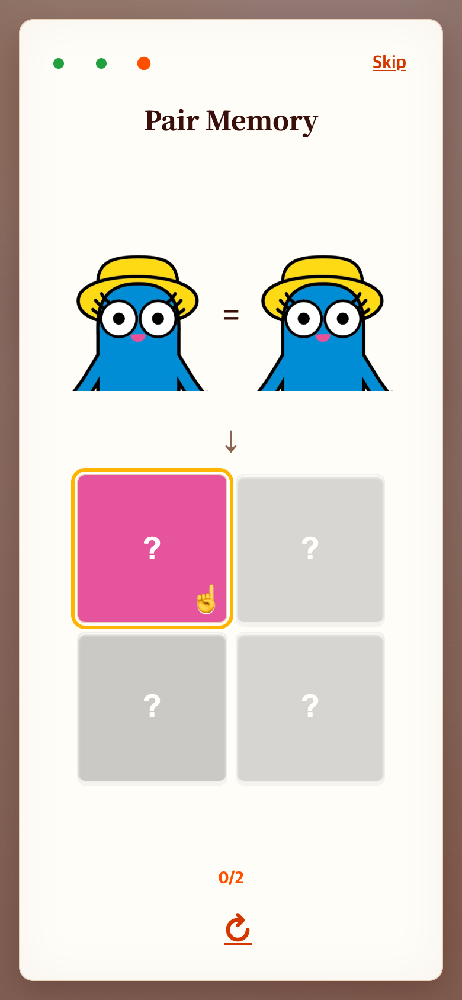
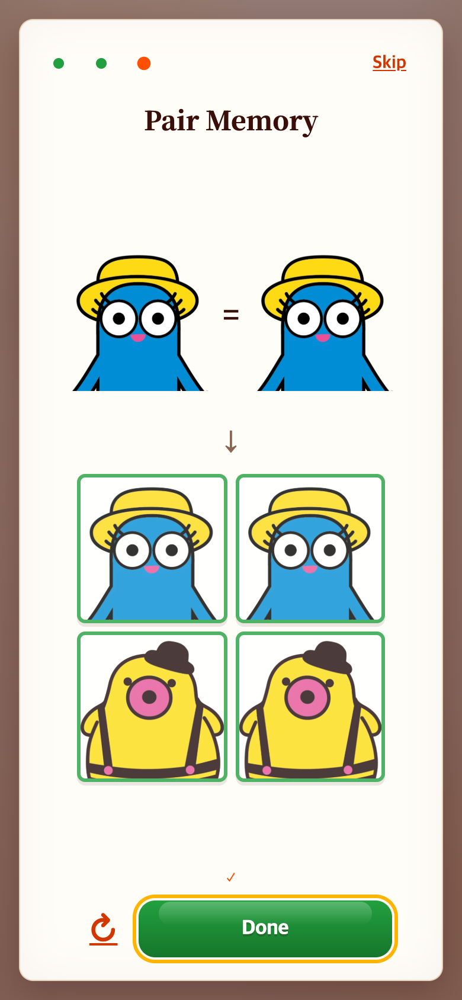

# TAPtoTEN 방식의 이미지 중심 How to play

2026-09-06. 이전 코드 기준 `b3530a0`. 로컬 TAPtoTEN `0d3ee75`의 튜토리얼 레이아웃·강조 방식을 읽기 전용으로 참고했다.

## 문제 → 수정

기존 체험형 도움말에도 설명 문장이 많았다. 사용자가 오른쪽 위 Skip, 최소한의 글, 컬러·빛으로 누르는 순서를 알려주는 구성을 요청했다.

- 상단: 진행 점 세 개, 오른쪽 **Skip**. 점을 눌러 다른 연습으로 이동할 수도 있다.
- 가운데: 게임 이름, 목표 그림, 아래 화살표, 네 개의 연습 버튼.
- 현재 누를 **한 버튼만 컬러·금색 테두리·빛·손가락 표식**으로 안내한다. 나머지는 회색이며 입력을 막는다. 맞춘 카드는 완료 상태를 유지한다.
- 게임 1은 세 조각을 차례로, 게임 2는 같은 얼굴 하나를, 게임 3은 첫 카드와 같은 얼굴의 짝을 차례로 안내한다.
- 하단: 진행 숫자와 다시 하기 아이콘. 성공하면 체크 표시와 빛나는 **Next / Done**이 나타난다.
- 긴 문장과 규칙 설명, Play game 버튼은 화면에서 제거했다. 보조기기용 짧은 안내는 숨김 텍스트로 유지한다.
- Skip과 Done은 메뉴로 돌아간다. 실제 게임은 메뉴에서 시작한다. 본 게임의 규칙·이미지는 바꾸지 않았다.

TAPtoTEN의 위·가운데·아래 배치를 기존 도움말 레이어 안에 적용했다. TAPtoPICK의 종이 배경과 폰트는 유지한다. 빛나는 효과는 버튼 위치를 움직이지 않으며, 동작 줄이기 설정에서는 정적인 컬러·테두리만 사용한다.

## 화면 비교

| 이전: 설명과 여러 버튼 | 변경: 이미지와 순서 안내 |
|---|---|
|  |  |

| 같은 얼굴 찾기 | 같은 얼굴 페어 | 완료 |
|---|---|---|
|  |  |  |

390×844 CSS px, 배율 2의 모바일 재현 화면이다. 이전 캡처는 직전 체험형 도움말 기록에서 재사용했다. 실제 휴대폰 촬영이나 사용자 이해도 실험은 아니다. 정지 화면은 테두리와 컬러를 보여주지만 빛의 시간 변화 전체를 보여주지는 않는다.

## 확인

- 관련 테스트 **44개 통과**, 빌드 성공.
- 순서 계산을 DOM 없는 `PracticeRun.nextIndex`에서 처리하고 테스트했다.
- 390×844, 375×667, 320×568에서 각 연습을 끝까지 클릭했다. 매 단계 활성 카드가 한 개이며, 완료 전 Next가 숨겨지고 완료 후 화면 안에 보이는지 검사했다.
- Skip, 재시도, 재진입, 다른 도움말의 헤더 복원, 동작 줄이기 설정을 검사했다. 페이지 오류 없음.
- 현재 연습은 정답 순서를 따라 하는 방식이다. 이전 자유 연습의 오답·카드 불일치 체험은 이 화면에서 제공하지 않는다. 본 게임의 오답 동작은 그대로다.

검증: [check.cjs](check.cjs), 결과: [verification.json](verification.json). 로컬 서버 5189 포트와 외부 Playwright로 실행한다. 브라우저 시계는 재현용으로 제어한다.

```sh
NODE_PATH=/path/to/node_modules node docs/research/2026-09-06-visual-help/check.cjs
```
