# 게임 반응·성취감·배경음악 체험

## 문제와 가설

기본 게임은 동작하지만 정답·완성·결과가 다시 플레이할 동기로 충분한지 확인하고 싶다는 요청이다. 스테이지를 늘리기 전에 정답의 짧은 반응, 완성 감상, 개인 기록과 다음 목표, 집중을 해치지 않는 음악을 붙여 체험한다. 사용자 만족도가 높아졌다고 입증한 것은 아니며 실제 플레이 피드백이 필요하다.

## 변경

- 정답 눌림·복원과 상승음, 페어 두 장 동시 반응. 오답 후 음높이 리셋.
- 게임1 완성 그림 감상, 게임2 승급/보너스, 게임3 완성 보드 감상 후 다음 단계. 실패에는 성공 소리·칭찬 대신 실패 소리와 TRY AGAIN.
- 결과의 이번 기록·최고 기록·다음 목표. 기기 저장 실패에도 게임은 계속되고 세션 기록임을 표시.
- 38.4초 오리지널 마림바풍 반복곡. 음악은 플레이에서만 사용하며 설정과 일시정지에서 끌 수 있음.

기준 커밋 `c8c01aa`, 복구 태그 `backup-before-game-feel-2026-09-08`, 실험 브랜치 `codex/game-feel-music`. 체험 당시 main을 보존했고, 2026-09-08 사용자가 긍정적인 피드백과 함께 메인 반영을 요청하여 체험 커밋 `4b3b488`을 main에 반영했다. TAPtoTALK는 수정하지 않았다. 복구 절차는 [체험판 문서](../../EXPERIMENT-game-feel.md).

## 화면

모든 PNG는 Chrome 모바일 에뮬레이션 390×844 CSS px, DPR2 = 780×1688px. 실제 휴대폰 사진은 아니다. 이전 이미지는 기준 커밋을 별도 임시 폴더에서 재현했고 현재 작업 파일을 과거 버전으로 바꾸지 않았다. 테스트는 자동 입력/제어된 시계로 진행하므로 화면의 시간·기록은 인간 플레이 기록이 아니다.

| 이전 | 이후 |
| --- | --- |
| 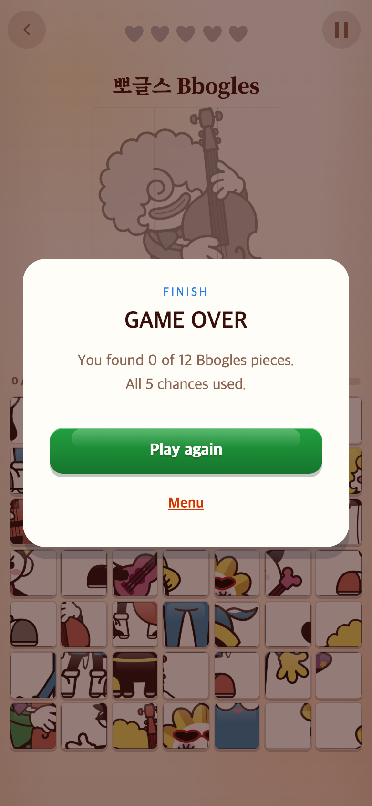 | 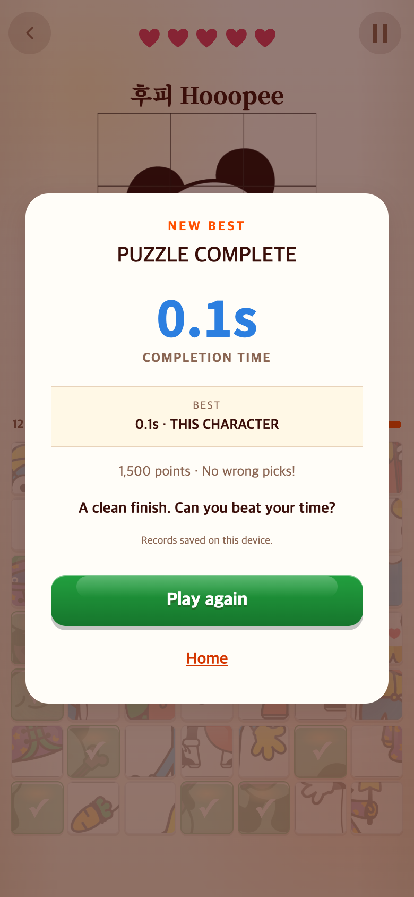 |
| 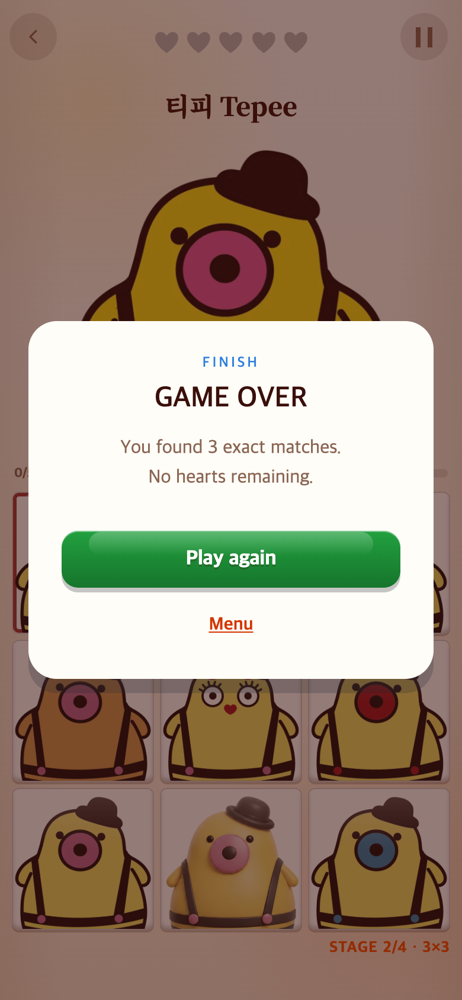 | 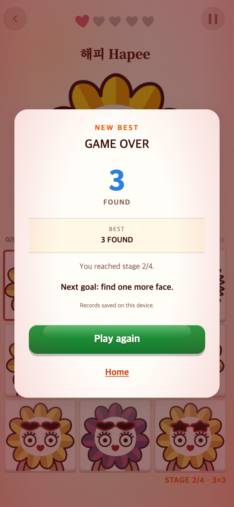 |
| 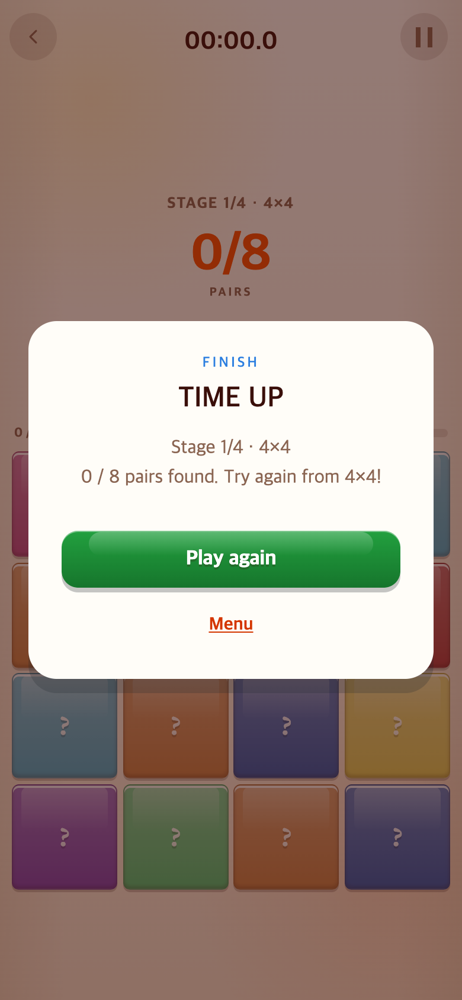 | 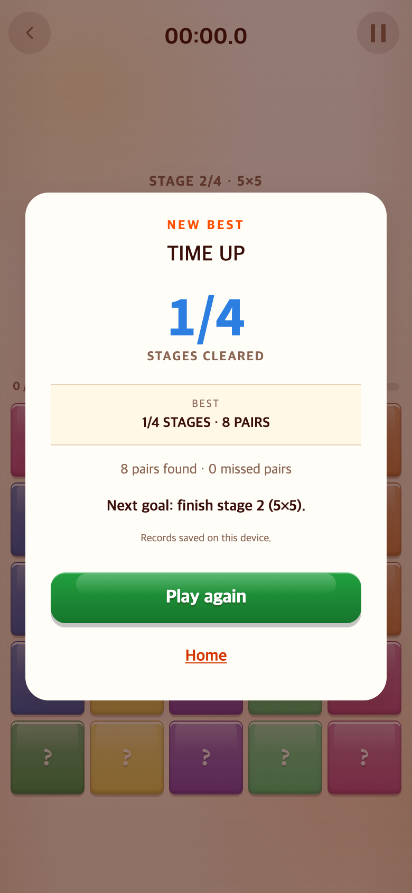 |

첫째·셋째 비교는 같은 성적이 아니라 결과 표현의 예시다. 둘째는 3명 발견 후 종료로 비교한다. 소스 상태·출처는 baseline.json, 검증 조건은 각 스크립트에 기록했다.

| 완성 그림 감상 | 단계 완료 | 음악 설정 |
| --- | --- | --- |
| 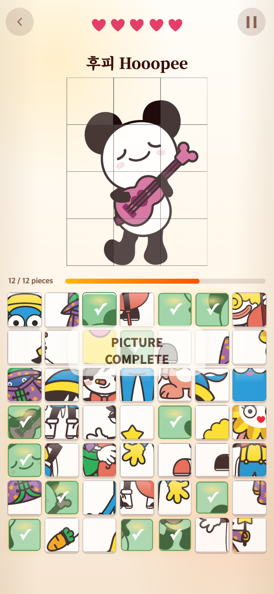 | 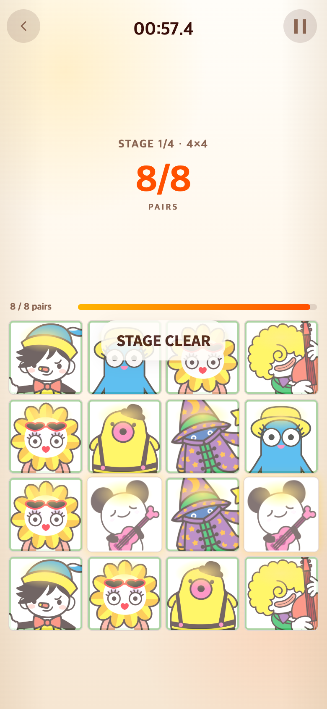 | 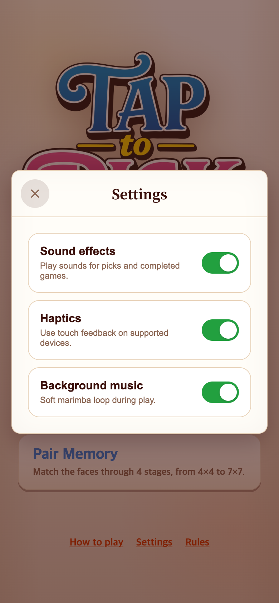 |

| 몽타주 전체 완주 | 페어 전체 완주 |
| --- | --- |
| 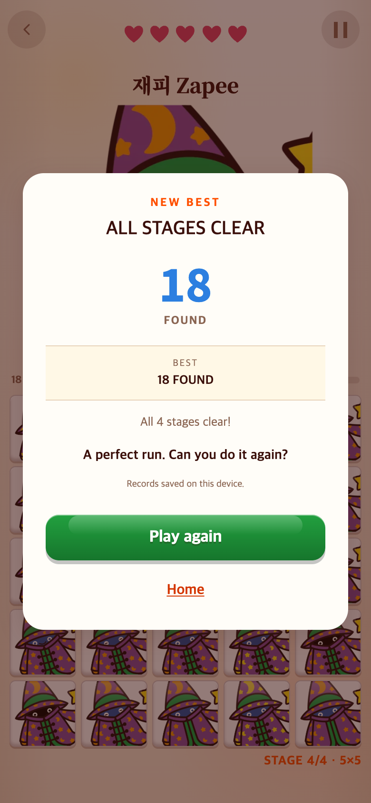 | 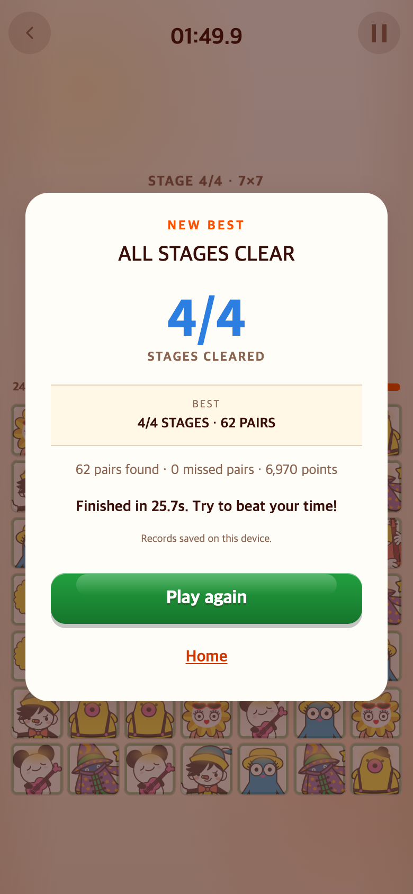 |

## 검증 근거

- `baseline-capture.cjs` / `baseline.json`: 이전 커밋·파일 해시·실제 렌더링 출처.
- `check.cjs` / `verification.json`: 390×844, 375×667, 320×568의 정답/실패/최고기록, 재시작, 일시정지, 음악재생 수, 설정 저장·재로드, reduced motion. 실제 Web Audio 소스를 관찰해 BGM 중복 없음을 확인.
- `victories.cjs` / `victories.json`: 게임2 18문제 및 게임3 총62페어 완주. 기존 단계·승패·점수 계산 사용.
- `lifecycle.cjs` / `lifecycle.json`: Continue 접근성, 탭 숨김·복귀, 중단 후 예약 취소. 이 검증의 영상/음성 재생 메서드는 모킹이며 실제 디코딩·동기화 품질을 입증하지 않는다.
- `scripts/verify-pick-music.mjs`: WAV/MP3 38.4초, 클리핑 여유, 루프 경계. 음악 컨트롤러 Vitest 10개, 기록 저장 Vitest24개.

음악은 [MP3](../../../public/assets/audio/pick-garden.mp3) / [WAV](../../../public/assets/audio/pick-garden.wav). 사용자 승인으로 main 반영했으며, 실제 휴대폰에서 장시간 사용했을 때의 반복 피로도는 추가 확인 대상이다.
