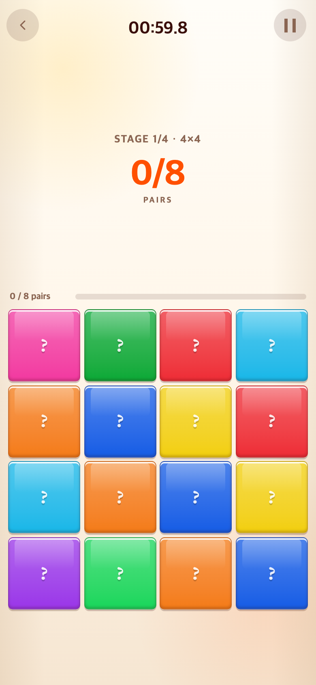
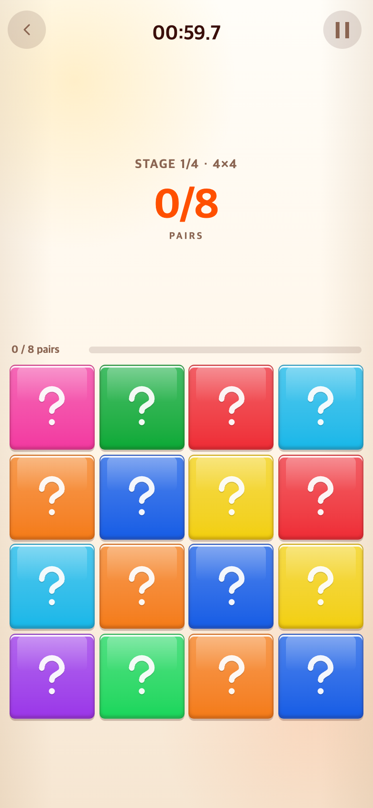
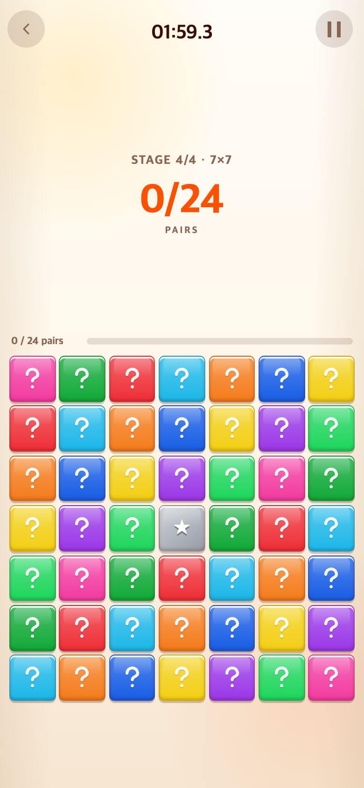
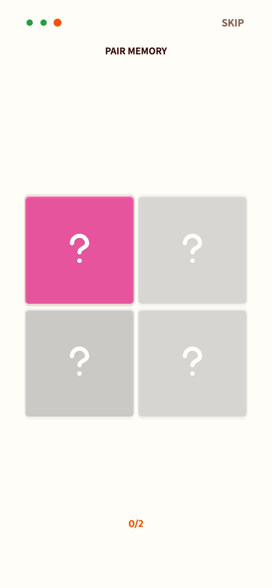

# 페어 카드 물음표 아이콘

## 문제와 요청

게임 3의 카드 뒷면은 폰트 문자 `?`를 사용했다. 사용자는 특별한 장식 없는 일반적인 물음표 아이콘과 조금 더 큰 표시를 요청했다.

## 변경

- 글꼴 대신 둥근 획과 점으로 구성한 인라인 SVG를 사용한다. 외부 이미지 다운로드가 필요 없다.
- 카드 크기에 비례한 58%의 정사각형 아이콘 영역을 사용하며 최대 52 CSS px로 제한한다. 4×4부터 7×7까지 카드 내부에 맞춰 줄어든다.
- 본 게임과 페어 How to play가 같은 아이콘을 사용한다.
- 카드 크기, 배경색, 회색 별 카드, 미리보기, 뒤집기, 매칭, 단계·시간 규칙은 유지한다. 다른 게임·음악은 변경하지 않는다.
- 아이콘은 장식으로 처리하고 카드 버튼의 앞면·뒷면·매칭 상태 접근성 설명을 유지한다.

## 화면 비교

390×844 CSS px, DPR 2의 모바일 브라우저 에뮬레이션 캡처다. PNG는 780×1688 px이며 실제 기기 촬영이나 사용자 실험 결과가 아니다. 같은 난수 시드로 시작했고 소리·음악·진동은 껐다.

### 변경 전 — 폰트 물음표

실제 커밋 `4156989b42a152b80c4dd5c38727a34b463ab0e0`을 별도 임시 폴더로 내보내 실행했다. 현재 파일의 스타일을 임시로 되돌린 이미지가 아니다.

### 변경 후 — 기본형 물음표 아이콘

### 변경 후 — 작은 7×7 카드에도 비례 적용

### 변경 후 — 페어 튜토리얼

## 검증 및 재현

- `npm test`: 기존 252개 테스트 통과.
- `npm run build`: TypeScript 검사 및 프로덕션 빌드 통과.
- `check.cjs`: 390×844, 375×667, 320×568에서 4×4·5×5·6×6·7×7을 실제 UI로 확인한다. 카드 정사각형 유지, 아이콘 중앙 배치·크기·장식 속성, 미리보기 때 숨김, 오답 뒤 카드 크기 유지, 매칭과 다음 단계 진입, 튜토리얼 완료를 검사한다.
- 캡처 출처: [baseline.json](baseline.json), 브라우저 검사 결과: [checks.json](checks.json).
- `baseline-capture.cjs`는 변경 전 커밋으로 별도 서버를 시작하고 종료한다. `check.cjs`는 실행 중인 Vite 서버(`BASE_URL`, 기본 `http://127.0.0.1:5189/`)를 사용한다. Playwright 모듈 경로를 `NODE_PATH`로 제공하며 설치된 Chrome을 사용한다.

이 문서와 검증 스크립트·스크린샷은 연구기록 전용이며 게임 진입점에서 불러오지 않는다. 이전 버전은 위 기준 커밋으로 추적할 수 있다.
