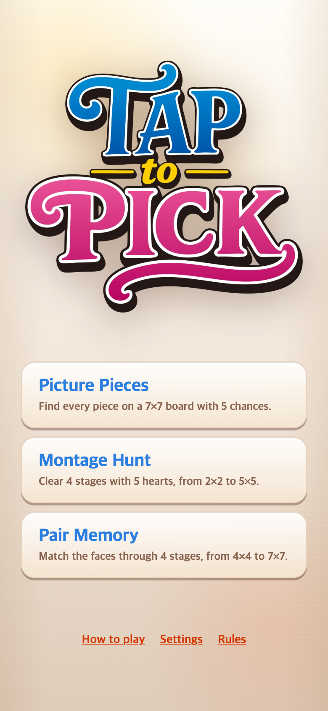
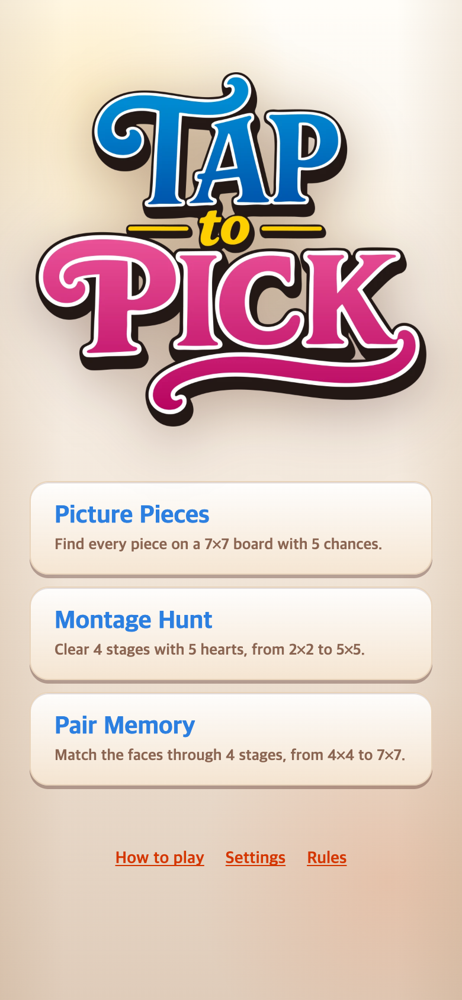
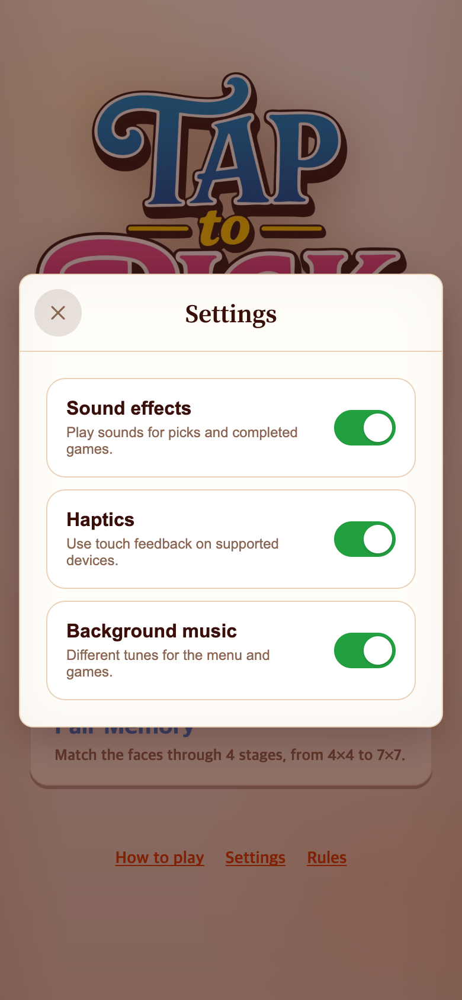

# 첫 방문 음악 시작과 독립 메뉴곡

## 문제와 요청

기준 버전: `a962331`. “처음 사이트에 들어가면 선택 화면은 조용하고, 게임에 들어갔다 나오면 음악이 나온다. 첫 화면에서도 나오게 하고 대기화면 음악을 완전히 다른 곡으로 바꿔달라.”

이전 코드는 메뉴 진입 시 재생 상태만 요청하고, 사용자 입력 전에는 오디오 컨텍스트 생성과 재생을 의도적으로 막았다. 따라서 자동재생을 허용한 브라우저에서도 첫 화면은 무음이었다. 또한 터치 활성화는 브라우저에 따라 pointerdown이 아니라 터치 해제·click 시점에 허용되므로 입력 처리를 보완했다.

## 변경

| 항목 | 이전 | 변경 후 |
| --- | --- | --- |
| 첫 게임 선택 화면 | 항상 사용자 입력을 기다림 | 자동재생을 실제로 시도 |
| 브라우저가 소리를 차단할 때 | 조용히 입력 대기 | 메뉴 아래 **Tap for music** 표시 |
| 첫 재생 입력 | pointerdown·키 입력 | pointerup·click도 처리; 로고·안내 버튼 터치로 게임 입장 없이 시작 |
| 음원 준비 | 재생 허용 후 다운로드·디코딩 | 메뉴 진입 시 다운로드·디코딩을 병행해 터치 후 지연 축소 |
| 대기화면 곡 | 게임곡과 같은 멜로디의 92 BPM 변주 | 독립곡 **Paper Lantern Waltz**, 72 BPM·F장조·3/4박자 |
| 게임곡·규칙 | Pick Garden와 기존 세 게임 | 그대로 보존 |

새 곡은 독립적인 멜로디와 화성 진행의 40초 왈츠다. 기타형 리드·부드러운 일렉트릭 피아노·베이스를 합성하고 타악기는 사용하지 않았다. 기존 4박자 마림바 게임곡과 구분한다. 외부 샘플이나 곡을 가져오지 않았다. 런타임 MP3는 244,324바이트로 이전 메뉴 변주(424,330바이트)보다 작다.

음악을 꺼둔 설정은 자동재생보다 우선한다. 로고·커버 인트로, 일시정지, 영상·결과 및 숨긴 화면의 무음 정책도 유지한다. 안내 버튼은 재생이 시작되면 사라지며 메뉴 하단에 고정 공간을 두어 다른 버튼이 움직이지 않는다. 키보드 포커스가 있던 안내를 숨길 때는 비활성 제목으로 옮겨 게임 선택을 잘못 실행하지 않게 한다.

## 브라우저 제약

소리가 있는 자동재생은 사이트 코드만으로 모든 브라우저에서 강제할 수 없다. **허용된 환경은 첫 메뉴에서 자동 시작, 차단된 환경은 실제 터치 한 번**이라는 동작이다. Chrome에서 `resume()`이 거부되지 않고 계속 대기할 수도 있어 500ms 후 컨텍스트 상태를 확인해 안내를 표시한다. 실패한 재생은 게임 진행을 막지 않는다. [Chrome 공식 자동재생 안내](https://developer.chrome.com/blog/autoplay), [WebKit 자동재생 안내](https://webkit.org/blog/7734/auto-play-policy-changes-for-macos/)

## 화면 기록

390×844 CSS px, 780×1688 PNG. 사용자 입력을 발생시키지 않는 브라우저 캡처로 첫 화면을 저장했다. 이전 화면은 앞선 연구기록에 저장된 원본을 재사용한다. 스크린샷만으로 오디오 재생을 증명할 수 없으므로 음원과 재생 로그를 함께 보관한다.

| 이전 — 첫 화면 무음, 안내 없음 | 변경 — 자동재생 차단 시 터치 안내 |
| --- | --- |
|  |  |

| 자동재생 허용 — 안내 없이 음악 시작 | 새 Settings 설명 |
| --- | --- |
|  |  |

- [새 대기화면 음악](../../../public/assets/audio/pick-lobby.mp3)
- [기존 게임 음악](../../../public/assets/audio/pick-garden.mp3)
- [이전 메뉴 변주 — 보관본](../../../public/assets/audio/pick-garden-menu.mp3)
- [생성과 재현 안내](../../../public/assets/audio/README.md)

## 검증

- **Vitest 25개 파일, 252개 테스트 통과**, TypeScript·Vite 프로덕션 빌드 통과. 자동재생 허용·거부·미응답, 디코딩 준비, 입력 재시도, 화면 이탈 후 지연 응답, 음소거 우선, 상태 전달과 겹침 방지 테스트 포함.
- **Chrome 자동재생 허용/차단 × 390×844/375×667/320×568 = 6개 조합 통과.** 첫 방문 검사 시 모두 `navigator.userActivation.hasBeenActive === false`를 직접 확인했다. 허용 환경의 실제 Web Audio 루프 재생과 차단 환경의 무음·터치 안내를 구분했다.
- 차단 환경에서 각각 로고 터치, 안내 버튼 터치, 키보드 Enter로 메뉴 음악을 시작했다. 게임 선택 화면을 떠나지 않았으며 40초 새 메뉴곡과 38.4초 게임곡 버퍼를 구분했다.
- 세 게임 진입·일시정지·재개·메뉴 복귀·Settings·음소거·새로고침 후 음소거 유지 확인. 동시 BGM은 최대 1개였으며 한 방문에서 두 활성 음원은 각각 한 번만 요청했다. 인트로와 음소거 상태에서는 BGM을 새로 요청하지 않는다.
- 안내 버튼이 마지막 게임 버튼을 가리지 않고 세 해상도 모두 화면 안에 들어가는지 검사했다.
- 자동화 도구의 일반 JavaScript 평가나 가상 시계 조작이 브라우저 활성화를 만들 수 있어, 첫 방문 검증 전에는 이를 사용하지 않았다. 실제 시간을 기다리고 `Runtime.evaluate(userGesture:false)`로 읽었으며 캡처도 `Page.captureScreenshot`으로 진행했다. 첫 터치 검증 후에만 일반 자동화와 가상 시계를 사용한다.
- 세 곡 WAV·MP3 6개 파일의 샘플 수·반복 경계·클리핑 여유 검증 통과. 새 MP3 peak −4.741 dBFS, RMS −18.998 dBFS. 기존 게임곡과 이전 메뉴곡의 WAV·MP3·JSON 6개 파일은 SHA-256까지 동일하게 보존했다.

이 검증은 데스크톱 Chrome의 모바일 화면 크기·터치 에뮬레이션과 명시적 브라우저 정책 조합이다. 실제 iOS Safari, 휴대폰 스피커의 음질·피로도·체감 시작 속도까지 검증했다고 주장하지 않는다.

[브라우저 검증 코드](check.cjs) · [재생·입력 상태 결과](verification.json) · [음원 측정·보존 검사](audio-verification.json)

```sh
NODE_PATH=/Users/scdi/.cache/codex-runtimes/codex-primary-runtime/dependencies/node/node_modules node docs/research/2026-09-08-menu-autoplay/check.cjs
npm test
npm run build
node scripts/verify-pick-music.mjs
```

## 복구와 원본 보호

이번 변경 직전은 `a962331`, 전체 게임 반응·음악 체험 전은 `backup-before-game-feel-2026-09-08`이다. 이전 두 곡을 삭제하지 않았고 [복구 안내](../../EXPERIMENT-game-feel.md)를 유지한다. TaptoPick만 수정하며 TAPtoTALK 원본은 변경하지 않는다. 이 연구기록은 게임 런타임에서 불러오지 않는다.
