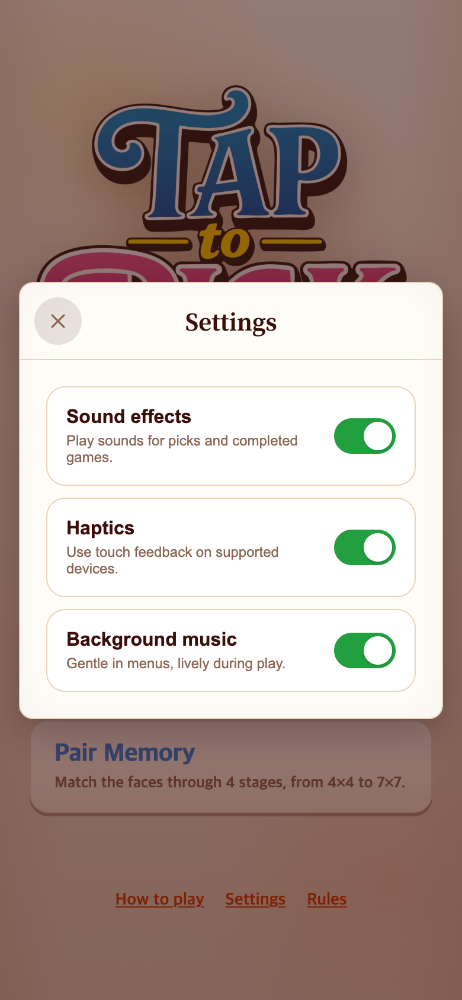
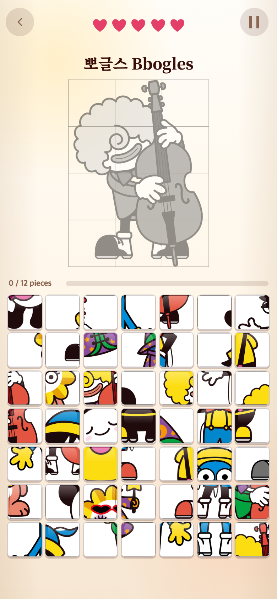

# 대기화면 음악과 플레이 음악 분리

## 요청과 문제

사용자 요청: “배경음악이 대기화면에서도 나오게, 아주 살짝 바꿔서 대기화면과 게임의 음악이 다르게.”

직전 main `5626b24`는 플레이할 때만 음악을 재생했다. 메인 메뉴로 나오면 무음이어서 대기화면에서도 같은 게임의 분위기가 이어지도록 개선했다. 게임 음악 자체와 규칙은 유지한다.

## 수정

| 항목 | 이전 | 변경 후 |
| --- | --- | --- |
| 대기화면·Settings·How to play·Rules | 무음 | 같은 멜로디의 메뉴 편곡 |
| 플레이 | Pick Garden, 100 BPM | 기존 파일 그대로 |
| 메뉴 편곡 | 없음 | 92 BPM, 부드러운 마림바 배음·약한 퍼커션 |
| 음악 설정 | 플레이 음악 켜기/끄기 | 메뉴·플레이 공통 켜기/끄기 |
| 일시정지·영상·결과·숨긴 화면 | 음악 중지 | 그대로 유지 |

메뉴곡은 같은 C major 멜로디·화성·16마디를 유지한다. 템포를 8% 낮추고, 높은 배음을 줄이며 퍼커션의 횟수와 세기를 절반으로 줄였다. 메뉴 MP3는 424,330바이트, 약 41.74초 반복이다. 기존 플레이 WAV·MP3·JSON은 변경하지 않았다.

`src/ui/sceneMusic.ts`에서 나가는 곡을 먼저 멈추고 들어오는 곡을 재생한다. 기존 `backgroundMusic.ts`의 350ms 페이드인과 디코딩 버퍼 재사용을 유지한다. 한 방문 세션에서는 곡마다 처음 필요한 시점에 한 번만 내려받는다. WAV와 연구기록은 게임에서 요청하지 않는다.

브라우저 자동재생 제한을 우회하지 않는다. 처음에는 터치 또는 일반 키 입력을 받은 뒤 음악이 시작한다. 메뉴에서 화면을 숨겼다 돌아오면 메뉴곡을 재개하지만, 플레이 중 화면을 숨기면 기존대로 게임을 일시정지하고 Resume을 기다린다.

## 화면 기록

390×844 CSS px, DPR 2로 촬영한 780×1688 PNG. 이전 화면은 앞선 체험판 검증에서 저장한 원본 캡처를 재사용한다. 화면 구성은 바꾸지 않았으며 Settings의 음악 설명만 새 동작에 맞춰 수정했다. **스크린샷은 소리를 증명하지 않으므로 아래 음원과 재생 검증 로그를 함께 보관한다.**

| 이전 Settings | 변경 후 Settings |
| --- | --- |
|  |  |

| 대기화면 — 메뉴곡 | 플레이 — 기존 곡 |
| --- | --- |
|  |  |

- [대기화면 MP3](../../../public/assets/audio/pick-garden-menu.mp3)
- [플레이 MP3](../../../public/assets/audio/pick-garden.mp3)
- [생성 방식과 음원 원본](../../../public/assets/audio/README.md)

## 검증과 한계

- Vitest 25개 파일, **243개 테스트 통과**. 화면별 음악 전환·상호 배타성·공통 음소거·해제를 검사하는 새 테스트 4개 포함.
- TypeScript 검사와 Vite 프로덕션 빌드 통과.
- Chrome 모바일 크기 390×844, 375×667, 320×568에서 세 게임 진입·일시정지·재개·메뉴 복귀, Settings·How to play, 빠른 왕복, 영상·결과, 음소거 저장·새로고침을 검증했다. 네이티브 Web Audio 소스의 실제 시작/종료를 관찰했으며 **동시 BGM 최대 1개**, 새로고침 전 **곡마다 다운로드 1회**를 확인했다. 메뉴 약 41.74초와 게임 38.4초 버퍼로 두 곡도 구분했다.
- 사용자 입력 전에는 BGM 요청이 없다. 첫 키 입력 후 메뉴 재생, 이후 포인터 입력으로 화면 전환과 음소거를 확인했다.
- 숨김/복귀는 `document.hidden`과 `visibilitychange`를 모사한 테스트다. 실제 휴대폰의 OS 백그라운드 정책과 스피커 음질을 검증했다는 의미는 아니다.
- WAV·MP3 네 파일의 전체 샘플 수, 클리핑 여유, 반복 경계를 FFmpeg로 검증했다. 메뉴 MP3 peak −4.74 dBFS, RMS −19.36 dBFS. 실제 모바일 청취 편안함·반복 피로도는 사용자의 청취 확인이 필요하다.
- 로컬 미리보기 검증 초기에 새 음원이 생성되기 전 캐시된 잘못된 경로가 관찰되어 설정 모듈을 갱신했다. 아래 결과는 올바른 `/assets/audio/` 경로에서 다시 실행한 최종 검증이다.

[브라우저 검증 코드](check.cjs) · [브라우저 결과](verification.json) · [음원 측정](audio-verification.json)

```sh
NODE_PATH=/Users/scdi/.cache/codex-runtimes/codex-primary-runtime/dependencies/node/node_modules node docs/research/2026-09-08-menu-music/check.cjs
npm test
npm run build
node scripts/verify-pick-music.mjs
```

## 보존 범위

TAPtoPick의 코드·음원·문서만 변경했다. 게임 규칙·점수·생명·스테이지와 원본 TAPtoTALK은 변경하지 않았다. 이번 메뉴 음악 추가 직전은 `5626b24`, 전체 반응·음악 체험 전은 `backup-before-game-feel-2026-09-08`이다. [복구 안내](../../EXPERIMENT-game-feel.md)를 유지한다. 이 기록은 런타임에서 불러오지 않는다.
