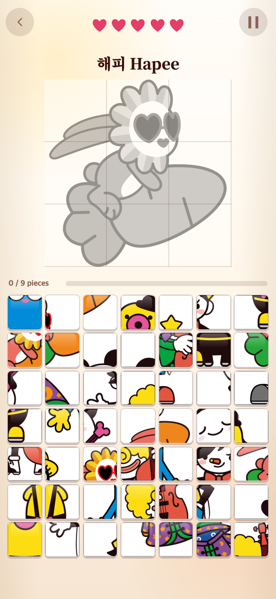
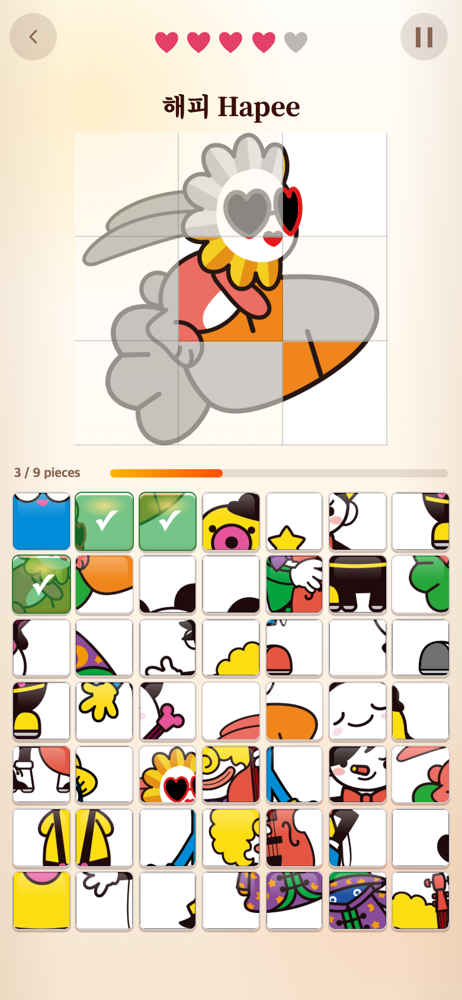
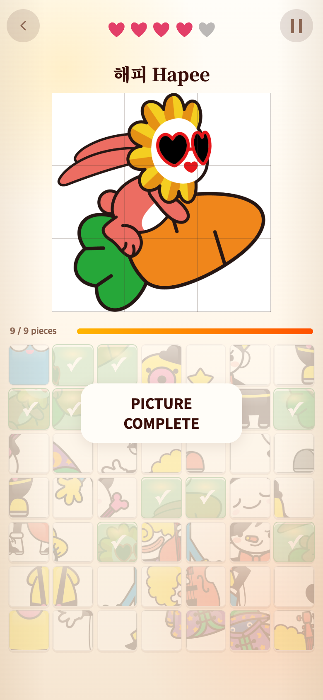
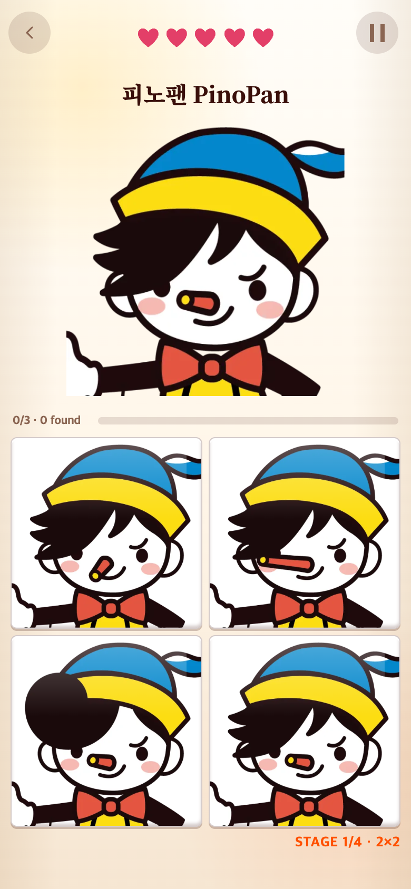

# 해피 당근 퍼즐 테스트와 캐릭터 순환 유지

기준 버전: `001d5f7` (How to play·Rules 제거 직후).

## 1. 한 장의 원본에서 조각 만들기

사용자는 개별 조각을 준비하는 대신 제공한 해피 당근 그림 한 장으로 게임 1을 시험하고자 했다.

- 원본 942×991 PNG를 `Ha/carrot-original.png`에 변경 없이 보관했다. SHA-256: `f8ab1035a8804988afcbda75431c6c952a7c30c6324dbc935552ff58c68775f6`.
- 비율을 유지해 흰 여백이 있는 960×960 이미지로 맞춘 뒤 3×3으로 잘랐다. 캐릭터를 잘라내거나 비율을 찌그러뜨리지 않았다.
- 완성 그림과 320×320 조각 9장을 무손실 WebP로 저장했다. 합계 248,394바이트이며 원본 PNG는 실행 시 다운로드하지 않는다. 원본보다 파일 합계가 작다는 의미는 아니다. 별도의 조각들을 합치면 완성 WebP와 픽셀이 일치하는 것을 생성 스크립트에서 검사한다.
- 위쪽은 회색 그림과 동일한 3×3 구획을 보여주고 정답에 해당하는 부분만 컬러로 복원한다. 구획선은 CSS로 위쪽에만 표시하며 조각 파일에는 넣지 않는다.
- 아래 7×7 보드는 새 정답 9개와 다른 캐릭터의 오답 조각 40개를 사용한다. 기존 해피 조각은 이번 보드에 섞지 않는다.
- 바로 시험할 수 있도록 현재 게임 1의 제시 캐릭터를 해피로 고정했다. 기존 해피 및 다른 캐릭터 원본은 삭제하지 않았다. 게임 2·3의 얼굴 파일은 변경하지 않았다.

### 시작 — 회색 9칸

### 정답 세 조각 — 해당 위치만 컬러

검증 과정에서 오답도 한 번 눌러, 색 복원 없이 하트만 줄어드는 것을 확인했다.

### 아홉 조각 완성

## 2. 게임 2의 일곱 캐릭터 중복 방지

기존 코드도 **한 판 안에서는** 일곱 캐릭터를 모두 한 번씩 제시했다. 다만 게임을 새로 시작할 때마다 남은 순서를 버리고 새 묶음을 만들었으므로, 메뉴 복귀·재시작을 반복하면 일곱 명을 다 보기 전에 캐릭터가 다시 나올 수 있었다.

이제 순서 관리를 순수 규칙 모듈의 `RandomIndexCycle`로 옮겼다. 같은 페이지에서는 단계 진급이나 메뉴 복귀·재시작에도 남은 순서를 이어간다. 일곱 명을 모두 제시하면 새 무작위 묶음을 만들고 이전 묶음의 마지막 캐릭터가 다음 묶음 첫 번째로 연속 등장하지 않게 한다. 오답이나 일시정지는 순서를 소비하지 않는다. 새로고침·새 페이지에서는 새 묶음으로 시작한다.

## 검증

- `npm test`: 255개 테스트 통과. 50개 난수 시드로 중단·재시작에 해당하는 호출 묶음과 새 묶음의 중복 방지를 검사한다.
- `npm run build`: 타입 검사 및 프로덕션 빌드 통과.
- `scripts/split-unit-image.cjs`: 9조각 재조립 및 완성 이미지 픽셀 일치 검사 통과. 실행에 `sharp`가 필요하다.
- `check.cjs`: 390×844, 320×568 CSS px에서 실제 버튼을 사용해 새 퍼즐 정답 9개·오답 40개, 틀렸을 때 색 유지, 맞춘 조각 위치, 전체 복원을 확인했다. 이어 게임 2의 2×2→5×5 진급과 여러 재시작을 포함해 각각 28개 제시 기록(일곱 명씩 네 묶음)을 확인했다. 모든 묶음의 캐릭터가 중복 없이 7종이며 두 난수 시드의 순서도 다르다. 브라우저 오류는 없었다. 전체 이름 순서는 [checks.json](checks.json)에 보관한다.
- 스크린샷: Chromium 모바일 에뮬레이션 390×844 CSS px, DPR 2 → 780×1688 PNG. 소리·음악·진동은 끄고 시계와 난수를 제어했다. 실제 기기 촬영 또는 사용자 연구 결과는 아니다.

## 재생성·되돌리기

`NODE_PATH`에 sharp 모듈 경로를 지정한 뒤 `node scripts/split-unit-image.cjs Ha/carrot-original.png HapeeCarrot`로 재생성한다. 브라우저 검증은 로컬 Vite와 Playwright, Chrome이 필요하며 `BASE_URL` 기본값은 `http://127.0.0.1:5189/`이다.

`src/content/puzzles.ts`의 `UNIT_TRIAL_CHARACTER_ID`를 `undefined`로 바꾸면 게임 1의 일곱 캐릭터 무작위 제시로 돌아간다. 해피 그림까지 이전 것으로 복원하려면 `character("ha", "Hapee", "HapeeCarrot", true)`를 `character("ha", "Hapee", "Ha")`로 바꾼다. 이 경우 이번 테스트 전용 콘텐츠 테스트도 맞춰 변경한다. 기존 파일이나 게임 2의 새 순환 규칙을 삭제할 필요는 없다.

이 연구기록은 게임 진입점에서 불러오지 않는다.
