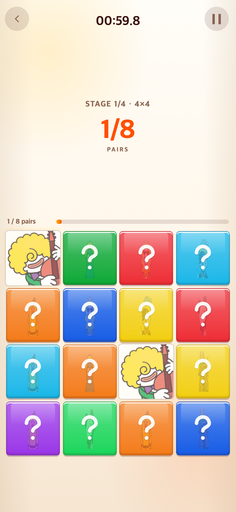

# 페어 메모리 정답 빛 효과 완화 — 2026-09-09

## 문제와 변경

페어를 맞혔을 때 카드 위의 노란빛과 바깥 광원이 강하게 느껴진다는 피드백을 반영했다.

- 게임 3에만 적용: 카드 위 빛의 알파 0.8 → 0.5, 주변 빛 알파 0.35 → 0.22, 번짐 12px → 8px.
- 정답 애니메이션의 220ms 길이와 크기 변화, 매칭 표시, 스테이지 완료 효과 및 게임 규칙은 유지했다.
- 게임 1·2는 기존 효과 값을 유지한다. 게임 이름은 추천만 진행하며 아직 변경하지 않았다.

## 모바일 비교

390×844 CSS 픽셀, DPR 2(780×1688px)의 Chromium 모바일 에뮬레이션이며 실기기 촬영은 아니다. 같은 난수 시드로 실제 페어를 선택했다. 비교를 위해 정답 애니메이션을 154ms(70% 광원 키프레임)에 정지하여 캡처했다. 카드 전환 중의 순간 화면이다.

| 수정 전 | 수정 후 |
| --- | --- |
|  |  |

## 검증

- 브라우저: 정답 카드 2개, 카드 크기 유지, 모션 줄이기 설정 존중, 실행 오류 없음.
- `npm test`: 255개 통과.
- `npm run build`, `git diff --check`: 통과.
- 재현 스크립트: `check.cjs`. `--before`는 수정 전 코드에서 실행하는 옵션이다.

이 기록과 이미지는 게임에서 불러오지 않는다. TAPtoTALK과 TAPtoTEN은 수정하지 않았다.
