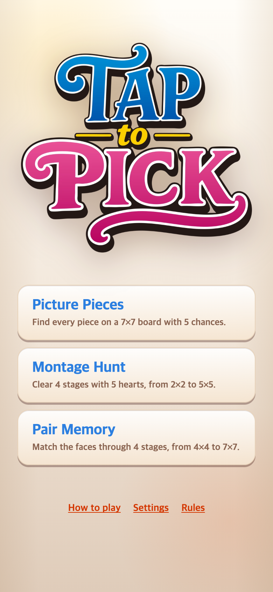
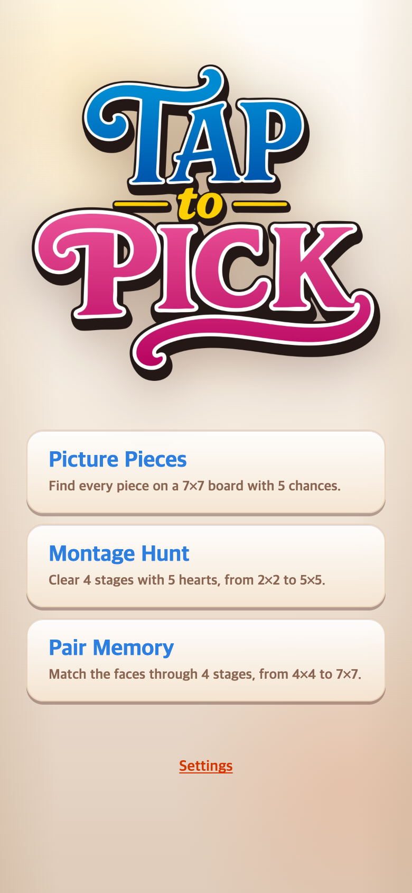

# How to play·Rules 메뉴 제거

사용자 요청에 따라 메인 화면의 두 안내 버튼과 실행 연결을 제거했다. Settings와 필요한 경우의 Tap for music은 유지한다. 튜토리얼 소스는 보관하되 현재 진입점에서는 불러오지 않는다. 게임 규칙·이미지·음악은 변경하지 않았다.

## 변경 전후

수정 전 앱 코드는 `88a69f65e0b117423e017a65ca8706145f974bf8` 상태에서 직접 캡처했다. 390×844 CSS px·DPR 2, PNG 780×1688 px의 Chromium 모바일 에뮬레이션이며 실제 기기 촬영이나 사용자 실험이 아니다.

320×568의 작은 화면도 [변경 전](before-menu-320.png)과 [변경 후](after-menu-320.png)를 저장했다.

## 검증

252개 테스트와 프로덕션 빌드가 통과했다. 두 모바일 크기에서 브라우저 오류 없이 설정·세 게임·일시정지·재개·메뉴 복귀를 확인했다.

`check.cjs`는 두 버튼의 존재 여부, Settings의 세 설정, 세 게임 진입, 일시정지·재개와 메뉴 복귀, JavaScript 오류를 확인한다. Vite 서버와 Playwright 및 로컬 Chrome이 필요하다. 변경 전 실행은 `--before`, 변경 후는 옵션 없이 실행하며 `BASE_URL` 기본값은 `http://127.0.0.1:5189/`이다. 자세한 결과는 `before-checks.json`, `after-checks.json`에 기록한다.

첫 게임의 원본 이미지 자동 분할은 이번 요청에서 가능 여부만 검토했다. 정사각형 조각과 동일 구획의 회색→컬러 복원 방식으로 연결 가능하지만 신규 이미지 처리나 게임 변경은 아직 적용하지 않았다.

이 폴더의 기록·스크린샷은 게임에서 불러오지 않는다.
