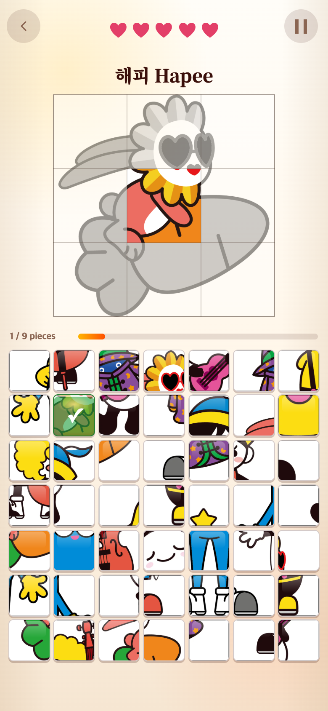

# 제시 이미지 테두리와 조각 경계 정렬

기준 버전: `f91f7e9`. 사용자는 완성 그림 바깥 네모 테두리를 요청하고 3×3 구획선이 미세하게 어긋나 보인다고 지적했다.

## 확인 및 수정

- 원본 WebP와 9조각을 재조립한 이미지는 픽셀이 동일했다. 파일 분할 오류는 없었다.
- 기존 CSS 배경은 각 구획의 마지막 1px에 선을 그렸다. 선 중심은 실제 경계보다 0.5 CSS px 안쪽이며, 작은 화면의 3등분은 소수점 좌표여서 미세한 차이가 더 눈에 띌 수 있었다.
- 반복 배경을 제거하고 이미지의 열·행 수를 좌표계로 사용하는 SVG 선으로 교체했다. 내부 선 중심을 1/3·2/3 위치에 두어 컬러 복원 영역과 맞췄다.
- 네 변을 감싸는 1 CSS px의 외곽 테두리를 추가했다. 테두리는 이미지 위에 겹쳐 그리므로 이미지 크기·위치·비율이 바뀌지 않는다. 모든 선은 클릭을 가로채지 않고, 보조기기에 중복 낭독되지 않는다.
- 원본·조각 파일, 게임 규칙, 게임 2·3은 변경하지 않았다.

## 전후 화면

같은 난수 시드로 가운데 조각만 맞춘 화면이다. 실제 변경 전 앱을 먼저 캡처했으며, 사후에 스타일을 되돌려 만든 이미지는 아니다. 390×844 CSS px·DPR 2 → 780×1688 PNG의 Chromium 모바일 에뮬레이션이다.

작은 화면: [320px 전](before-320.png) · [320px 후](after-320.png) · [375px/DPR 3 전](before-375.png) · [375px/DPR 3 후](after-375.png).

## 검증

- 255개 테스트·타입 검사·프로덕션 빌드 통과.
- `check.cjs`로 원본/조각 재조립 픽셀 일치, 선 좌표/컬러 복원 경계 일치, 테두리 크기, 정답 9조각 완료, 브라우저 오류 없음을 확인했다.
- 264px 그림에서는 내부 선이 88·176px, 182px 그림에서는 60.666…·121.333…px에 위치했다. 실제 브라우저의 `clip-path` 직렬화 반올림을 감안해 0.002 CSS px 허용 오차로 검증했으며 모두 통과했다. 물리 화면의 안티앨리어싱 차이와 좌표 불일치는 구분한다.
- 변경 전후 이미지 영역은 390px 화면에서 264×264, 320/375px 화면에서 182×182로 동일하다. [이전 결과](before-checks.json) · [수정 후 결과](after-checks.json).
- 캡처는 실제 기기 촬영 또는 사용자 실험이 아니다. 시계·난수는 제어했고 음악·효과음·진동은 껐다.

재현은 Vite(127.0.0.1:5189)와 Playwright·sharp·Chrome이 필요하다. `check.cjs --before`는 구형 화면을 기록하며 옵션 없는 실행은 수정 후 경계를 검사한다. 이 문서·스크린샷·검사 스크립트는 게임에서 불러오지 않는다.
