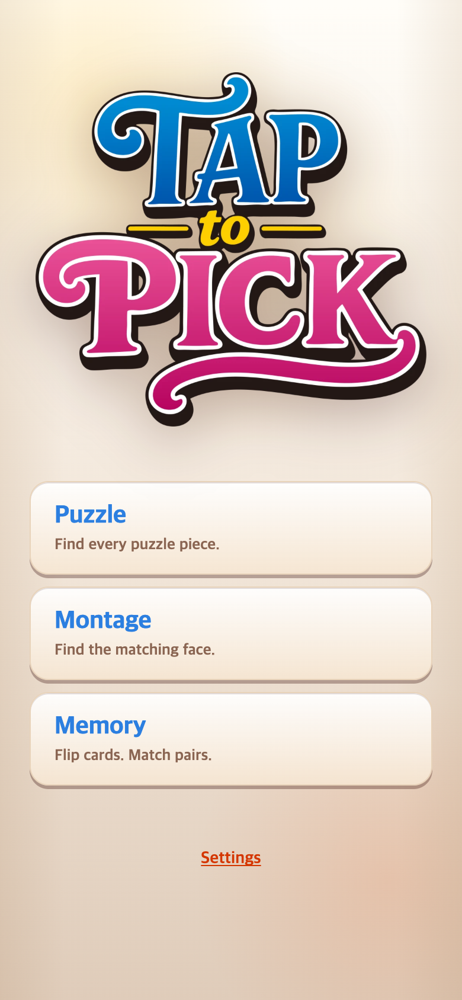
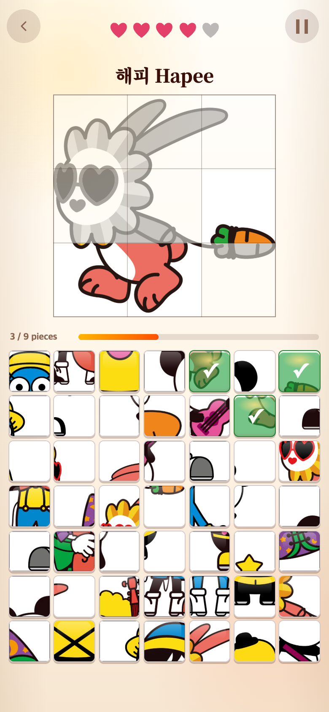
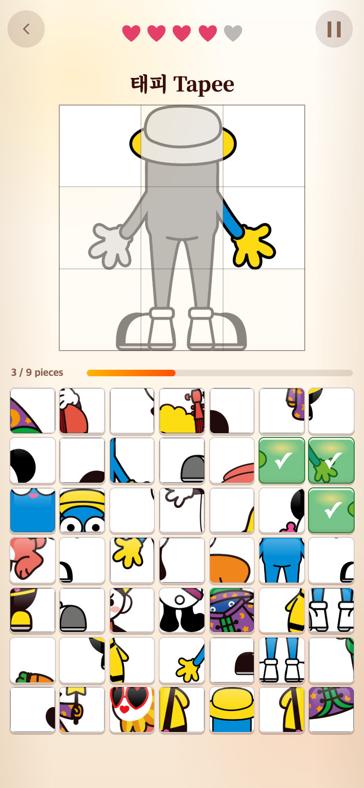
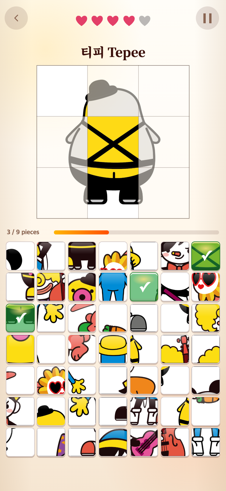
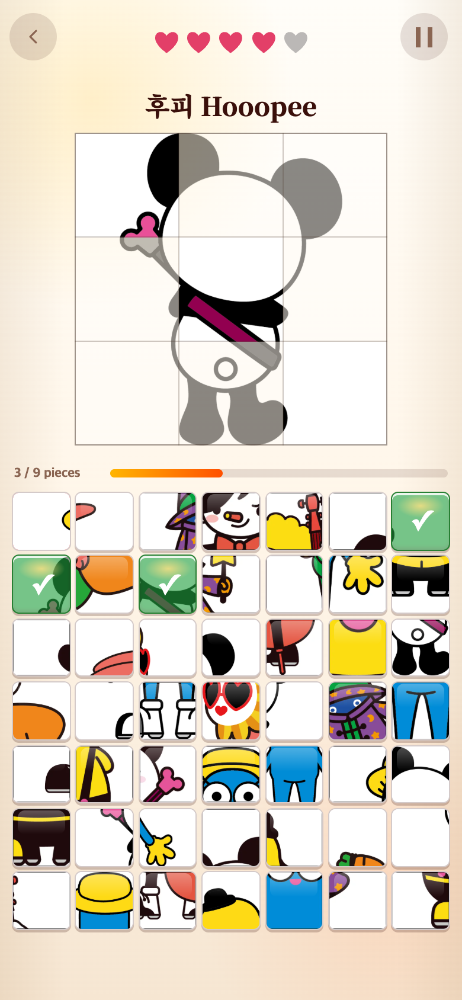

# 게임 이름 정리와 원본 한 장 퍼즐 4종 추가 — 2026-09-09

기준 커밋: `6827e64` (페어 메모리 광원 완화).

## 요청과 변경

- 두 단어 이름을 **Puzzle / Montage / Memory**로 변경했다. 메인 메뉴·START 안내·플레이 화면·접근성 이름에 적용하고 보관 중인 튜토리얼도 공통 제목을 참조한다. 기존 모드 ID와 저장된 기록은 유지한다.
- 게임 1은 해피 당근 한 장 고정에서 기존 그림 + 새 그림 네 장, **총 다섯 그림 무작위 선택**으로 바꿨다. 한 판에 한 그림, 7×7 보드에 정답 9개 + 다른 그림 조각 40개라는 규칙은 유지한다.
- 같은 해피라도 그림마다 고유 ID를 사용하여 다른 포즈 조각이 정답으로 처리되지 않도록 했다. 완료 영상은 그림 ID와 분리된 `celebrationId`로 해당 캐릭터에 연결한다. 개인 기록은 그림별로 구분한다.
- 새 뒷모습 그림은 게임 1에서만 사용한다. 게임 2의 승인된 제외 목록, 게임 3의 원본 얼굴 구성은 변경하지 않았다.

## 원본과 웹용 파일

| 제공 파일 | 원본 보관 경로 | 웹용 폴더 | 이름·완료 영상 |
| --- | --- | --- | --- |
| 기존 해피 당근 | `Ha/carrot-original.png` | `HapeeCarrot` | 해피 Hapee |
| 게임1-02.png | `assets/puzzle-originals/game1-02.png` | `HapeeCarrot02` | 해피 Hapee |
| 게임1-03.png | `assets/puzzle-originals/game1-03.png` | `TapeeBack` | 태피 Tapee |
| 게임1-04.png | `assets/puzzle-originals/game1-04.png` | `TepeeBack` | 티피 Tepee |
| 게임1-05.png | `assets/puzzle-originals/game1-05.png` | `HooopeeBack` | 후피 Hooopee |

원본은 변경 없이 복사했다. `scripts/split-unit-image.cjs`로 960×960 완성 이미지와 320×320 조각 9장을 무손실 WebP로 생성한다. 비율을 보존하고 필요한 경우 흰 여백을 추가하며, 이미지에 구획선을 새기지 않는다. 위쪽 테두리·구획선과 회색→컬러 복원은 기존 SVG와 동일 좌표를 사용한다.

네 그림의 완성 WebP + 조각 파일 합계는 619,442바이트(약 605KiB)다. 원본 PNG는 실행 중 다운로드하지 않는다. 파일 수와 용도가 다르므로 원본 한 장보다 합계가 작아진다는 뜻은 아니다.

## 모바일 화면

기존 이름과 단일 그림 상태는 [이전 START 화면 기록](../2026-09-09-start-screen/README.md)과 [해피 당근 테스트](../2026-09-09-carrot-and-character-cycle/README.md)에 보관되어 있다.

아래 화면은 오답 1회·정답 3조각을 누른 실제 플레이 상태다.

| 새 해피 당근 | 태피 뒷모습 |
| --- | --- |
|  |  |

| 티피 뒷모습 | 후피 뒷모습 |
| --- | --- |
|  |  |

기존 [해피 당근 그림](HapeeCarrot.png)도 계속 등장한다.

## 검증

- 생성 및 `check.cjs`: 다섯 그림 모두 9조각 재조립 픽셀과 완성 이미지가 일치한다.
- 모바일 Chromium 에뮬레이션: 390×844와 320×568 CSS 픽셀에서 다섯 그림 모두 정답 9개·오답 40개, 정사각형 카드·제시 그림, 오답 시 복원 없음, 정답 9조각 전체 복원을 확인했다. 세 게임의 이름도 확인했고 브라우저 실행 오류가 없었다.
- 스크린샷: 390×844 CSS 픽셀, DPR 2 → 780×1688 PNG. 시계·난수를 제어했으며 각 그림을 빠짐없이 검증하기 위해 START 직전 다음 난수 한 번만 그림별 값으로 지정했다. 실제 기기 촬영이나 사용자 연구 결과는 아니다.
- `npm test`: 257개 통과. 그림별 보드 구성·캐릭터 영상 연결·프리로드·기존 몽타주 제외 목록 및 메모리 원본 얼굴을 검증한다.
- `npm run build`: 통과.

## 이후 방향 — 참고만 기록

사용자는 앞으로 3D 재질 이미지와 만화 한 컷도 같은 원본 한 장→정사각형 분할 방식으로 추가할 예정이다. 이번에는 추가 UI나 새 게임 모드를 만들지 않았다. 만화는 여러 캐릭터가 나올 수 있으므로 표시 제목·완료 영상과 작은 조각의 가독성을 확인한 후 등록한다.

이 폴더는 실행 코드에서 불러오지 않는다. TAPtoTALK과 TAPtoTEN은 변경하지 않았다.
