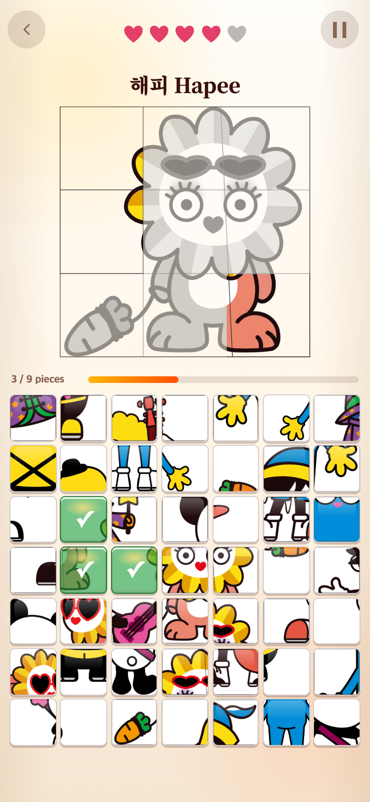
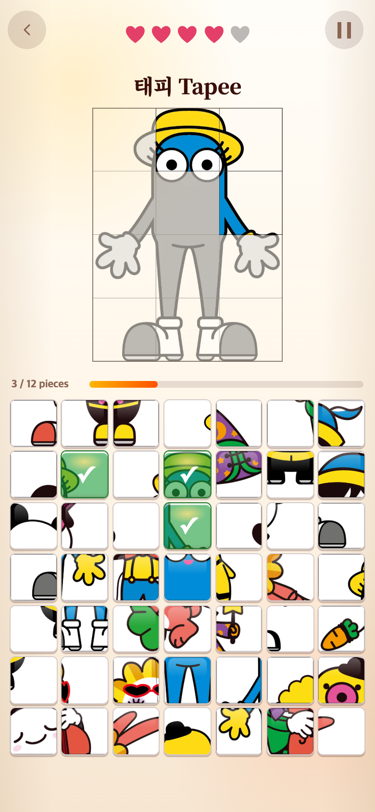
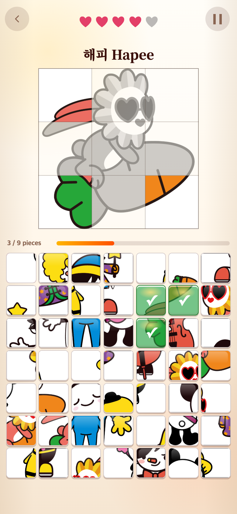

# 기존 퍼즐 7종 제시 목록 복구 — 2026-09-09

## 문제

새 그림을 추가하는 과정에서 제시 목록을 신규 다섯 그림으로 한정했다. 기존 여섯 캐릭터는 오답 조각으로만 남았고, 기존 해피 그림은 당근 그림으로 대체된 상태였다. 사용자는 기존 7종도 그대로 제시되기를 원했다.

## 수정

- 기존 `Bb`, `Ha`, `Hoo`, `Ja`, `Pino`, `Tapee`, `Tepee`의 원래 완성 이미지와 9/12조각 구성을 복구했다. 파일은 삭제되지 않아 보관된 최적화 WebP를 다시 연결했다.
- 기존 7종과 신규 5종을 합쳐 총 12종 모두 `UNIT_TARGET_CHARACTERS`에 등록했다. 한 판에 한 그림을 무작위로 제시한다.
- 기존 해피는 `ha`, 해피 당근은 별도 `hapee-carrot` ID로 구분한다. 각각의 조각을 혼동하지 않으며 두 그림 모두 완료 시 해피 영상을 연결한다.
- 새 이미지 추가 시 기존 제시 목록을 제외하지 않는다는 지침과 회귀 테스트를 추가했다. 게임 2·3, 화면 디자인, 기존 파일은 수정하지 않았다.

## 화면

수정 전 목록 구성은 [이전 기록](../2026-09-09-puzzle-artworks/README.md)에 남아 있다. 아래는 오답 1회·정답 3조각 이후의 실제 플레이 화면이다.

| 복구된 해피 원본 | 복구된 태피 12조각 |
| --- | --- |
|  |  |

## 검증

- 브라우저: 390×844·320×568 CSS 픽셀에서 12종씩 총 24회 진입·정오답·전체 조각 복원을 검사했다. 7×7 보드, 원래 제시 비율(3×3 또는 3×4), 실행 오류 없음을 확인했다.
- 12종을 빠짐없이 검사하기 위해 START 직전 다음 난수 한 번을 제어했다. 게임 상태는 수정하지 않았다.
- 캡처: Chromium 모바일 에뮬레이션, 390×844 CSS 픽셀·DPR 2(780×1688 PNG). 실기기 촬영이나 사용자 연구 결과는 아니다.
- `npm test`: 258개 통과. 기존 7종의 제시 목록 포함, 원본 해피 경로, 태피 12조각, 전체 12종의 정답/오답·영상 연결·프리로드를 검증한다.
- `npm run build`: 통과.

연구기록은 게임에서 불러오지 않는다. TAPtoTALK과 TAPtoTEN은 수정하지 않았다.
