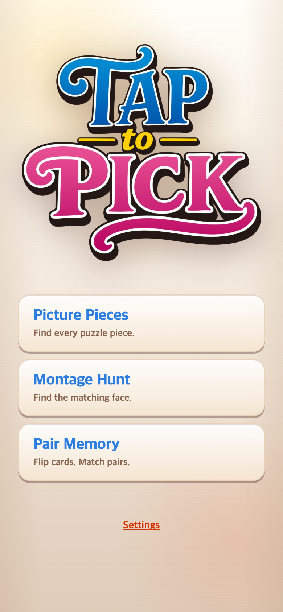
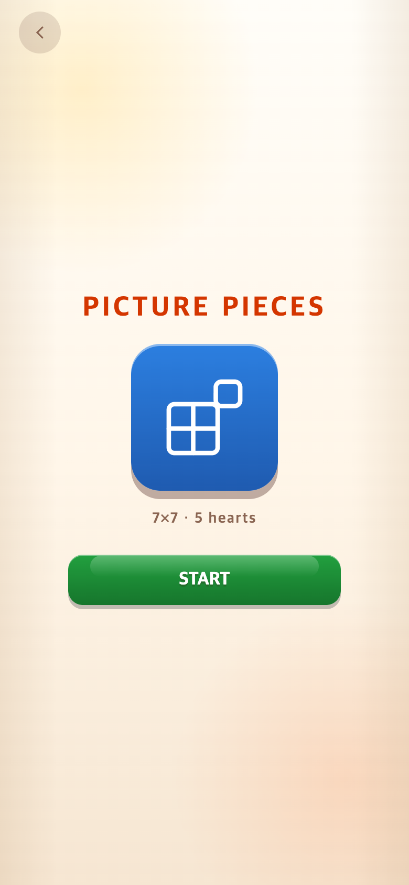
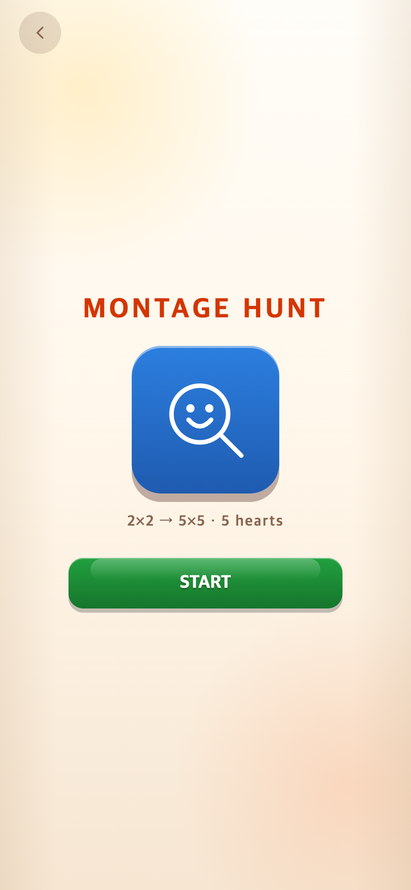
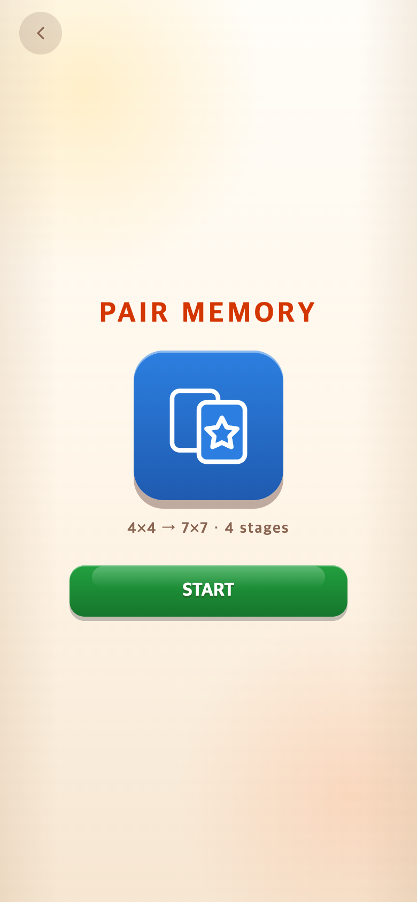

# START 화면과 짧은 게임 설명

기준 버전: `0d06cc3` (해피 당근 테스트와 캐릭터 순환 보완).

## 요청과 참고

기존 PICK은 게임 이름을 누르면 즉시 플레이가 시작됐다. 사용자는 TALK·TEN처럼 START를 한 번 더 누르는 화면과 짧은 게임 설명을 요청했다.

로컬 참고 프로젝트를 읽기 전용으로 확인했다.

- TAPtoTALK `0523806e92a3ea19eaa829ae831bde06ee8b61d4`: `index.html`의 Alphabet/Syllable 시작 화면, `talkApp.ts`의 `showAlphabetIntro`, `talk.css`의 `.alphabet-intro-*`.
- TAPtoTEN `bd3d5e21e47aa5d59d5513bb5e22f35eb061c41a`: `index.html`의 `screen-intro`, `picker.css`의 `.intro-*`.

둘 모두 팝업이 아닌 **별도 화면**이며 왼쪽 위 뒤로가기, 중앙 제목·아이콘·짧은 안내, START 버튼 구조다. 원본 프로젝트는 수정하거나 푸시하지 않았다.

## 적용

- 제목 26px·굵기 900·자간 .12em, 아이콘 판 140×140·모서리 28px, START 최대 너비 260px를 맞췄다. 간격 18px와 하단 여백은 TALK, 620px 이하 높이에서 아이콘을 100px로 줄이는 방식은 TEN을 참조했다.
- 공통 배경·폰트·색상·입체 버튼을 유지하고 세 모드에 맞는 조각/얼굴 찾기/카드 아이콘을 넣었다. 아이콘은 인라인 SVG라 별도 이미지 다운로드가 없다.
- 모드 선택 및 결과 화면 Play again은 시작 화면만 연다. START에서만 보드·하트·타이머를 초기화하고 게임 2의 다음 캐릭터를 소비한다. 게임 3의 3초 미리보기도 START 이후에 시작한다. 단계 사이에 추가 START 화면은 넣지 않았다.
- START 전에는 메뉴 음악을 유지한다. 뒤로가기 또는 Escape로 취소할 수 있고 메뉴 버튼으로 키보드 포커스를 돌려준다. START 후에는 숨겨진 버튼에 포커스가 남지 않도록 게임 화면으로 옮긴다. START 이중 실행을 막는다.
- 게임 규칙·캐릭터 순환·해피 테스트 이미지·점수는 변경하지 않았다.

## 메뉴 설명

| 게임 | 짧은 설명 |
| --- | --- |
| Picture Pieces | Find every puzzle piece. |
| Montage Hunt | Find the matching face. |
| Pair Memory | Flip cards. Match pairs. |

이전 긴 설명은 [이전 메뉴 기록](../2026-09-09-menu-simplification/after-menu-390.png)에서 확인할 수 있다. 그 이후 해피 테스트에서도 메뉴 문구는 동일했다.

## 검증

- 255개 테스트와 프로덕션 빌드 통과.
- 390×844, 320×568, 844×390에서 제목/아이콘/안내/START 순서와 크기, 가로 넘침 없음, 12초 대기 중 보드 변경 없음, Back/Escape, START 이중 클릭, 게임 진입·일시정지·재개를 검사했다.
- 게임 3은 START 전 대기를 거친 뒤에도 3초 미리보기가 정상적으로 시작되고 이후 1분 타이머가 시작되는 것을 확인했다.
- 같은 난수 시드에서 시작 화면을 취소한 경우와 취소하지 않은 경우의 게임 2 제시 순서 14개가 동일했다. 두 묶음 모두 일곱 캐릭터가 중복 없이 나온다.
- `check.cjs`에는 게임 종료→영상 넘기기→Play again→START→새 하트/조각 상태 검사도 포함한다. 상세 실행 결과는 [checks.json](checks.json)에 저장한다.

캡처는 390×844 CSS px·DPR 2 → 780×1688 PNG의 Chromium 모바일 에뮬레이션이다. 실제 기기 촬영이나 사용자 연구 결과가 아니다. 검증에서는 음악·효과음·진동을 끄고 시계와 난수를 제어했다. `check.cjs`는 Playwright·로컬 Chrome·Vite를 사용하며 `BASE_URL` 기본값은 `http://127.0.0.1:5189/`이다.

이 폴더의 문서·스크린샷·검사 스크립트는 게임에서 불러오지 않는다.
