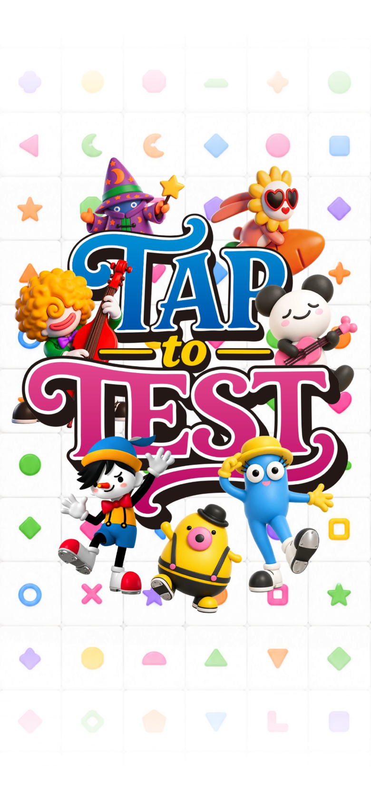
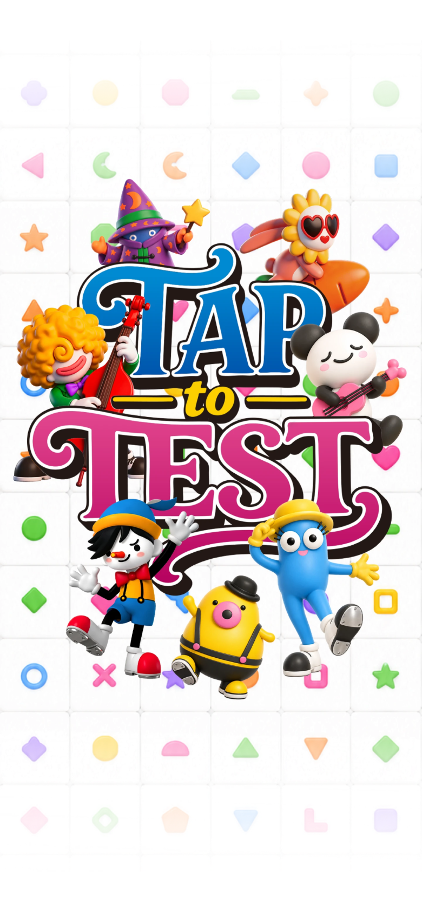

# 커버 최신 수정본 재교체

사용자가 같은 파일명으로 다시 제공한 커버를 적용했다. 기존 위치·크기·표시 시간은 변경하지 않았고 게임 규칙도 유지한다. 최신 메인 로고와 함께 반영하는 변경이다.

- 원본 보존: `assets/cover-originals/taptopick-cover-0911-01-v2.png`
- 웹용: `public/assets/brand/taptopick-cover-0911-01-v2.webp` (1440×2841)
- 원본 비율을 유지해 기존 웹용 크기 안에 맞춘다. 이전 파일과 캐시가 구분되도록 새 URL을 사용한다.

## 변경 전

## 변경 후

모바일 390×844 CSS px, DPR 2 캡처. `check.cjs`로 390×844와 320×568에서 이미지 경로·해상도, 커버 표시 후 메인화면 전환 및 브라우저 오류 유무를 검증한다. 기존 연구 캡처는 수정하지 않는다.
