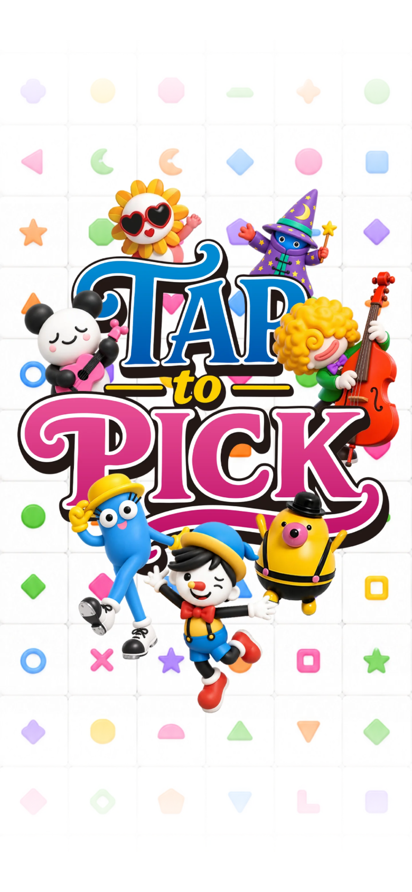

# 커버 교체 — 2026-09-11

- 제공된 `taptopick-cover-0911-01.png`로 커버만 교체했다. 이미지 속 **TAP to TEST** 문구는 그대로 사용했다. 앱 이름과 메뉴 로고는 변경하지 않았다.
- 원본은 `assets/cover-originals/taptopick-cover-0911-01.png`에 보관했다(4837×9540, 2,791,921바이트).
- 웹용은 `public/assets/brand/taptopick-cover-0911-01.webp`(1440×2841, 594,910바이트). Sharp `resize(1440,2841,{fit:'contain',background:{r:255,g:255,b:255,alpha:0}}).webp({quality:90,effort:6})`로 생성했다. 비율 유지와 최소 여백으로 기존 커버 출력 크기에 맞췄다.
- `src/config/app.ts`의 `productCover` 경로만 교체했다. 이전 커버 파일은 삭제하지 않아 경로를 되돌리면 복구할 수 있다.
- 스튜디오 로고 1.8초·제품 커버 4초 설정과 가로 100%·세로 중앙 표시 CSS는 변경하지 않았다.

| 변경 전 | 변경 후 |
| --- | --- |
|  |  |

검증: 390×844·320×568 모바일 Chromium 에뮬레이션에서 이미지 로딩·커버 표시·메뉴 전환·실행 오류 없음을 확인했다. 빌드와 `git diff --check` 통과. 스크린샷은 390×844 CSS 픽셀·DPR 2(780×1688 PNG), 제어된 시계로 촬영했으며 실기기 촬영이 아니다.

이 연구기록은 게임에서 불러오지 않는다. TAPtoTALK과 TAPtoTEN은 수정하지 않았다.
