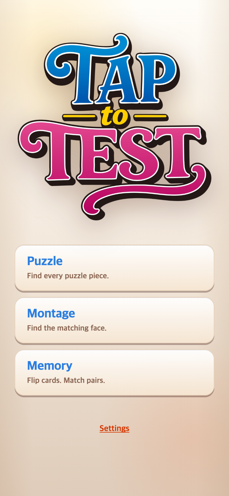
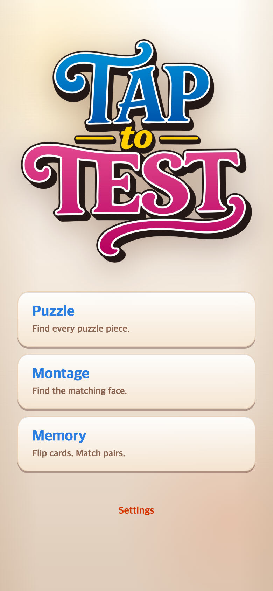

# 로고 최신 수정본 재교체

사용자가 같은 파일명으로 제공한 최신 PNG(3326×3214)를 다시 적용했다. 이전 파일과 SHA-256이 다른 실제 수정본임을 확인했다. TAPtoTALK과 같은 반응형 너비와 기존 위치 설정은 그대로 유지한다. 그림에 표기된 TEST도 변경하지 않았다.

기존 파일과 연구기록을 덮어쓰지 않고 원본을 `assets/logo-originals/TAPtoPICK-logo-0911-01-v2.png`, 웹용을 `public/assets/brand/TAPtoPICK-logo-0911-01-v2.webp`로 보관한다. 투명 배경과 비율을 유지해 너비 990px로 변환했다. 새 URL을 사용해 이전 로고 캐시와 구분한다.

## 변경 전

직전 작업에서 저장한 화면을 참조한다.

## 변경 후

390×844 CSS px, DPR 2로 캡처한다. `check.cjs`로 390×844와 320×568에서 로고 비율, 화면 경계, 게임 버튼 비겹침 및 START 진입을 검증한다. 실행 결과는 `after-checks.json`에 저장한다. 이 기록은 로컬 변경이며 푸시 여부와 별개다.
