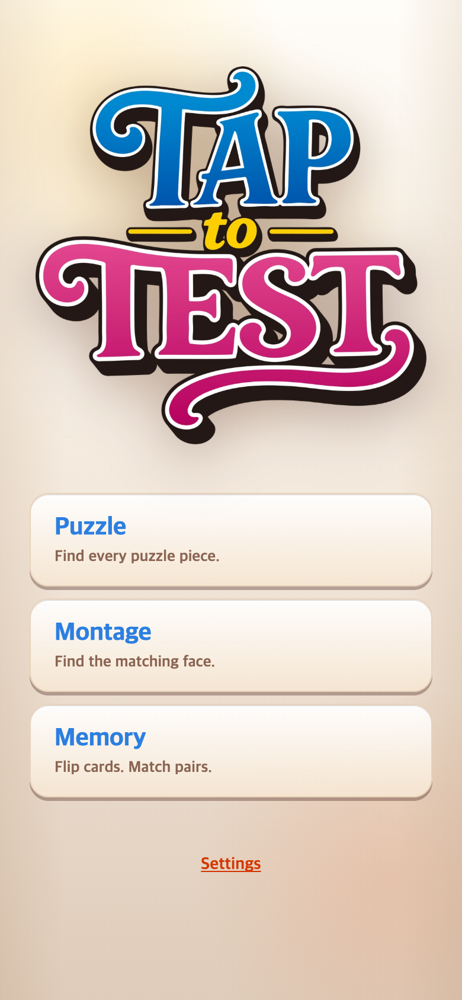

# 새 로고 교체와 TAPtoTALK 크기 비교

## 요청 및 적용

사용자가 새로 제공한 `TAPtoPICK-logo-0911-01.png`로 메인 로고를 교체했다. 파일명과 달리 그림의 글자는 TAP to TEST이므로 그림과 대체 텍스트는 TEST 그대로 유지한다. 커버와 게임 규칙은 변경하지 않았다.

원본 3314×3208 PNG는 `assets/logo-originals/`에 보존하고, 같은 이름의 990px 너비 WebP를 `public/assets/brand/`에 생성해 사용한다. 투명 배경과 원본 비율을 유지하며 이전 로고도 보관한다.

## 크기 비교

TAPtoTALK의 `src/ui/styles/title.css`를 읽기 전용으로 비교했다. PICK의 설정이 이미 동일하므로 CSS 변경 없이 그대로 사용한다.

| 화면 높이 | 두 게임의 동일한 로고 너비 설정 |
| --- | --- |
| 700px 초과 | min(89.76vw, 330px) |
| 580px 초과, 700px 이하 | min(76.56vw, 284px) |
| 580px 이하 | min(58.08vw, 218px) |

둘 다 height: auto이다. TALK SVG는 855.2399247×759.0264926 비율이고 새 그림은 3314×3208 비율이므로 너비는 같아도 높이는 다르다. 양쪽 치수를 강제로 같게 만들어 왜곡하지 않는다. TAPtoTALK의 기존 미추적 파일에는 손대지 않았다.

## 모바일 전후

390×844 CSS px, DPR 2 (780×1688 PNG). 이전 연구 캡처는 보존했다.

`check.cjs`는 이전 로고 검증 코드를 읽어 경로만 바꾸어 실행한다. 390×844와 320×568에서 이미지 비율, 화면 경계, 버튼 비겹침 및 START 화면 이동을 확인하고 결과를 JSON으로 저장한다. 원격 푸시 여부와는 별개의 로컬 검증 기록이다.
