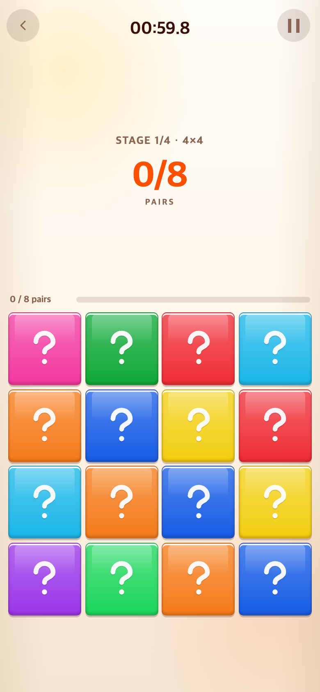
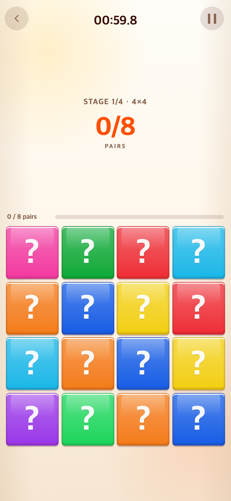
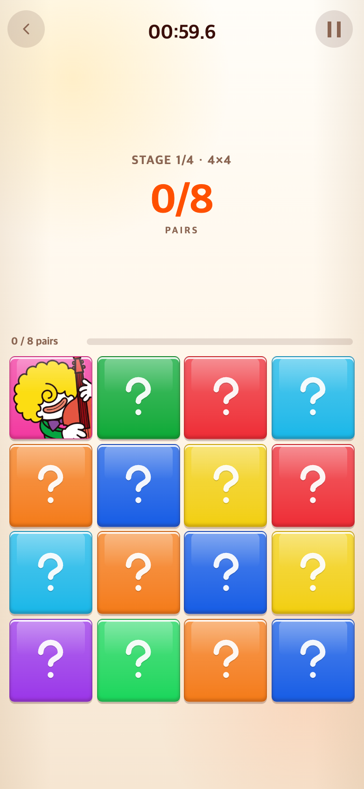
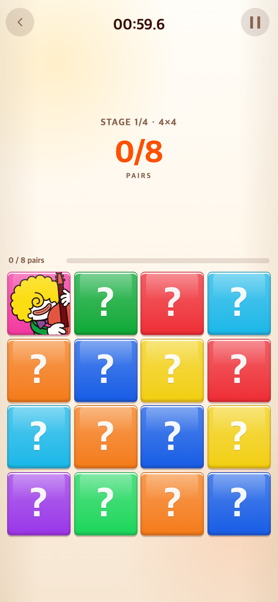
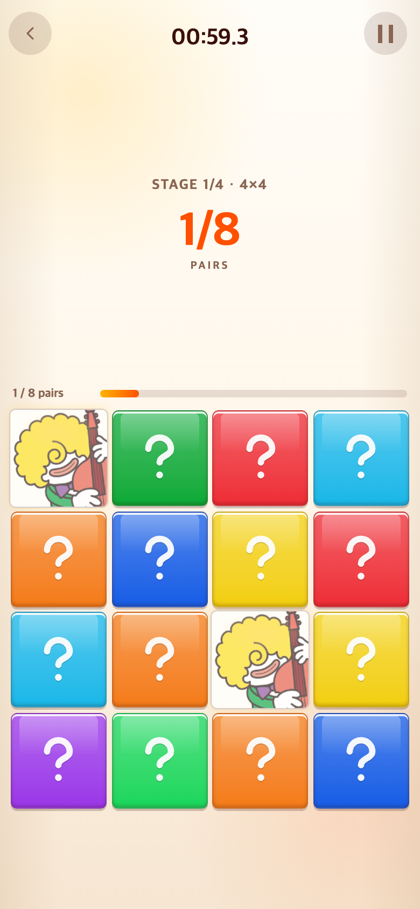

# 메모리 물음표 통일과 뒤집기 빛 완화 — 2026-09-11

기준 커밋: `f5b3f1d`.

## 요청과 참고 확인

사용자는 TAPtoTEN의 `SUM = ?`와 같은 물음표를 쓰고 메모리 카드가 뒤집힐 때의 빛을 줄이기를 요청했다.

TAPtoTEN은 읽기만 수행했다. 확인 시점 HEAD는 `e42b3bc4f421e47e84445709b0aabbd47e548e85`이며 작업 전후 커밋·작업 트리 상태가 동일했다.

- `index.html`의 `#sum-total`은 별도 그림이 아닌 `<b>?</b>` 텍스트다.
- `src/ui/styles/game.css`의 `.sum-total`은 굵기 900이다.
- `src/ui/styles/tokens.css`의 body 서체는 `Apple SD Gothic Neo`, `Noto Sans KR`, `Malgun Gothic`, system-ui, sans-serif 순이다.
- `src/ui/screens/hud.ts`는 선택한 숫자가 없을 때 `?`를 표시한다.

## 변경

- 기존 수작업 선형 SVG 물음표를 같은 서체 목록·굵기 900의 `?`로 교체했다. 색과 카드 대비 크기(58%, 최대 52px)는 유지한다.
- 고정 24×24 SVG 안의 텍스트로 표시하여 서체가 카드 크기를 바꾸지 않도록 했다. OS별 실제 서체는 TAPtoTEN처럼 달라질 수 있다. 별도 폰트 파일을 복사하거나 외부 폰트를 추가하지 않았다.
- 카드 한 장을 열 때도 나타나던 흰 반사광 불투명도를 1 → 0.65로 낮췄다.
- 정답 노란빛 알파는 0.5 → 0.4, 주변 번짐은 8px·0.22 → 6px·0.16으로 낮췄다. 열린 카드의 반사광 불투명도도 함께 적용된다.
- 뒤집기·매칭 시간, 정답 움직임, 스테이지 규칙, 게임 1·2 효과는 유지했다. 시작 화면의 별·미소 아이콘은 변경하지 않았다.

## 모바일 비교

| 상태 | 변경 전 | 변경 후 |
| --- | --- | --- |
| 물음표 |  |  |
| 한 장 뒤집기 |  |  |
| 정답 빛 |  |  |

[7×7 변경 전](before-7-closed.png) · [7×7 변경 후](after-7-closed.png)

## 검증

- `check.cjs`: 390×844·320×568 CSS 픽셀에서 4×4→5×5→6×6→7×7 전체 페어를 실제 카드 클릭으로 완성했다. 변경 전후 같은 흐름으로 확인했다.
- 새 물음표의 서체·굵기와 실제 글자 획이 SVG 안에 들어오는지 검사했다. SVG 텍스트의 빈 행간이 포함되는 `getBBox` 대신 동일 서체의 실제 glyph 경계를 사용했다.
- 반사광·정답 번짐 값, 220ms 정답 애니메이션 유지, 카드 크기 유지, 브라우저 실행 오류 없음을 확인했다.
- `npm test`: 258개 통과. `npm run build`: 통과.
- 캡처: Chromium 모바일 에뮬레이션, 390×844 CSS 픽셀·DPR 2 → 780×1688 PNG. 난수·시계를 제어하고 CSS 전환을 완료시킨 상태에서 촬영했다. 정답 빛은 154ms 키프레임에 정지해 비교했다. 실기기 촬영은 아니다.

연구기록은 게임에서 불러오지 않는다. TAPtoTEN과 TAPtoTALK은 변경하지 않았다.
