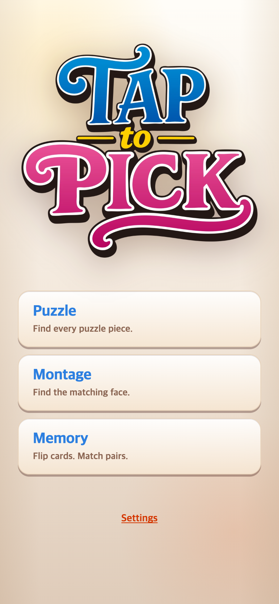
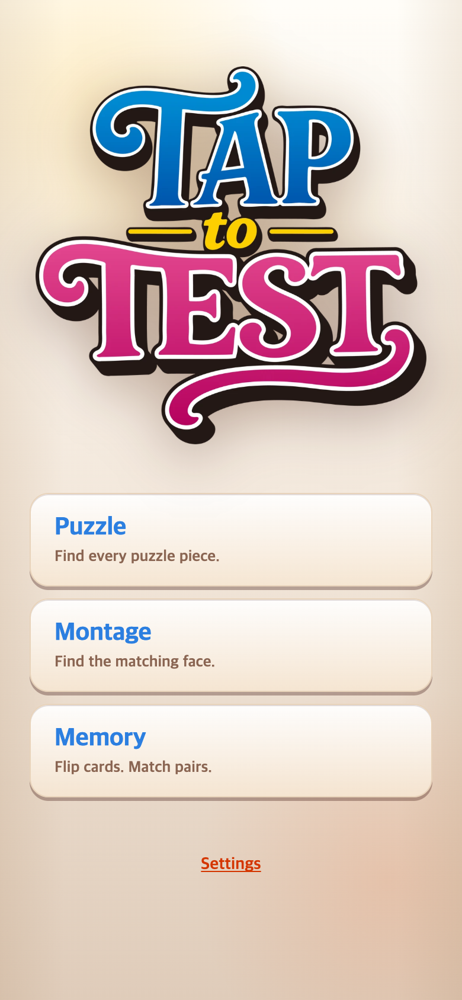

# 메인화면 TAPtoTEST 로고 교체

## 요청과 변경

새 커버에 이어 사용자가 제공한 `TAPtoTEST-logo-0911-01.png`를 메인화면에 적용했다. 기존 로고 CSS와 반응형 너비는 유지하고, 이미지 경로와 대체 텍스트만 교체했다. 새 그림의 원본 비율이 달라 표시 높이는 자연스럽게 달라진다. 게임 규칙과 앱 전체 명칭은 변경하지 않았다.

- 원본: `assets/logo-originals/TAPtoTEST-logo-0911-01.png` (3366×3259)
- 웹용: `public/assets/brand/TAPtoTEST-logo-0911-01.webp` (990×959, 106,406 bytes)
- 투명 배경과 종횡비 유지. 기존 로고 파일도 보존.

## 전후 화면

390×844 CSS px, DPR 2로 저장한 780×1688 PNG. 이전 연구 이미지에는 손대지 않았다.

### 변경 전

### 변경 후

## 검증

`check.cjs`로 390×844 및 320×568 화면에서 새 이미지 로딩, 비율 유지, 화면 범위, 게임 버튼과 비겹침, START 화면 진입을 확인했다. 브라우저 오류 없음. `npm run build` 통과. 구체적인 좌표는 `before-checks.json`, `after-checks.json`에 저장했다.

이 기록은 로컬 변경 검증이며 원격 저장소 반영을 의미하지 않는다.
