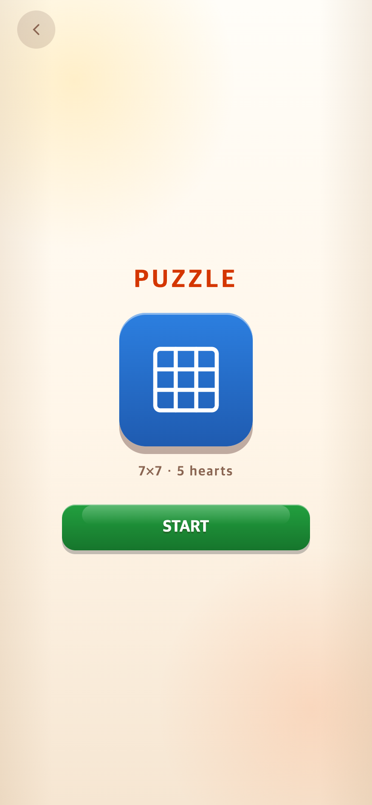
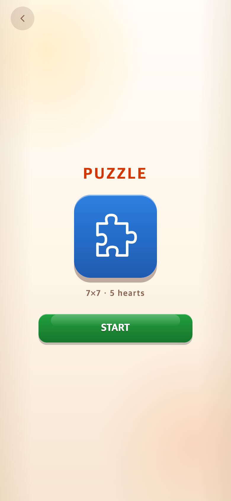
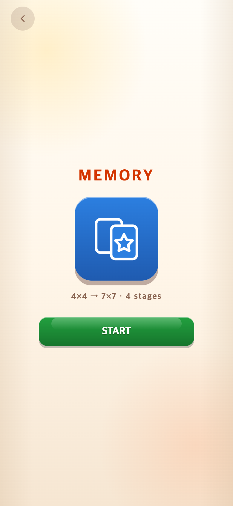
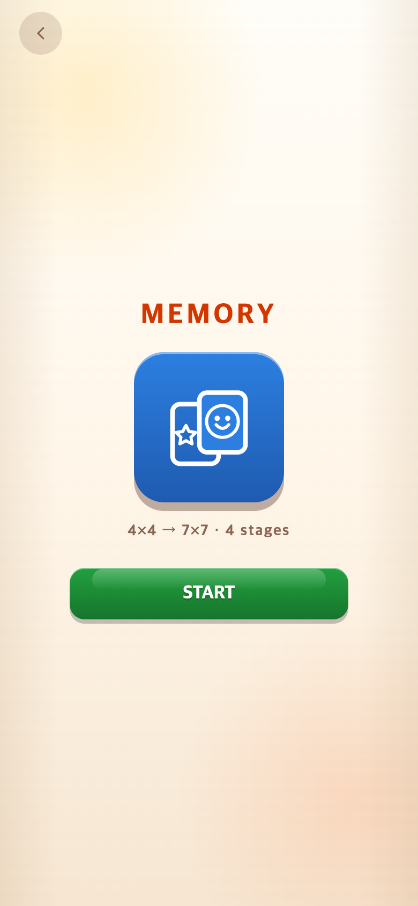

# 시작 화면의 퍼즐·메모리 아이콘 변경 — 2026-09-11

기준 커밋: `eede33a`.

## 요청과 변경

- Puzzle: 3×3 그리드 대신 맞물리는 돌출부·홈이 있는 전형적인 퍼즐 한 조각으로 변경.
- Memory: 아래쪽에 겹친 뒷면 카드에는 별, 위쪽 앞면 카드에는 Montage와 같은 미소 얼굴을 표시.
- Montage: 기존 돋보기·미소 SVG를 변경 없이 유지. Memory에도 동일한 미소 도형을 사용한다.
- 아이콘의 48×48 좌표계·86px 크기, 배경판·색상·START 위치를 유지한다. 게임 안의 실제 카드 뒷면, 퍼즐 이미지, 규칙은 변경하지 않았다.

## 모바일 비교

| 모드 | 변경 전 | 변경 후 |
| --- | --- | --- |
| Puzzle |  |  |
| Memory |  |  |

Montage의 [변경 전](before-montage.png)·[변경 후](after-montage.png)도 함께 보관했다. 돋보기·미소 SVG 소스는 그대로 유지했다. 화면 캡처는 렌더링 시점 차이가 있어 픽셀 단위 동일성을 보장하지 않는다.

## 검증

- Chromium 모바일 에뮬레이션 390×844·320×568 CSS 픽셀에서 세 모드의 START 진입과 게임 보드 생성 확인. 실행 오류 없음.
- 변경 전후 두 화면 크기에서 아이콘 위치·크기가 동일함을 확인.
- 스크린샷: 390×844 CSS 픽셀·DPR 2 → 780×1688 PNG. 시계 제어, 실제 버튼 조작. 실기기 촬영은 아니다.
- `npm test`: 258개 통과. `npm run build`: 통과.
- 재현: `check.cjs`; `--before`는 기준 코드에서 실행한다.

연구기록은 게임에서 불러오지 않는다. TAPtoTALK과 TAPtoTEN은 수정하지 않았다.
