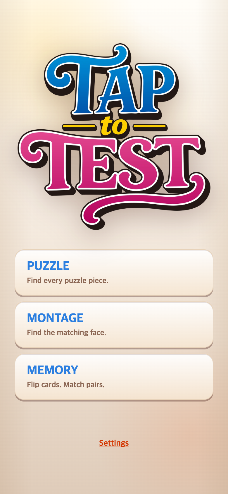

# TEN 기준 메인 버튼 배치·대문자 제목

## 문제와 변경

PICK은 로고 높이와 별도의 44px 음악 안내 공간 때문에 같은 space-evenly 배치여도 게임 선택 버튼과 Settings 좌표가 TEN과 달랐다.

- 로고 그림의 너비는 기존 TALK 기준 그대로 보존한다. 로고가 차지하는 레이아웃 영역의 높이는 TEN의 반응형 로고 높이(원본 비율 618.4357745×725.7594137)에 맞춘다. 그림은 중앙에 놓는다.
- 빈 음악 안내 공간을 없애고, TEN처럼 음악 안내와 Settings가 같은 하단 줄에 놓이게 한다. 자동 재생 차단 시 안내 버튼 기능은 유지한다.
- 게임 제목을 PUZZLE / MONTAGE / MEMORY로 바꿨다. 콘텐츠 설정과 HTML 모두 변경한다. 기존 START 중간 화면 흐름과 게임 규칙은 유지한다.

## 전후

이전 메인 배치는 로고 최종 교체 당시 기록에서 확인할 수 있다.

## 검증

390×844, 390×667, 320×568에서 버튼·Settings의 좌표를 검사했다. 비교용 TEN은 원본 앱 실행 캡처가 아니라, 공통 화면 위에 읽기 전용 TEN title.css와 원본 로고를 적용한 기준 화면이다. 음악 안내가 숨겨진 상태에서 두 버튼 영역의 x/y/너비/높이가 1px 이내로 일치했다. 검사 결과는 checks.json, 실행 코드는 check.cjs에 보관한다. 390×844 DPR 2로 화면을 저장했다. TAPtoTEN 파일은 수정하지 않았다.
