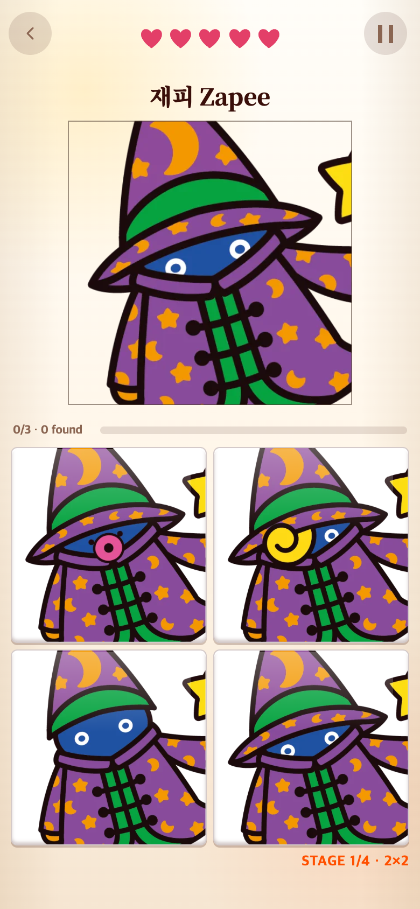
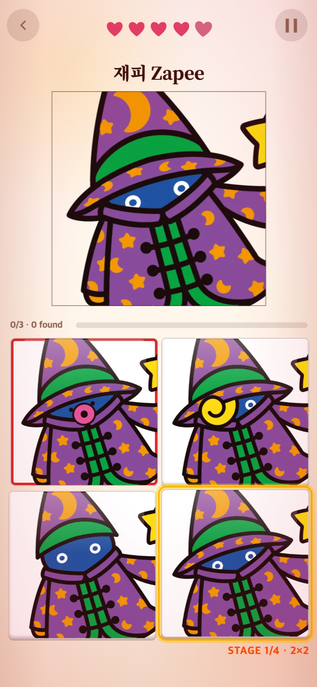

# 몽타주 오답 후 정답 빛 안내

오답을 눌렀을 때 정답을 시각적으로 알려달라는 요청을 반영했다. TAPtoTEN의 `src/ui/styles/tutorial.css`에 있는 `tutorial-target` 효과를 읽기 전용으로 참고했다. 노란 2px 테두리와 7px까지 퍼지는 금빛, 2px 상승을 1.1초 주기로 세 번 표시한다.

정답 타일 ID에 효과를 붙여 5×5에서 자리가 바뀌어도 정답 블록을 따라간다. 정답 클릭·새 문제에서는 제거된다. 오답을 다시 누르면 재시작한다. 하트와 점수 규칙은 그대로이며 자동 정답 처리는 하지 않는다. 마지막 생명을 잃어 종료되면 새 안내를 시작하지 않는다. 동작 줄이기에서는 움직임 없는 금빛 테두리를 3.3초 표시한다.

390×844 CSS px, DPR 2. 효과 정점은 애니메이션을 550ms 위치에 고정하여 캡처했다. `check.cjs`로 정답 하나만 강조, 하트 차감 유지, 일반·동작 줄이기 스타일, 종료 시 제거, 정답 선택과 다음 문제에서 제거를 검증했다. 빌드 통과. 기존 연구기록을 보존했다.
