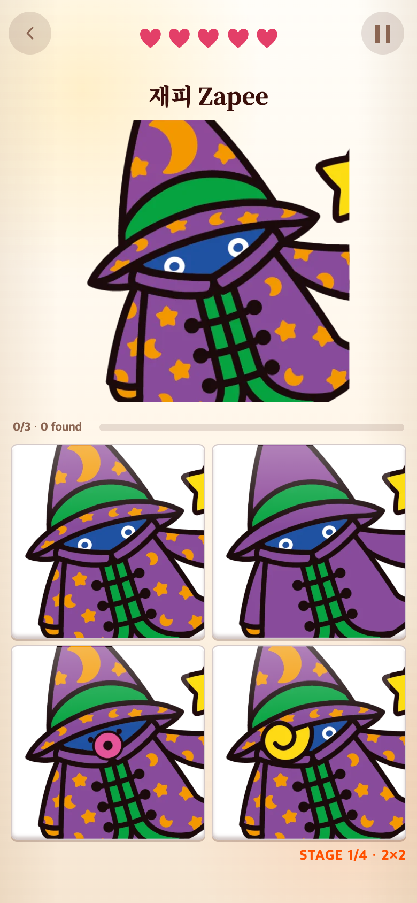

# 몽타주 제시 이미지 테두리

## 요청과 변경

퍼즐처럼 몽타주 제시 그림의 범위를 알아보기 쉽도록 외곽선 하나를 추가했다. 퍼즐의 실제 표시 선과 같은 1px, `rgba(79,60,48,.55)`를 사용한다. 내부 그리드는 추가하지 않는다.

이미지 요소에 전용 클래스를 붙이고 너비는 원본 비율을 따르게 했다. 현재 일곱 정답 이미지는 모두 512×512이므로 화면에 보이는 그림 크기는 기존과 동일하다(일반 화면 264×264, 작은 화면 182×182). 내부 outline은 공간을 차지하지 않으므로 이미지 축소·왜곡이나 보드 이동이 없다. 퍼즐·메모리 및 게임 규칙은 변경하지 않았다.

## 전후

390×844 CSS px, DPR 2로 저장했다. 변경 전은 같은 캐릭터와 보드에서 이전 CSS(너비 100%, 테두리 없음)를 적용해 재현한 비교 화면이다.

## 검증

390×844 및 320×568에서 정사각 비율, 테두리 두께, 보드와 비겹침, 브라우저 오류 없음을 확인했다. 결과는 `checks.json`, 재현 코드는 `check.cjs`에 있다. `npm run build` 통과. 로컬 변경 기록이며 푸시는 별도다.
