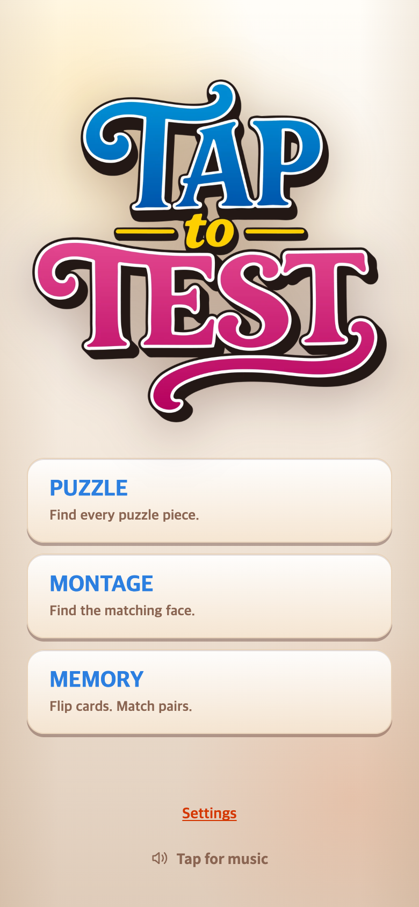

# TALK 스타일 음악 안내 복원

메인 버튼 위치 변경 때 음악 안내까지 같은 줄의 텍스트 버튼으로 변경한 것을 사용자 요청으로 되돌렸다. TAPtoTALK index.html과 talk.css를 읽기 전용으로 확인해 스피커 아이콘·작은 글씨·Settings 아래 안내를 복원했다.

음악 슬롯은 Settings 아래 절대 위치로 배치해 표시 여부가 게임 버튼과 Settings 좌표에 영향을 주지 않게 한다. 높이 580px 이하에서는 터치 영역 높이를 44px에서 36px로 줄여 320×568에서도 잘리지 않게 한다. 음악 재생 조건·클릭 이벤트는 그대로이며 대문자 게임명과 앞서 맞춘 버튼 좌표도 유지한다.

390×844 DPR 2. 캡처는 음악 재생 차단 시에만 나오는 안내를 DOM에서 강제로 표시해 검증했다. 실제 오디오 재생 차단 상황을 재현한 캡처는 아니다. check.cjs는 390×844, 390×667, 320×568에서 안내 아이콘, Settings 아래 배치, 화면 내 표시, 안내 표시 전후 Settings 좌표 불변을 검사한다. 기존 기록은 보존했다.
