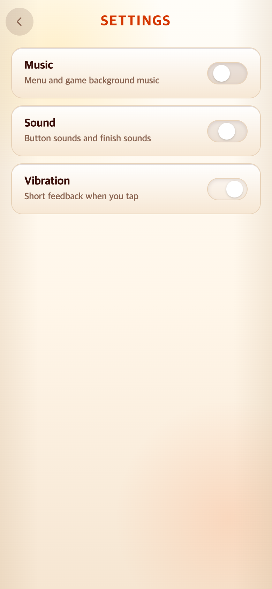
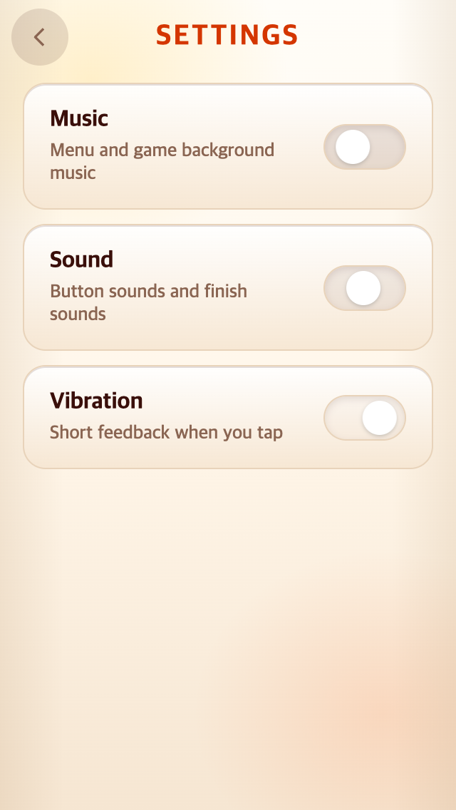

# Settings 전체화면 전환

## 문제와 변경

기존 Settings는 메인 위에 help-layer 팝업으로 열렸다. TAPtoTEN의 index.html 및 picker.css를 읽기 전용으로 참고해 별도 screen-settings 화면으로 변경했다. 왼쪽 위 뒤로가기, 중앙 SETTINGS, 아래 음악·효과음·진동 스위치로 구성한다. 화면이 작으면 목록이 스크롤된다.

메인화면은 숨겨져 뒤쪽 버튼에 접근하지 않으며 메뉴 음악은 이어진다. 스위치 값을 저장하고 즉시 적용하되 DOM을 다시 만들지 않아 키보드 포커스를 유지한다. Escape와 뒤로가기는 메뉴 Settings 버튼으로 복귀한다. 게임 일시정지 팝업과 규칙은 그대로다.

## 결과

후속 요청에 따라 TAPtoTALK의 실제 설정 문구를 확인해 **Music → Sound → Vibration** 순서와 이름, 보조 설명까지 맞췄다. 아래 캡처는 이 최종 문구를 반영한다.

`check.cjs`로 두 해상도의 전체화면 표시, 팝업 숨김, 세 스위치 변경·저장·새로고침 유지, 포커스, Escape/뒤로가기, 게임 일시정지·재개를 검증했다. 이전 팝업 캡처는 이번 기록에 포함하지 않았으며 변경 전 구현은 Git의 09afdcb에서 확인할 수 있다.
