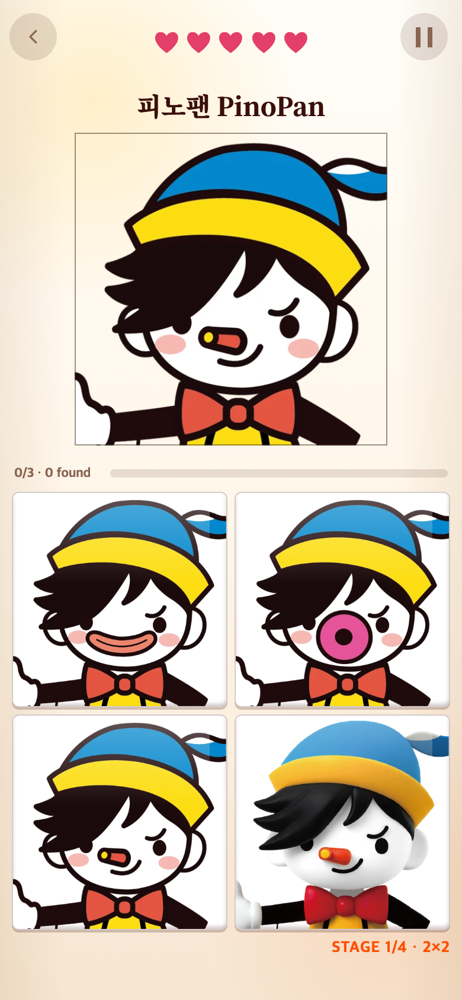
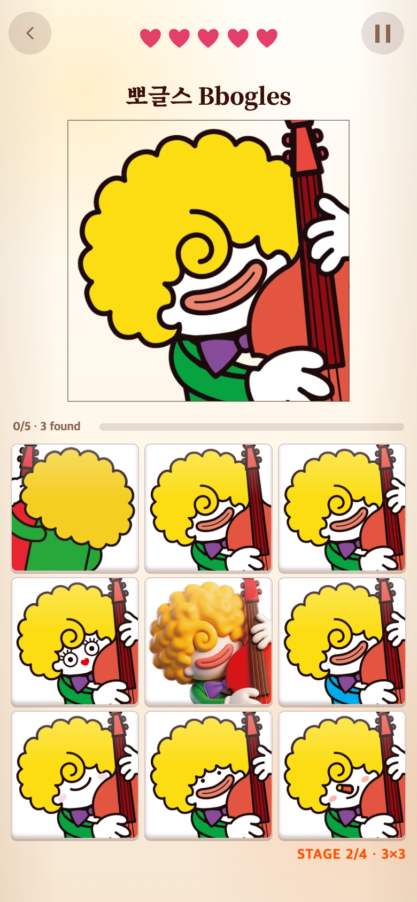
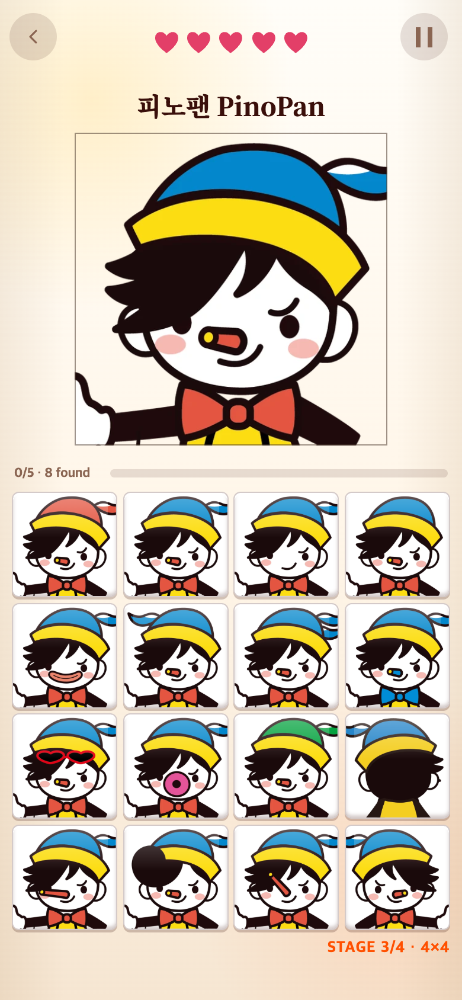
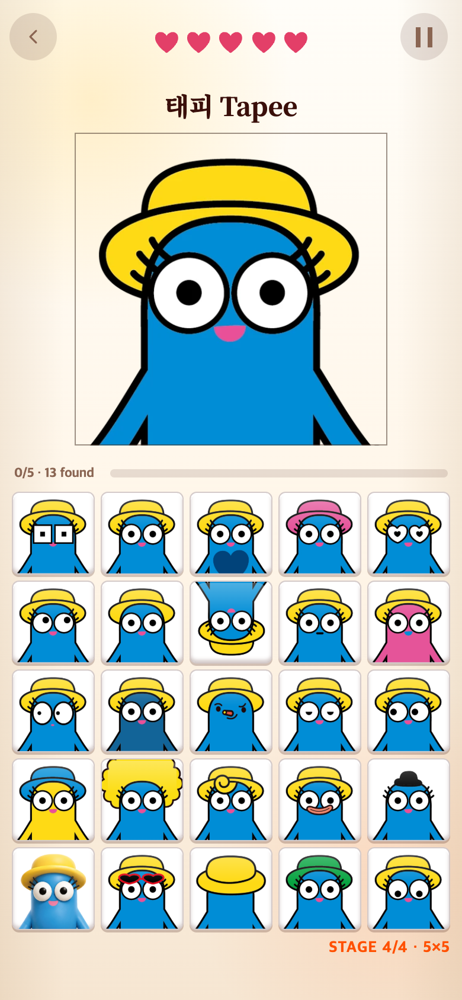

# PORTRAIT 난이도별 새 이미지 적용

## 문제

기존에는 제한된 오답 후보를 반복하여 큰 보드 안에서 같은 이미지가 여러 번 등장했다. 새 파일의 번호별 난이도도 반영되지 않았다.

## 변경

- 일곱 캐릭터별 원본 1장과 오답 24장으로 교체했다. 원본만 정답이다.
- 1–5번은 쉬움, 6–20번은 중간, 21–24번은 어려움이다. 이전 뒷모습·반전 제외 규칙은 이번 분류로 대체한다.
- 2×2: 쉬운 오답 3개. 3×3: 쉬움 5개 + 중간 3개. 4×4: 쉬움 3개 + 중간 12개. 5×5: 전체 오답 24개.
- 같은 보드 안에서는 이미지가 중복되지 않는다. 다른 문제에서 다시 나오는 것은 허용한다.
- 기존 3/5/5/5문제 진급, 하트, 일곱 캐릭터 순환, 마지막 단계의 두 블록 문 닫기·교환은 유지한다.
- 웹용 512×512 WebP로 비율을 유지하여 변환했다. PNG 원본은 보존한다.
- PUZZLE과 POSITION의 기존 이미지는 변경하지 않았다.

## 검증

각 캐릭터·단계·여러 랜덤 입력에서 정답 수, 고유 이미지 수, 난이도별 개수를 테스트한다. 후보 부족 시 중복으로 채우지 않고 오류를 감지한다.

모바일 화면: 390×844 CSS 픽셀, DPR 2.

전체 Vitest 테스트 275개와 프로덕션 빌드 통과. WebP 175장의 총 디스크 용량은 약 5.3MB다.
