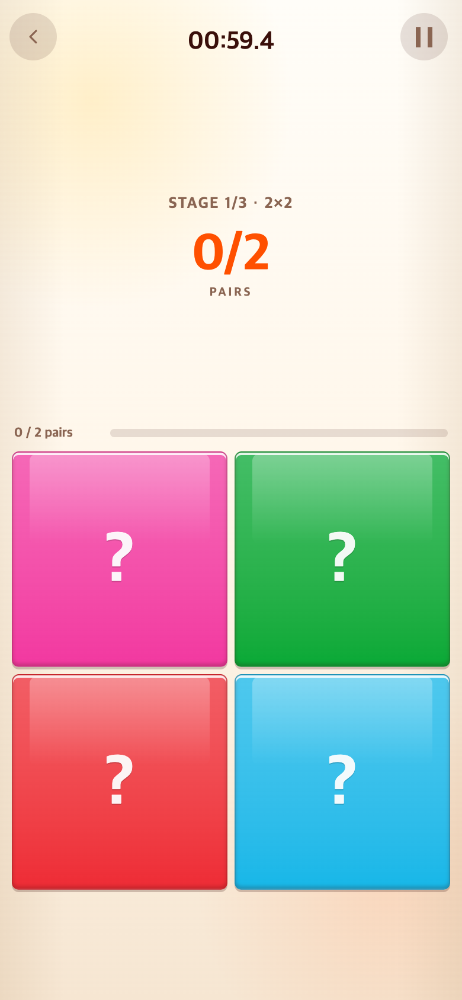
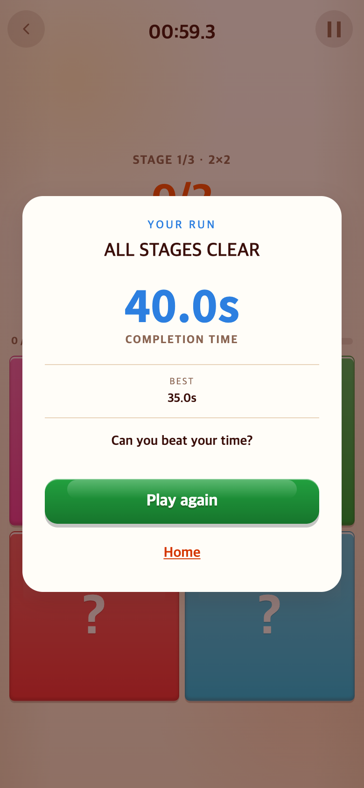

# POSITION 3단계와 결과 화면 정리

- POSITION을 4×4/5×5/6×6/7×7에서 2×2/4×4/6×6으로 변경했다. 각 2쌍/8쌍/18쌍, 제한시간은 60초/60초/90초다.
- PORTRAIT 결과는 현재 찾은 수와 최고 찾은 수를 유지하고 부가 단계 안내를 제거했다.
- POSITION 완주 결과는 현재 총 플레이 시간과 최고 완주 시간을 표시한다. 미완주 결과는 완료 단계 수와 누적 쌍 수를 표시한다. 점수·오답 수는 제거했다.
- 완주 여부, 도달 단계, 맞춘 쌍 수, 짧은 시간 순으로 기록을 비교한다. 미리보기와 일시정지 시간은 포함하지 않는다.
- 예전 4단계 기록은 보존하되 새 3단계 기록과 별도 키로 저장한다.
- 영상 규칙은 유지한다. 성공 시 티피 외 6명 중 랜덤, 실패 시 notbad. 단계 사이에는 영상 대신 STAGE CLEAR 효과가 나온다.

규칙 테스트로 3단계 진행·제한시간을, 기록 테스트로 이전 기록 분리·빠른 완주 우선을, 결과 테스트로 현재·최고 기록 표시를 검증한다.

전체 테스트 276개 및 빌드 통과. 390×844 CSS 픽셀(DPR 2)에서 새 보드와 결과 화면을 확인했다.

아래 결과 화면은 렌더링 확인용 예시 데이터(현재 40초, 최고 35초)이며 실제 플레이 기록은 아니다.

